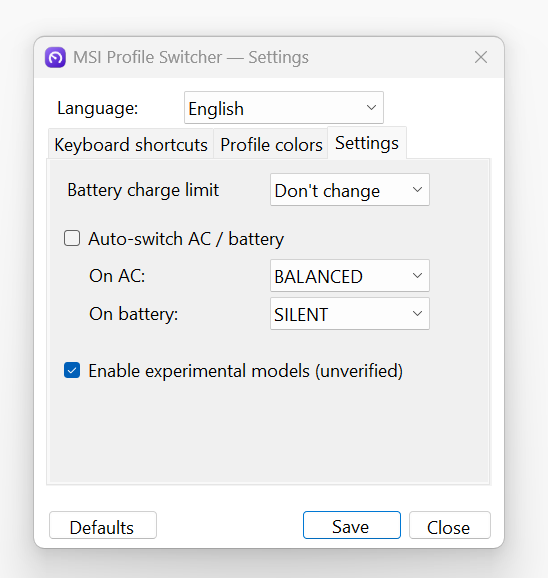

# MSI Profile Switcher

A lightweight Windows **tray app** to switch MSI laptop power profiles — **Silent / Balanced / Extreme / Super Battery** — instantly via global hotkeys, the tray menu, or auto-switch on AC/battery, with an on-screen overlay showing the active profile.

Built because **MSI Center 2.0 removed the _Silent_ profile**. This app talks to the Embedded Controller (EC) through MSI's own **WMI interface** — no kernel driver, no disabling of Windows security — so it works regardless of the MSI Center version (even with MSI Center uninstalled).

> ⚠️ **Hardware-specific.** Developed and tested on **MSI Raider GE78HX 13V** (board MS-17S1, i9-13950HX, EC firmware `17S1IMS1.114`). EC registers are model/firmware-specific — read [docs/TECHNICAL.md](docs/TECHNICAL.md) before trying it on another model. **Use at your own risk.**

## Features

- 🖥️ Tray icon (color = active profile) with a profile menu
- ⌨️ Global, **rebindable** hotkeys (default `Ctrl+Alt+F1–F4`, `Ctrl+Alt+P` = cycle)
- 🔔 On-screen overlay (OSD) on every profile change
- 🌍 **8 languages** — EN / PL / DE / FR / ES / 中文 / PT-BR / RU
- 🎨 Custom color per profile
- 📊 **Status window** — live CPU/GPU temperature & fan %, charge limit, EC firmware, session stats
- 🔌 Optional **auto-switch** on AC / battery (off by default, so it won't fight MSI software)
- 🔋 **Battery charge limit** (60 / 80 / 100 %)
- 🚀 **Start with Windows** (elevated scheduled task — no UAC nag at logon)
- 🔄 Syncs the UI if the profile is changed externally (e.g. by MSI Center)

## Screenshots

| | |
|:---:|:---:|
|  |  |
| **Tray menu** — switch profile, Status, Language, Settings | **Status** — live temps/fans, tier badge, EC info |
|  |  |
| **Shortcuts** — rebindable global hotkeys + autostart | **Colors** — 12-swatch palette per profile |
|  | |
| **Power** — charge limit, AC/battery auto-switch, experimental models | |

## Download

Grab the latest **`MSIProfileSwitcher.exe`** from the [**Releases**](../../releases) page.
It's a single, self-contained file — no install, no .NET runtime needed. Run it and approve the UAC prompt (EC access requires administrator).

## Supported models

Each model is **✅ tested** (verified on real hardware) or **⚗️ experimental** (built from the [msi-ec](https://github.com/BeardOverflow/msi-ec) register maps but not yet verified — the "Silent" power-cap behaviour is unconfirmed). On an **unrecognized firmware** the app runs **read-only** (Status works, writes disabled), so it never writes wrong registers on an untested machine.

Experimental models are **opt-in**: enable them in *Settings → Power → "Enable experimental models"*. They write only documented MSI shift/fan registers (low risk), but switching may not give the same low-power "Silent" until an owner confirms it.

| Model | EC firmware | Status |
|---|---|---|
| MSI Raider GE78HX / Vector GP78HX 13V | `17S1IMS1.*` | ✅ tested |
| MSI Raider GE68HX 13V | `15M2IMS1.*` | ⚗️ experimental |
| MSI GS66 Stealth | `16V1EMS1.*` | ⚗️ experimental |
| MSI GS65 Stealth | `16Q4EMS1.*` | ⚗️ experimental |
| MSI Katana GF66 | `1582EMS1.*` | ⚗️ experimental |
| MSI Katana GF76 | `17L1EMS1.*` | ⚗️ experimental |
| MSI GE66 Raider / GP66 Leopard | `1543EMS1.*` | ⚗️ experimental |
| MSI GF65 Thin | `16W2EMS1.*` | ⚗️ experimental |

**Got a different MSI — or own an experimental one and can confirm it works?** Open a **[Model support request](../../issues/new?template=model-support.yml)** with your EC firmware (shown in the app's Status window) and the output of the diagnostic scripts in [`scripts/diagnostics/`](scripts/diagnostics). The procedure is in [docs/TECHNICAL.md](docs/TECHNICAL.md) §11.

## Build from source

Requires the **.NET 8 SDK**.

```bash
dotnet publish -c Release -r win-x64 --self-contained true ^
  -p:PublishSingleFile=true -p:IncludeNativeLibrariesForSelfExtract=true -o publish
```

The app icon is generated by `tools/gen-icon.ps1` (already committed as `app.ico`).

## How it works (short version)

Each profile is a small set of EC register writes sent through `root\wmi` → **`MSI_ACPI.Set_Data`** (a 32-byte `Package_32` buffer: `Bytes[0]` = address, `Bytes[1]` = value). The key lever is the **fan-mode register `0xD4`** (Silent = `0x1D`), which the EC firmware ties to the power cap — in testing it dropped package power from ~104 W to ~30 W under load.

Full reverse-engineering write-up, register map, measurements and the diagnostic scripts: **[docs/TECHNICAL.md](docs/TECHNICAL.md)** — also available in **[Polski](docs/TECHNICAL.pl.md)**.

EC register map credit: [**BeardOverflow/msi-ec**](https://github.com/BeardOverflow/msi-ec).

## Testing the model gate (developer)

To preview the **experimental** / **unsupported** UI on any machine, set the `MSIPS_FORCE_FIRMWARE` environment variable to a firmware string before launching. The app then **simulates** that firmware and performs **no EC writes** (UI preview only):

```powershell
# Run from an ADMIN PowerShell so the variable reaches the elevated app:
$env:MSIPS_FORCE_FIRMWARE = "16V1EMS1.100"   # an experimental model
# or "ZZZZ" for an unsupported firmware
& .\MSIProfileSwitcher.exe
# (close it, clear the variable, relaunch to return to normal)
```

The Status window / tray show a `(test)` marker while simulating.

## License

[MIT](LICENSE) © 2026 wygodad
