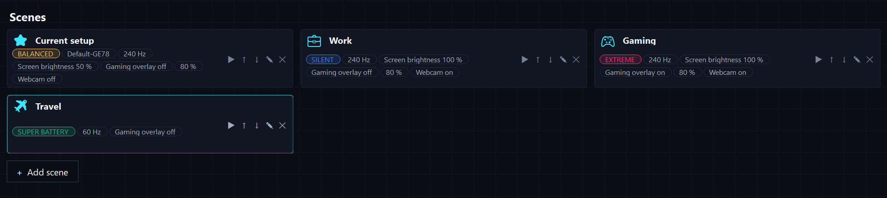
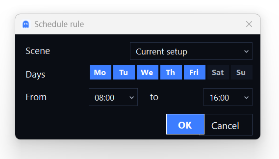
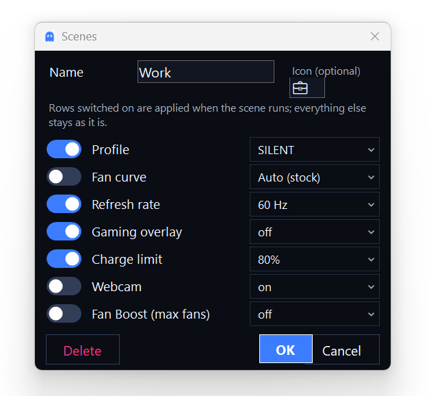
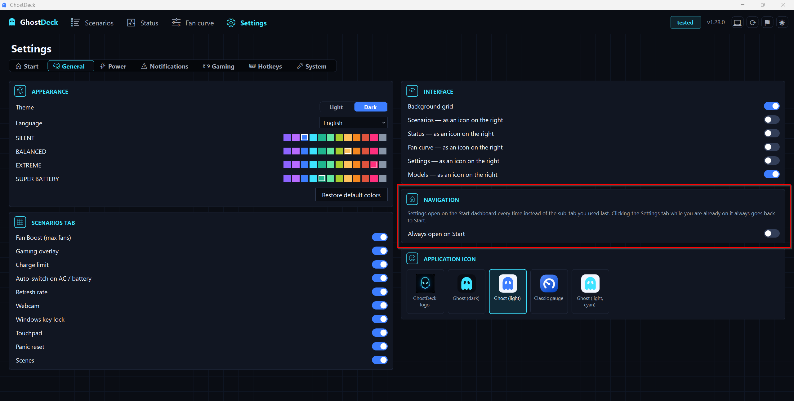
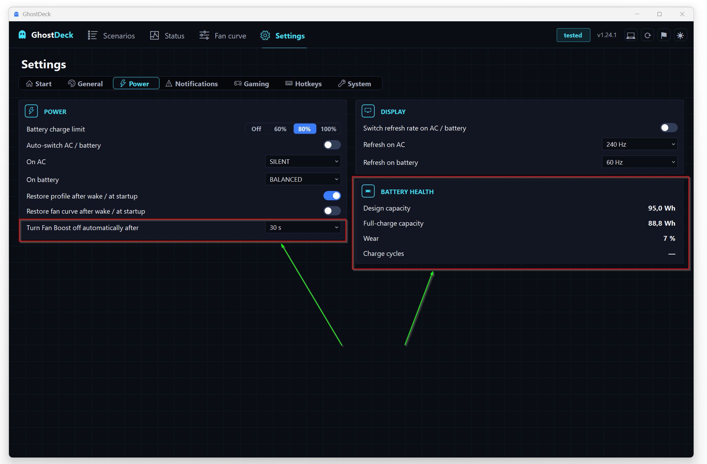
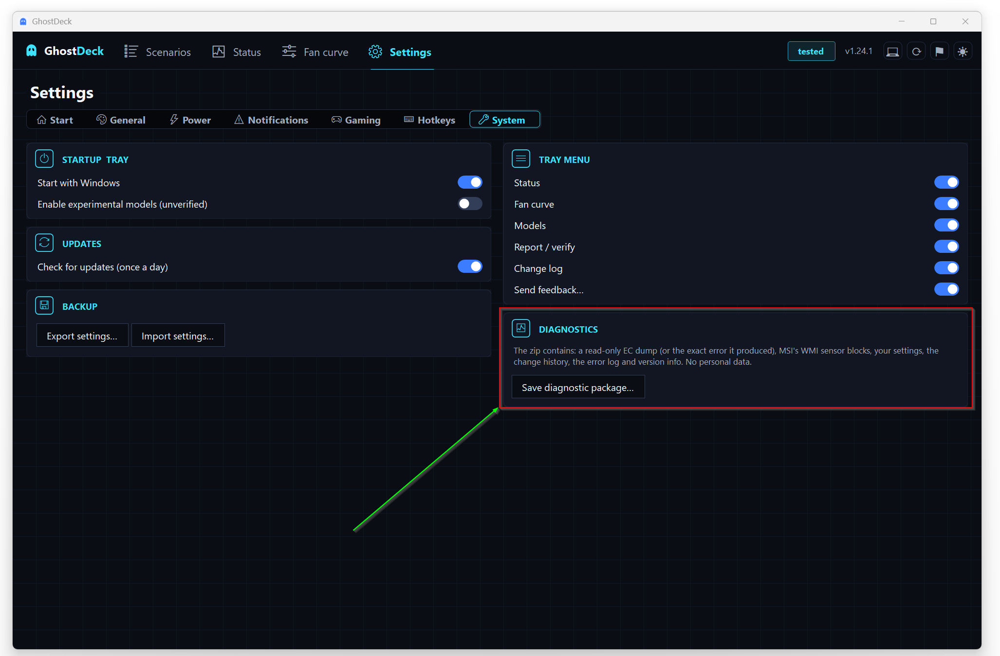
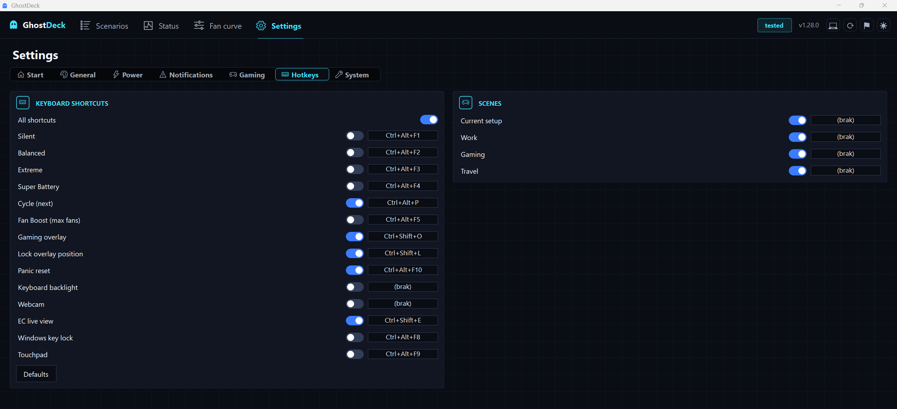
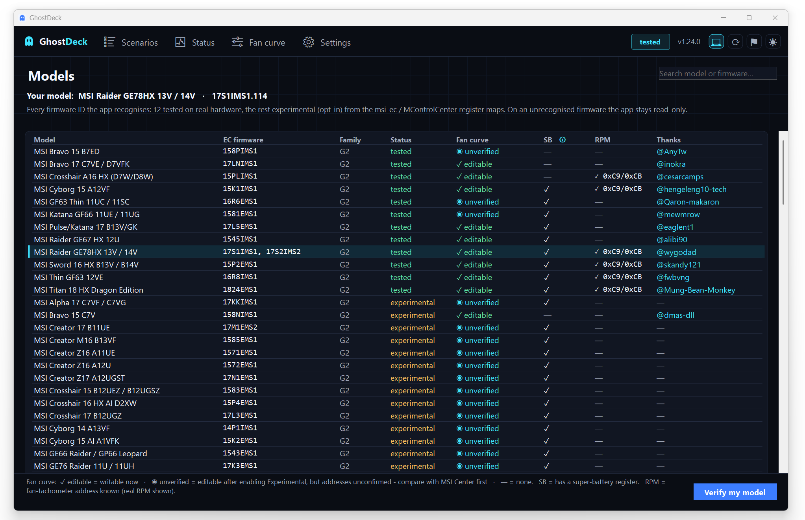
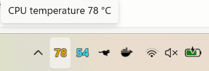
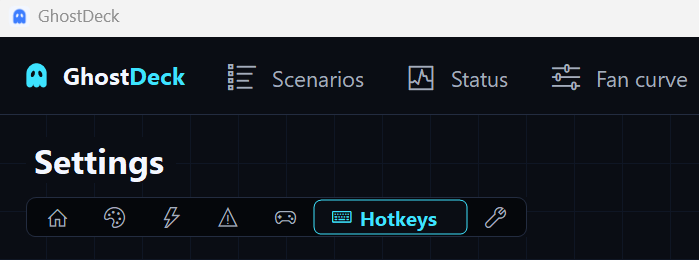

# GhostDeck - for MSI laptops

<sub>*(formerly “MSI Profile Switcher” - renamed to keep the project clearly independent of MSI; see [docs/ABOUT_THE_NAME.md](docs/ABOUT_THE_NAME.md))*</sub>

A lightweight, **independent** Windows **tray app** to switch MSI laptop power profiles - **Silent / Balanced / Extreme / Super Battery** - instantly via global hotkeys, the tray menu, or auto-switch on AC/battery, with an on-screen overlay showing the active profile.

Built because **MSI Center 2.0 removed the _Silent_ profile**. This app talks to the Embedded Controller (EC) through MSI's own **WMI interface** - no kernel driver, no disabling of Windows security - so it works regardless of the MSI Center version (even with MSI Center uninstalled).

> ⚠️ **Hardware-specific.** Developed and tested on **MSI Raider GE78HX 13V** (board MS-17S1, i9-13950HX, EC firmware `17S1IMS1.114`), and confirmed by an owner on the **GE78 HX 14V** (`17S2IMS2`, same board). EC registers are model/firmware-specific - read [docs/TECHNICAL.md](docs/TECHNICAL.md) before trying it on another model. **Use at your own risk.**

📋 **~145 MSI models recognised** - **17 models confirmed on real hardware** by their owners (GE78HX/Vector boards, Crosshair A16 HX, Crosshair 16 HX AI, Sword 16 HX, GE67 HX, Cyborg 15, both GF63 Thins, Raider GE76 12UE/12UGS, Raider A18 HX, Vector A18 HX, Titan 18 HX Dragon, Bravo 15 B7ED, Bravo 17, Katana GF66 11U, Pulse/Katana 17 B13V, Modern 14 C12M), the rest are experimental (opt-in). See the **[full supported-models list](docs/SUPPORTED_MODELS.md)**, or browse it live in the app's **Models** tab.

## Features

- 🖥️ Tray icon (color = active profile) with a profile menu, plus a **tabbed main window** (Scenarios / Status / Fan curve / Models / Report / Updates) with a **light / dark theme**; Settings is organized into **icon sub-tabs** (a Start page with tiles + General / Power / Notifications / Gaming / Hotkeys / System) and reopens on the sub-tab you used last (or always on Start, your choice). On a narrow window the sub-tab strip shrinks to icons instead of pushing a scrollbar, and clicking the tab you are already on takes you back to its first page
- 🎬 **Scenes** - one-click macros that set any mix of **profile + fan-curve preset + refresh rate + screen brightness + HDR + overlay + charge limit + keyboard backlight + webcam + Windows-key lock + touchpad + Fan Boost** in a single stroke ("Gaming": Extreme, 240 Hz, 80 % brightness, HDR on · "Work": Silent, 60 Hz, 45 %, HDR off). Run them from cards on the Scenarios tab, the tray menu, a **per-scene hotkey**, the tray scroll wheel or the CLI (`--scene "Name"`); an example set is one click away
- ⏰ **Scene schedule** - different settings for **work hours, nights and weekends**: rules (weekdays + a time window, overnight ranges fine) apply a scene when the window starts, also right after boot. Edge-triggered, so your manual tweaks inside a window are respected; first matching rule wins (Settings → Power)
- 🔋 **Battery-level rules** - e.g. **below 30 % → Super Battery, above 80 % → Balanced**: two direction-aware thresholds (the low one fires while discharging, the high one while charging, once per crossing), each running any profile or scene (Settings → Power)
- 🌡️ **Temperature in the tray** *(opt-in)* - show CPU and/or GPU temperature as their own icons next to the profile ghost, with your own warning / hot thresholds and colours
- 🖱️ **Tray-icon mouse actions** - **scroll the wheel** over the tray icon to switch profiles (or scenes / backlight), **middle-click** for Fan Boost; left, middle and wheel are all configurable in Settings (open a tab, toggle overlay, panic reset, …)
- ⌨️ Global, **rebindable** hotkeys (default `Ctrl+Alt+F1–F4`, `Ctrl+Alt+P` = cycle)
- 💡 **Keyboard-backlight level** (off / low / mid / high) on supported models (single-colour keyboards, per msi-ec's register map; per-key RGB laptops keep their own Fn key - [why](docs/LIGHTING.md)) - a brick on Scenarios, a cycle hotkey, a wheel mode, a CLI switch and a scene field; follows the Fn key
- 📷 **Webcam switch** - the EC-level camera cut-off the Fn key uses (the camera drops off USB, below Windows privacy settings), as a brick / hotkey / CLI switch / scene field - plus an advanced **hard camera block** that even the Fn key can't override (a panic reset always restores the camera)
- 🔁 **Fn / Windows key swap** - swap the two keys **in hardware** on boards where msi-ec documents the `fn_win_swap` register (162 firmware prefixes): pick the side the Fn key sits on in Settings → System or with `--fnswap left|right`; the setting lives in the EC itself, so it survives reboots
- 🚫 **Windows-key lock** - block both Win keys while gaming so the Start menu never steals focus: a brick on Scenarios, a scene field, a hotkey shipped as `Ctrl+Alt+F8` (off by default) and `--winlock on|off`. Software hook, works on **any** laptop; fine print: Win+L is blocked too while active, Ctrl+Alt+Del never is, and a **panic reset always unlocks**
- ☀️ **Screen brightness in scenes & CLI** - the internal panel's brightness as a scene field (Gaming 80 % · Work 45 % · Travel 25 %) or `--brightness <0-100>`; driver-free Windows WMI, works on any laptop (external monitors excluded)
- 🌈 **HDR in scenes & CLI** - switch HDR on for games and films and off for work, automatically as part of a scene or with `--hdr on|off` (Windows DisplayConfig API; shown only on HDR-capable displays)
- 🖱️ **Touchpad switch** - turn the precision touchpad off for gaming from a scene, a brick, a hotkey (`Ctrl+Alt+F9`, off by default) or `--touchpad on|off` - device-level, works on any laptop; the hotkey and a **panic reset always re-enable it**
- 🔔 On-screen overlay (OSD) on every profile change
- 🎮 **Detachable gaming overlay (HUD)** - a small always-on-top panel with **FPS / frametime**, temps / fan RPM / profile / load / GPU% / VRAM / clocks / RAM / battery, in a **card or bar** layout. Pick which metrics to show, drag it anywhere (position remembered) or snap to a corner, toggle with a hotkey (default `Ctrl+Shift+O`). Rendered per-pixel with **independent background & content opacity**, smooth anti-aliased text, a readability shadow, optional click-through lock (`Ctrl+Shift+L`)
- 🎯 **FPS & frametime of any game** - measured **driver-free** from Windows' own ETW `Present` events (the same source Intel PresentMon uses): no DLL injection, nothing touches the game, **anti-cheat-safe**. Live FPS + frametime in the overlay, and a **Status → Gaming** tab with a 60 s frametime chart (stutter markers), 1% lows and a stutter counter. The monitor runs **only** while the overlay or the Gaming tab is open - zero idle cost
- 🏁 **Game-session report** - when a game exits, GhostDeck pairs the FPS story with the EC story nobody else has: *"1 h 42 min · avg 87 FPS · 1% low 54 · CPU max 91 °C"* in a sleek **borderless popup** (frametime sparkline included) with one-click **save as PNG** and **data export (JSON/CSV)**, plus a summary card on Status → Gaming and a change-history entry
- 🌍 **8 languages** - EN / PL / DE / FR / ES / 中文 / PT-BR / RU
- 🎨 Custom color per profile
- 📊 **Status** - live CPU/GPU temperature & fan rings, **fan RPM**, CPU usage & **approx. clock**, **GPU load % / VRAM**, RAM, **battery %**, plus **NVMe/SSD temperature**, **estimated battery time left** and a live **EC profile-byte matrix** (what each profile writes vs. the current values). Extra metrics are read **driver-free** (Windows PDH/WMI - no kernel driver, anti-cheat-safe)
- 🌀 **Fan curve editor** - drag a custom CPU/GPU curve and run it on **Balanced / Extreme / Super Battery** (MSI Center only allows one in Extreme); fully reversible. *Silent is the exception:* its power cap lives in the same EC byte the curve needs, so turning a curve on in Silent necessarily leaves Silent for Balanced - the app warns and switches for you. **Single-fan-curve boards** (where MSI Center shows one slider, e.g. Thin GF63 12VE) automatically get a single full-width curve editor, and the unused GPU tables are never written
- 🗂️ **Fan-curve presets** - save curves under a name, switch them from the editor or the tray menu, **assign a preset per profile** (auto-applied on every switch; Silent stays stock), and **export / import / share** presets as JSON - a Share button opens a prefilled GitHub Discussion with your model and curve
- 📈 **History charts** - local trend of CPU/GPU temperature, fan duty, fan RPM and **game FPS** over the last 5-60 minutes (Status → History) with a crosshair value readout; memory-only, nothing is stored or sent anywhere - unless you hit **Export…** to save the window as **CSV/JSON** for your own analysis
- ⌨️ **Command line** - `GhostDeck.exe --profile Silent`, `--fanboost on [seconds]`, `--curve "<preset>"`, `--scene "<name>"`, `--refresh 240`, `--charge 80`, `--brightness 45`, `--hdr on`, `--touchpad off`, `--kbd high`, `--webcam off`, `--fnswap left`, `--winlock on`, `--panic`, `--diag` and `--status` (rich JSON: temps, fans/RPM, battery, disks, states) for Task Scheduler, Stream Deck and scripts - same safety gates as the UI
- 🌪️ **Fan Boost** - force both fans to full speed with one click, a tray entry or a global hotkey (default `Ctrl+Alt+F5`), independent of the active profile; shown as a compact toggle "brick" on the Scenarios tab *(equivalent of MSI's Cooler Boost)*, with an optional **auto-off timer** (30 s to 15 min, or your own value) so a quick cooling blast never turns into a forgotten hurricane
- 📜 **Change-history log** - a running log of recent profile switches and EC writes (time, source: hotkey / tray / auto-AC / fan curve / external sync, the bytes written, and a readback), with a full-log window - handy for model-support reports
- 🛡️ **Firmware-change guard** - after a BIOS/EC update the app detects the changed firmware, blocks automatic writes and asks you to re-verify the model before it touches the EC again
- 🌡️ **Temperature alert** *(opt-in)* - an OSD toast + tray notification when the CPU or GPU stays above a chosen threshold (70-100 °C) for a chosen time (5-60 s), with a cool-down between alerts and an entry in the change history; the **OSD display time is adjustable** (1-15 s, alerts stay up at least 5 s)
- 🆘 **Panic reset hotkey** (default `Ctrl+Alt+F10`) - one press returns the machine to a safe stock state: Fan Boost off, Balanced profile, fans back on the automatic curve
- 💾 **Settings backup** - export every preference (colors, hotkeys, rules, overlay, alerts) to a JSON file and import it after a reinstall or on another machine; machine-specific state (firmware guard, window position) stays local
- 🌡️ **Temperatures even on unsupported firmware** - a few MSI models ship firmware without MSI's EC control interface (GhostDeck used to be dead there); the app now falls back to MSI's WMI sensor blocks and still shows live **CPU/GPU temperature** in Status and the overlay, while saying plainly that profiles, fan curves and the charge limit are unavailable on that machine
- 🩺 **One-click diagnostic package** (Settings → System) - a single zip with a read-only EC dump, settings, change history and error log, ready to attach to a bug report; no personal data involved
- 🔌 Optional **auto-switch** on AC / battery (off by default, so it won't fight MSI software)
- ♻️ **Startup / wake restore** *(opt-in, Settings → Power)* - the EC resets to factory state on every cold boot (and sometimes wakes in Super Battery on its own); GhostDeck can re-assert both your **profile** and your **custom fan curve** a few seconds after startup and resume, so the machine always comes back exactly as you left it
- 🖥️ **Refresh-rate auto-switch** *(opt-in)* - drop the panel to 60 Hz on battery and jump back to 144/240 Hz on AC, automatically; pickers list only the modes your panel reports. Pure Windows display API, so it works on **every** laptop - even unrecognised models
- 🔋 **Battery charge limit** (60 / 80 / 100 %) plus a **battery health panel** (design vs full-charge capacity, wear %, charge cycles) in Settings → Power
- 🚀 **Start with Windows** (elevated scheduled task - no UAC nag at logon)
- 🔄 Syncs the UI if the profile is changed externally (e.g. by MSI Center)
- 🗄️ **Signed model-database updates** - support for newly verified models and fan curves arrives **without waiting for a release**: the daily check fetches a **digitally signed** model database from the repo and uses it on the next start when newer. Signature verified on every load, older files rejected, anything invalid falls back to the built-in tables - a bad download can never break the app
- ⬇️ **In-app updates** - a daily update check (can be disabled) with a tray notification, plus **one-click install from the Updates tab**: it downloads the new release, shows a progress bar and restarts itself on the new version (the previous `.exe` is kept as a `.bak` and cleaned up on next start); falls back to the download page if the download fails. The tab also lists the **last 20 releases with download counts and full release notes readable inline** (click an entry to expand), and recovers from a lost connection on its own (retry button + automatic re-check)
- 🔏 **Digitally signed releases** - every `GhostDeck.exe` published since v1.24.0 carries a verified publisher signature ("WYGODA DAWID FENIX INSPIRE"), so Windows can confirm who built it and that nobody tampered with it - see [Download](#download) for what that means in practice
- 📣 **Announcements & feedback** - occasional in-app notices (tray balloon + a dismissible banner) fetched read-only from the repo on the same daily check; a **Send feedback…** tray entry opens GitHub Discussions. No data is collected by the app (a plain download, same privacy footprint as the update check); both can be turned off with the update-check toggle

## Comparison with MSI software

GhostDeck is a small, focused tool - it deliberately does one thing (power/fan profiles) well, rather than replacing MSI Center. The table shows where it helps most: the **Silent** profile MSI removed, a fan curve outside just Extreme, no background services, and full transparency of what it writes to the EC.

| Feature | MSI Center 2.0 | GhostDeck |
|---|:---:|:---:|
| **Silent profile** | ❌ *(removed in 2.0)* | ✅ |
| Balanced / Extreme / Super Battery modes | ✅ | ✅ |
| Full fan speed (Fan Boost / MSI Cooler Boost) | ✅ | ✅ *(+ auto-off timer)* |
| Battery charge limit | ✅ *(60/80/100)* | ✅ *(60/80/100)* |
| Custom fan curve | Limited¹ | ✅ *(Balanced / Extreme / Super Battery)*¹ |
| Global **rebindable** hotkeys | Limited² | ✅ |
| Scenes (one-click multi-setting macros) | ❌ | ✅ *(profile + curve + Hz + overlay + more)* |
| Tray-icon wheel / middle-click actions | ❌ | ✅ *(configurable)* |
| CPU / GPU temperature in the notification area | ❌ | ✅ *(opt-in, own thresholds + colours)* |
| Keyboard-backlight level (EC register) | ✅ | ✅ *(supported single-colour models)* |
| Webcam switch + hard camera block | ✅ *(switch)* | ✅ *(switch + firmware-level block)* |
| Screen brightness as part of a scene | ❌ | ✅ |
| Time-based scene schedule (work hours / nights / weekends) | ❌ | ✅ |
| Battery-level rules (below X % / above Y %) | ❌ | ✅ |
| Auto-switch profile on AC / battery | ❌ | ✅ |
| Auto refresh-rate switch on AC / battery | ❌ | ✅ *(any model)* |
| On-screen overlay (OSD) | ✅ *(profile / Fn keys)* | ✅ *(every function)*⁶ |
| Detachable gaming overlay (HUD) | ❌ | ✅ *(FPS / frametime / temps / RPM / GPU% / VRAM / clocks / RAM / battery; card or bar)* |
| FPS + frametime counter (any game, no injection) | ❌ | ✅ *(ETW, anti-cheat-safe)* |
| Game-session report (FPS + temps/fans together) | ❌ | ✅ *(on game exit)* |
| Live EC profile-byte view / transparency | ❌ | ✅ |
| Change & EC-write history log | ❌ | ✅ |
| Temperature alert (threshold + duration) | ❌ | ✅ *(opt-in, OSD + tray)* |
| Panic reset hotkey (back to a safe stock state) | ❌ | ✅ *(Ctrl+Alt+F10)* |
| Settings backup (export / import) | ❌ | ✅ |
| Fan-curve presets + per-profile auto-apply | ❌ | ✅ *(share/import as JSON)* |
| Local history charts (last 60 min) | ❌ | ✅ *(temps + fans, memory-only)* |
| Command-line interface (automation) | ❌ | ✅ |
| Hardware monitoring | ✅ | Limited³ *(temps, fans, disks, battery health)* |
| One-click diagnostic package for bug reports | ❌ | ✅ |
| Works with any / no MSI Center version | ❌ | ✅ |
| Installed size | ~950 MB⁴ + background services | ~155 MB⁵ *(single portable .exe, no services)* |
| RGB / per-key lighting / other MSI-Center features | ✅ | ❌ |
| In-app self-update | ✅ | ✅ *(one-click install + restart)* |
| Open source | ❌ | ✅ |

1. MSI Center only allows a custom fan curve in **Extreme**; this app runs one on **Balanced / Extreme / Super Battery**, fully reversible. **Silent** is a hardware exception: its power cap and the fan-curve mode share the same EC byte (`0xD4`), so enabling a curve in Silent necessarily switches the profile to Balanced (the app warns first).
2. MSI Center's shortcuts are limited; here every hotkey is global and rebindable.
3. Monitors CPU/GPU temperature, fan RPM, CPU & RAM usage via EC/WMI, plus GPU load %, VRAM, an approximate CPU clock and battery % via driver-free Windows PDH counters, and game FPS / frametime via Windows ETW `Present` events - not MSI Center's full telemetry.
4. MSI Center 2.0.x as the UWP app plus the files it installs to `C:\Program Files (x86)\MSI` on first launch.
5. Self-contained single `.exe` - no installer, no background service, no separate .NET runtime.
6. MSI Center shows an overlay for profile / Fn-key changes; this app shows one for **every** action it performs - profile switch **and** Fan Boost (and future functions) - so you always get feedback on what changed.

> The comparison is against **MSI Center 2.0** (the version that dropped Silent). This app is an **unofficial, independent** project - **not affiliated with, endorsed, sponsored or supported by MSI**. "MSI", "MSI Center" and "Cooler Boost" are trademarks of Micro-Star International Co., Ltd.; they are used here only descriptively to state compatibility.

## Screenshots

| | |
|:---:|:---:|
|  |  |
| **Tray menu** - switch profile, run a scene, Status, Language, Settings | **Scenarios** - profile tiles, quick-control bricks (Fan Boost, overlay, charge limit, refresh rate, webcam, Windows-key lock, touchpad, panic reset) and one-click **scenes** |
|  |  |
| **Scenes** - every setting the scene touches as a chip; the profile pill wears that profile's color | **Scene schedule** - a rule is a scene + weekday chips + a time window (overnight ranges fine) |
|  |  |
| **Scene editor** - switch on only the settings a scene should apply (brightness, HDR, Windows-key lock and touchpad included); everything else stays as it is | **Settings → General** - pick which bricks and sections the Scenarios tab shows; the gear on Scenarios jumps here and highlights this card |
|  |  |
| **Status** - temperature/fan rings, fan RPM, per-disk S.M.A.R.T. temperatures, battery time, RAM | **Settings** - Start dashboard: icon sub-tabs, live state on every group tile, quick switches |
|  |  |
| **Settings → Power** - charge limit, scene schedule, battery-level rules, battery health, Fan Boost auto-off timer, refresh rate and HDR | **Settings → System** - tray-icon mouse actions, tray temperature icons, camera privacy block, Windows-key lock, touchpad, Fn/Win keyboard layout, diagnostics, backup |
|  |  |
| **Settings → Hotkeys** - every action rebindable, including one shortcut per scene | **Updates** - one-click install, 20 releases with download counts and inline notes |
|  |  |
| **Report my model** - guided in-app EC capture → pre-filled GitHub issue | **Models** - every recognized firmware with its support tier |
|  |  |
| **Fan curve** - drag a custom CPU/GPU fan curve (manual fan control) | **Status (EC bytes)** - live profile-byte matrix, legend and fan-curve tables |
|  |  |
| **Change log** - full history of profile switches and EC writes | **Fan Boost auto-off** - the OSD note when the boost timer hands the fans back |
|  |  |
| **Temperature in the tray** - CPU and GPU as their own icons next to the clock, colour by your own thresholds | **Narrow window** - the sub-tab strip drops to icons instead of pushing a scrollbar; the tab you are on keeps its label |

## Download

Grab the latest **`GhostDeck.exe`** from the [**Releases**](../../releases) page.
It's a single, self-contained file - no install, no .NET runtime needed. Run it and approve the UAC prompt (EC access requires administrator).

**Every release since v1.24.0 is digitally signed.** In plain terms: before publishing, the exe gets a cryptographic seal tied to the developer's registered business, verified by Microsoft (Azure Artifact Signing). That gives you three guarantees:

- **You know who made it** - right-click the exe → Properties → **Digital Signatures** shows **"WYGODA DAWID FENIX INSPIRE"** (the developer's registered company). Windows shows the same name in the UAC prompt instead of "Unknown publisher".
- **Nobody tampered with it** - if even one byte of the file were modified after signing (by malware, a broken download, or a fake mirror), the signature check fails visibly.
- **Fewer scary warnings over time** - SmartScreen and antivirus tools treat consistently-signed software as increasingly trustworthy, so "Windows protected your PC" prompts fade away as the signature builds reputation.

**A `GhostDeck.exe` v1.24.0+ without this signature is not an official build - don't run it.**

## Supported models

Each model is **✅ tested** (verified on real hardware) or **⚗️ experimental** (built from the [msi-ec](https://github.com/BeardOverflow/msi-ec) register maps but not yet verified - the "Silent" power-cap behaviour is unconfirmed). On an **unrecognized firmware** the app runs **read-only** (Status works, writes disabled), so it never writes wrong registers on an untested machine.

Experimental models are **opt-in**: enable them in *Settings → Power → "Enable experimental models"*. They write only documented MSI shift/fan registers (low risk), but switching may not give the same low-power "Silent" until an owner confirms it.

**~134 models** are recognised, grouped into two EC families taken from the [msi-ec](https://github.com/BeardOverflow/msi-ec) maps and cross-checked against [MControlCenter](https://github.com/dmitry-s93/MControlCenter):

| Tier | Models | EC firmware / registers | Fan curve |
|---|---|---|---|
| ✅ **Tested** | **MSI Raider GE78HX / Vector GP78HX 13V**, **GE78 HX 14V / Vector 17 HX A14V**, **Crosshair A16 HX**, **Sword 16 HX B13V/B14V**, **Raider GE67 HX 12U**, **Cyborg 15 A12VF / A13VF**, **Thin GF63 12VE**, **Titan 18 HX Dragon Edition**, **Bravo 15 B7ED**, **Bravo 17 C7VE/D7VFK**, **GF63 Thin 11UC/11SC**, **Katana GF66 11UE/11UG**, **Pulse/Katana 17 B13V/GK**, **Crosshair 16 HX AI D2XW**, **Modern 14 C12M** | `17S1IMS1.*`, `17S2IMS2.*`, `15PLIMS1.*`, `15P2EMS1.*`, `1545IMS1.*`, `15K1IMS1.*`, `16R8IMS1.*`, `1824EMS1.*`, `158PIMS1.*`, `17LNIMS1.*`, `16R6EMS1.*`, `1581EMS1.*`, `17L5EMS1.*`, `15P4EMS1.*`, `14J1IMS1.*` - shift `0xD2` / fan `0xD4` | ✅ editable |
| ⚗️ **G2 family** (~101) | Raider / Vector / Titan HX (13V–14V), Stealth 16-18, Sword / Pulse / Crosshair 16, Katana, Cyborg, Bravo, Modern / Prestige / Summit | shift `0xD2` / fan `0xD4` / super-batt `0xEB` | ◉ editable after opt-in (unverified) |
| ⚗️ **G1 family** (~35) | older GS / GF / GE / GP, Modern, Alpha, Bravo, Delta, Creator | shift `0xF2` / fan `0xF4` / charge `0xEF` | - profiles only |

The G2 fan-curve tables use the fixed addresses (CPU `0x6A`/`0x72`, GPU `0x82`/`0x8A`) that MControlCenter writes across the whole family, so they are practice-confirmed; on experimental models the curve is editable once you opt in, but stays flagged **unverified** until you compare it with MSI Center on your own model. See the **[full per-firmware list of all ~145 models](docs/SUPPORTED_MODELS.md)** (source of truth: [`Devices.cs`](Core/Devices.cs)). A handful of models whose msi-ec config documents no "Silent" fan value are deliberately left out (Silent is this app's core function - guessing it would be unsafe).

**Got a different MSI - or own an experimental one and can confirm it works?** The easiest way is right inside the app: tray menu → **Report my model…** (also a button in the Status window). It walks you through a read-only EC capture in each MSI Center scenario, builds the report, copies it to your clipboard, saves it to a file, and opens a pre-filled GitHub issue - just paste and submit. (Requires MSI Center installed as the scenario reference.)

Prefer to do it by hand? Open a **[Model support request](../../issues/new?template=model-support.yml)** with your EC firmware (shown in the app's Status window) and the output of the diagnostic scripts in [`scripts/diagnostics/`](scripts/diagnostics). The procedure is in [docs/TECHNICAL.md](docs/TECHNICAL.md) §11.

## CLI / automation

Every core action is scriptable - handy for Task Scheduler, Stream Deck, AutoHotkey or plain shortcuts. Run from an **elevated** prompt (EC access needs admin, same as the app):

```powershell
GhostDeck.exe --profile Silent        # or Balanced / Extreme / SuperBattery
GhostDeck.exe --cycle                 # next profile
GhostDeck.exe --fanboost on 120       # full fan speed; optional auto-off in N seconds (needs the app running)
GhostDeck.exe --curve "My quiet"      # apply a saved fan-curve preset ("auto" = stock fans)
GhostDeck.exe --scene "Gaming"        # apply a saved scene (needs the app running)
GhostDeck.exe --refresh max           # panel refresh rate (a number or "max"; any laptop)
GhostDeck.exe --charge 80             # battery charge limit (60/80/100, "off" = stop managing)
GhostDeck.exe --brightness 45         # internal-panel brightness (any laptop)
GhostDeck.exe --hdr on                # HDR / advanced color (HDR-capable displays)
GhostDeck.exe --touchpad off          # precision touchpad, device level (any laptop)
GhostDeck.exe --kbd high              # keyboard-backlight level (supported models)
GhostDeck.exe --webcam off            # EC-level webcam switch (same as the Fn camera key)
GhostDeck.exe --fnswap left           # which side the Fn key is on (EC-persisted swap)
GhostDeck.exe --winlock on            # block both Windows keys (needs the app running)
GhostDeck.exe --overlay on            # gaming overlay (needs the app running)
GhostDeck.exe --panic                 # safe state: Fan Boost off, Balanced, fans auto
GhostDeck.exe --diag                  # diagnostic zip, works even when the UI won't start
GhostDeck.exe --status                # rich JSON: profile, temps, fans/RPM, battery, disks, states
```

If the tray app is running, the command is executed by it (with the exact same safety gates as the UI - tier, experimental opt-in); otherwise a one-shot mode talks to the EC directly and exits. Exit codes: `0` OK, `1` failed, `2` bad usage.

Full reference - every command, the `--status` JSON schema and ready-made recipes (Task Scheduler, Stream Deck, AutoHotkey, game-launcher wrappers): **[docs/CLI.md](docs/CLI.md)**.

## Build from source

Requires the **.NET 8 SDK**.

```bash
dotnet publish -c Release -r win-x64 --self-contained true ^
  -p:PublishSingleFile=true -p:IncludeNativeLibrariesForSelfExtract=true -o publish
```

The app icon is generated by `tools/gen-icon.ps1` (already committed as `app.ico`).

## How it works (short version)

Each profile is a small set of EC register writes sent through `root\wmi` → **`MSI_ACPI.Set_Data`** (a 32-byte `Package_32` buffer: `Bytes[0]` = address, `Bytes[1]` = value). The key lever is the **fan-mode register `0xD4`** (Silent = `0x1D`), which the EC firmware ties to the power cap - in testing it dropped package power from ~104 W to ~30 W under load.

Full reverse-engineering write-up, register map, measurements and the diagnostic scripts: **[docs/TECHNICAL.md](docs/TECHNICAL.md)**.

Full per-firmware list of every recognised model: **[docs/SUPPORTED_MODELS.md](docs/SUPPORTED_MODELS.md)** (also shown live in the app's **Models** tab).

EC register map credit: [**BeardOverflow/msi-ec**](https://github.com/BeardOverflow/msi-ec).

## FAQ

See **[docs/FAQ.md](docs/FAQ.md)** - fan control outside Extreme, exact-wattage / PL1-PL2 sliders (and the BIOS route), running alongside MSI Center (and why changes don't show in its UI), **keyboard backlight and why per-key RGB laptops don't get it**, RGB/colour control, auto-clearing RAM, safety, and the admin/UAC prompt.

## Testing the model gate (developer)

To preview the **experimental** / **unsupported** UI on any machine, set the `MSIPS_FORCE_FIRMWARE` environment variable to a firmware string before launching. The app then **simulates** that firmware and performs **no EC writes** (UI preview only):

```powershell
# Run from an ADMIN PowerShell so the variable reaches the elevated app:
$env:MSIPS_FORCE_FIRMWARE = "16V1EMS1.100"   # an experimental model
# or "ZZZZ" for an unsupported firmware
& .\GhostDeck.exe
# (close it, clear the variable, relaunch to return to normal)
```

The Status window / tray show a `(test)` marker while simulating.

## License

[MIT](LICENSE) © 2026 wygodad
