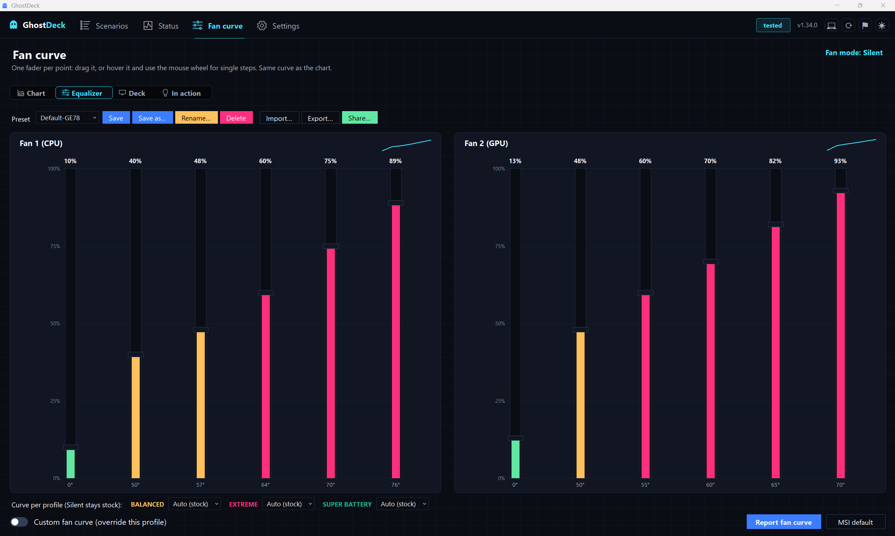
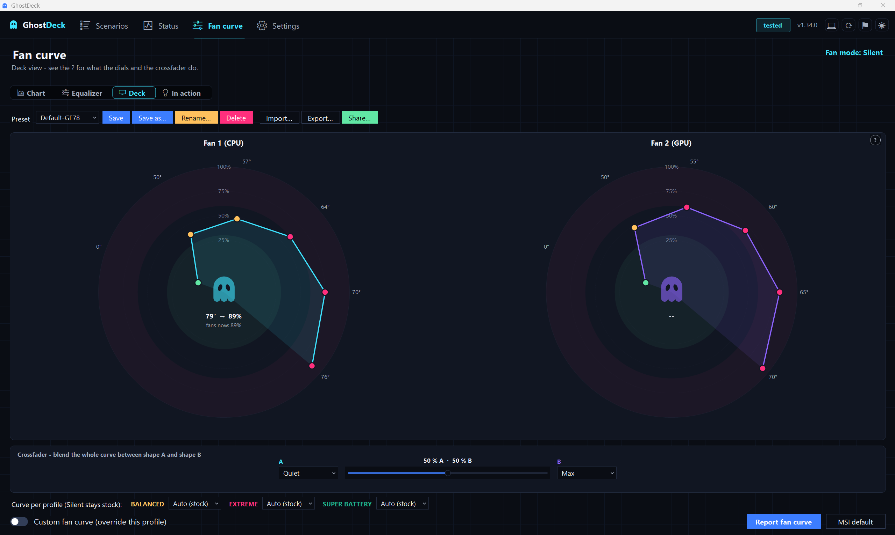
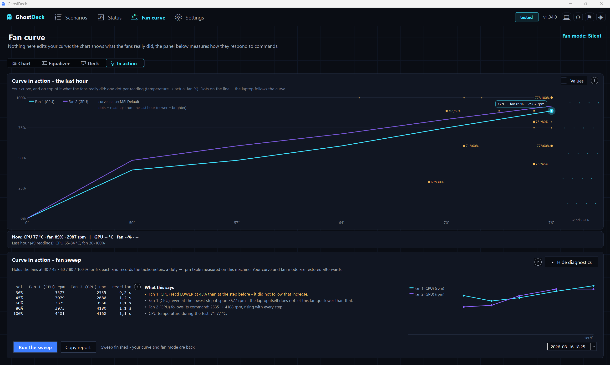
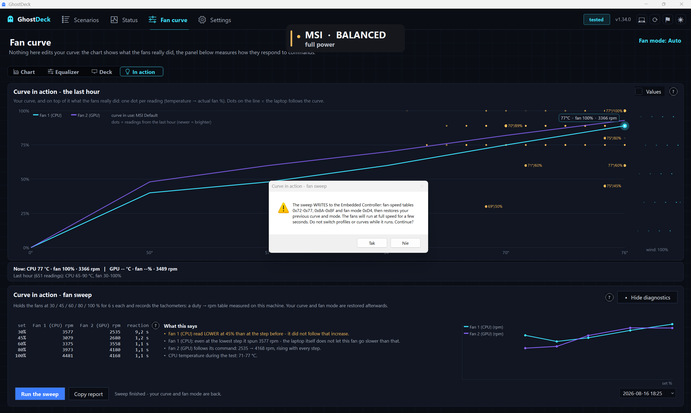

# Fan curve page

Everything the Fan curve tab does, why it does it that way, and where the numbers come from.
[TECHNICAL.md](TECHNICAL.md) §65 is the short version and links here; §17 holds the register
maps this page writes through, and [RENDERING.md](RENDERING.md) holds the drawing rules it obeys.

Source: [`UI/FanCurvePage.cs`](../UI/FanCurvePage.cs), [`Core/CurveModel.cs`](../Core/CurveModel.cs),
[`Core/FanSweep.cs`](../Core/FanSweep.cs), [`Core/FanSweepHistory.cs`](../Core/FanSweepHistory.cs),
[`UI/FanLiveFeed.cs`](../UI/FanLiveFeed.cs).

---

## 1. One curve, four views

There is exactly ONE curve state on the page: six temperature nodes and six speed nodes per fan
(`_cpuT/_cpuS`, `_gpuT/_gpuS`), matching the six-point tables the EC holds. The four sub-tabs are
four ways of showing and grabbing those same numbers, not four features:

| View | What it is | Edits by |
|---|---|---|
| **Chart** | the drag-the-node graphs plus the extras in §4 | dragging nodes, intent tiles, table cells |
| **Equalizer** | one vertical fader per node, per fan, with a value read-out | dragging faders, mouse wheel |
| **Deck** | a rotary dial per node, live VU bars, and a crossfader between two shapes | vertical drag on a dial, wheel, the crossfader |
| **In action** | what the fans really did, and a measurement of how they answer commands | nothing - this view never edits the curve |

The preset bar, the per-profile assignment row and the on/off switch are shared by the three
editing views. The In-action view hides all of them: it neither edits nor applies anything, so
none of that chrome belongs there.

The last view is remembered in `AppSettings.FanCurveView` (machine-local, like `SettingsSubTab`).

Temperature nodes are fixed the way MSI Center fixes them; the page edits speeds. Every speed
array is kept clamped to 0-100 and non-decreasing left to right (`CurveModel.Monotone`), so no
edit path - drag, wheel, typed cell, intent, blend - can produce a curve that dips.

## 2. What "apply" actually writes

Turning the switch ON writes the two speed tables and engages **Advanced fan mode**
(`FanCurveSpec.AdvancedModeValue`, `0x8D` on the boards we ship). Turning it OFF hands the fans
back to the profile's own behaviour and resets the graph to the factory default.

Three constraints inherited from the hardware, all documented in TECHNICAL §17.5:

- **Silent and a curve cannot coexist.** The Silent power cap and the fan mode share byte `0xD4`
  (Silent `0x1D`, Advanced `0x8D`), so a curve necessarily drops the cap. Apply warns and switches
  the profile to Balanced explicitly rather than leaving the machine in a state that says Silent
  and behaves like Balanced. The same rule is why Silent cannot be assigned a curve in the
  per-profile row (`AssignableProfiles` = Balanced, Extreme, Super Battery).
- **No readback verification.** Writes are not read back and compared. The profile bytes are
  dynamic and gave false failures; see the invariant in TECHNICAL §19.
- **Unverified models may still edit.** `FanCurveSpec.Verified = false` produces a warning line in
  the UI, not a lock. Curve addresses are family-derived and a user with an unverified board is
  exactly the person who can confirm them.

Applied curves are recorded through `AppSettings.RecordActiveCurve` so the rest of the app knows
which curve is live (issue #49).

## 3. CurveModel: the arithmetic, and what it is not

`Core/CurveModel.cs` is pure arithmetic, no EC and no UI:

- `OrdinalX(temps, t)` - where a temperature sits on an **index-spaced** x axis. The charts space
  nodes evenly whatever their temperature, so a live reading has to be interpolated onto that axis.
- `SpeedAt(temps, speeds, t)` - the expected speed at temperature `t`, **linearly** interpolated.
- `Monotone`, `Shift(delta)`, `Blend(a, b, mix)`, `SameShape`.
- `Band(pct)` - audibility band, see §4.
- `IntentShape(intent, factoryDefault, temps)` - see §4.

**The linear interpolation is a model of the firmware, not a measurement.** Nothing in any register
map documents how the EC interpolates between nodes or what hysteresis it applies. Every consumer
of `SpeedAt` labels its output as expected, never as a reading. This is why the In-action view was
rebuilt around real history instead of a simulator: a simulator could only ever redraw the model
back at the reader.

## 4. Chart view

The two graphs (one on single-fan boards) with six draggable nodes each, plus five extras. All are
persisted and all can be switched off:

- **Live operating point + trail.** A dot per chart at the current temperature, placed **on the
  curve line** (the fan's real duty can exceed 100 % of what the curve asks while the firmware
  ramps, and a dot outside the plot area is a drawing bug, not information). The real duty and rpm
  are in the dot's label. An opt-in amber trail shows the last three minutes. A sleeping dGPU
  (temperature 0) shows "no live reading" instead of a dot at 0 °C.
- **Audibility zones** - three faint bands behind the plot: below 30 % quiet, 30-60 % audible,
  above 60 % loud (`CurveModel.QuietMax` / `LoudMin`). Fixed thresholds, described in the UI as
  indicative. A per-model calibration in rpm needs the sweep data of §7 first.
- **Intent tiles** - Quiet / Balanced / Cool / Max. Each is **derived from the model family's own
  factory default**, so nothing is invented per model: Quiet = default −12 pp, Balanced = the
  default, Cool = default +10 pp, Max = the default up to 55 °C then a straight ramp to 100 % by
  70 °C. Clicking loads the shape; the tile matching the current shape is lit; a drag un-lights it.
- **Comparison layers** - chips for the factory default and every saved preset, up to three drawn
  at once as dashed lines (violet / amber / green). Layers only paint, they never edit.
- **Coupled points table** - ONE table under both charts, one row per node index: Temp CPU | % CPU |
  Temp GPU | % GPU | band | vs. MSI default. Hovering a row halos that node on **both** charts;
  clicking a % cell opens an inline `TextBox` (Enter commits, Escape cancels, focus loss commits)
  with the same clamp as a drag. Expanding the table shortens the charts by a fixed amount: it is a
  build-time layout change, not a scroll.

## 5. Equalizer and Deck views

**Equalizer** - one vertical fader per node per fan, the node's temperature under it and its value
above it, with the audibility bands tinting the track. Drag or mouse wheel; the wheel nudges the
fader under the pointer by one point, clamped by its neighbours so the shape stays monotone.

**Deck** - the nodes as **rotary dials**: the needle angle is the node temperature, the filled ring
is the speed, and a ghost mark in the dial's own axis shows the factory default for that node.
Dials carry a live VU bar with the current duty. Under them sits a **crossfader**: pick a shape for
pole A and pole B (the four intents, or any saved preset) and the fader blends the whole curve
between them node by node (`CurveModel.Blend`), 0 = all A, 100 = all B. Picking the same shape on
both poles is guarded, since a crossfader between two identical shapes does nothing.

Both views edit the same arrays as the chart and are subject to the same monotone invariant.

## 6. In-action view: what the fans really did

This view answers two different questions with two blocks.

**Last hour** (top card). Your curve is drawn as the line; over it goes one dot per real reading
from the last hour (`HwHistory`), placed at (temperature → the duty the fan actually ran at). Newer
dots are brighter. Hovering a dot shows its values, clicking pins the label, and the **Values**
switch turns every label on at once - labelling all of them by default was a wall of text. Under
the chart: the current readings and the hour's range. On the right, "airflow particles" run at a
speed set by the **current real fan duty** - a wind gauge, not a simulation.

The curve's own line is labelled with which curve is in use (a preset name, "MSI default", or
"custom"), because the reader needs to know what the dots are being compared against.

**Diagnostics** (bottom card, collapsible). The fan sweep of §7 with its explanation, its start
button, the results table, the findings of §8, a mini chart and the history picker.

The panel is never squeezed: on a wide window the table, findings and mini chart sit side by side;
below a threshold they stack and the panel grows, and if the result no longer fits the window, the
view scrolls (§10).

## 7. The fan sweep

The one thing on this page that writes to the EC for measurement rather than for control.

The EC has **no "set duty" register**. So each step writes a **flat curve** (every node = the
step's duty) into the same tables the editor uses, with Advanced fan mode engaged. Steps are
30 / 45 / 60 / 80 / 100 %, each held 6 s, with the last 3 one-second readings averaged. During the
settle the code notes when the duty readback first came within ±2 of the command: that is the
**reaction time**.

Recorded per step: commanded %, CPU/GPU duty readback, CPU/GPU rpm where the board has
tachometers, CPU/GPU temperature, reaction time.

Safeguards, all of them deliberate:

- A **consent dialog naming the exact addresses** that will be written and the fan-mode byte.

  
- Only when the app is writable and not simulating.
- **Started from Silent**: the same warning as Apply, plus the profile is switched to Balanced for
  the run and **switched back to Silent afterwards** - unlike Apply, the sweep is a temporary test.
- Runs inside `D.EcSession()`, so the automatic engines and a model-database swap wait for it.
- The previous curve tables and fan mode are restored in a `finally`: on completion, on cancel and
  on exception alike.
- A ChangeLog entry at start and at end.

**History.** Every run is stored in `%APPDATA%\GhostDeck\fan-sweeps.json`, newest first, capped at
30 entries (`FanSweepHistory.Keep`). An entry keeps the steps plus the context needed to read it
later - model, firmware, app version and the findings as the app worded them at the time. The
picker lists runs by date and time and nothing else. Re-exporting an old run uses its **stored**
firmware, app version and findings: a report pasted into an issue must describe the machine as it
was when the run happened.

## 8. How the findings are composed

The block titled "What this says" is generated by `FanSweep.Findings(Result)`, which returns
`(language key, format args)` pairs that the UI renders in the app's language. Deliberately, it
states **facts derived from the numbers and nothing else**: no advice, no guesses at causes, no
"repeat the test" or "report this" - the same numbers always produce the same lines.

For each fan, over the steps where a value exists (rpm when the board has tachometers, otherwise
the duty readback):

| Line | Condition | Colour |
|---|---|---|
| **follows the command** | no step is below 95 % of the previous one; quotes the first and last value | neutral |
| **did not follow** | at least one step fell below 95 % of the previous one; names the % steps where it happened | amber |
| **floor** | the lowest step already spins above 75 % of the top step; quotes that value (tachometer boards only) | neutral |
| **no tachometer reading** | fewer than two steps produced a value on a board that has a tachometer address | neutral |

Across both fans, on tachometer boards: the step with the **largest relative difference** between
the two fans is taken, and if that difference exceeds **35 %** of the larger value, a **gap** line
names the step and both rpm values (amber).

Reaction time: any step settling in **more than 4 s** produces a **slow** line naming those steps
and the worst time (amber). The **first step is skipped** by design - it starts from wherever the
profile left the fans, and spinning up from far away legitimately takes longer.

Then one context line with the CPU temperature range during the test - context, not judgement,
because a sweep at 45 °C and a sweep at 85 °C are not the same experiment.

Finally, if none of the amber lines (drop, gap, slow) fired, one line says the run showed nothing
out of the ordinary. A clean run should say so, not say nothing.

**Why the thresholds are what they are.** 95 % tolerates measurement noise on a 3-sample average
while still catching a fan that stops climbing. 75 % marks a fan whose lowest commanded step is
already near its top - a floor imposed by the firmware, not by our command, which is worth knowing
before anyone concludes the curve is being ignored. 35 % between two fans is far beyond what
different fan sizes and duty curves explain on the models we have data for. 4 s is roughly four
times the ~1 s in which fans normally reach a new level.

## 9. The report

**Copy report** puts a plain-text report on the clipboard: header (date, app version, EC firmware,
model and tier, tachometer addresses or their absence, duration and abort/error state), the step
table, and a final line defining what "reaction" means.

The body stays in **invariant English on purpose**: these reports get pasted into issues and read
by people who do not share the reporter's language. The findings are appended under a marked
heading **in the app's language**, because they are for the person who ran the sweep and are
trivial to delete before pasting.

## 10. Live feed, DPI and scrolling

**Live feed** (`UI/FanLiveFeed.cs`). One 1.5 s timer for the whole page and one worker at a time:
per tick it reads the fan-mode byte plus temperatures and duty (`Ec.ReadMany`), or a full
`TryReadHw` snapshot on boards with tachometers, then hands the sample back with `BeginInvoke` and
keeps a three-minute ring for the trail. `Poll()` is called after every write, so the switch
reflects a change without waiting for the next tick.

**DPI.** The page predates per-monitor DPI handling: the two original charts size themselves off
`Width`/`Height` and use `TextRenderer`, which follows the font. Everything added since goes
through `S(px)` / `Sf(px)` (`DeviceDpi / 96`). A fixed-size widget that skips them looks correct at
100 % and clips every label at 140 %.

**Scrolling.** The In-action view is the only one that can outgrow the window, and it scrolls by
**offsetting its geometry** (`PlayArea` = the content rectangle moved by `-_scrollY`), never by
transforming the `Graphics`. `TextRenderer` ignores `Graphics.TranslateTransform` and
`Graphics.Clip` unless it is explicitly told not to, so a transform-based scroll moves the cards,
curves and dots while every label stays behind - see [RENDERING.md](RENDERING.md) §5.1, which is
the rule for the whole app. Consequences on this page:

- one coordinate space serves painting, child controls and hit tests, so they cannot drift apart;
- the page header is painted **last**, over a repainted band, because overflow cannot be clipped;
- child controls go through `Place()`, which hides anything scrolled out of the viewport (a child
  control paints over its parent and no paint clip applies to it);
- the wheel, a draggable painted scrollbar and clicks on its track all drive the same `_scrollY`;
- WinForms `AutoScroll` is off on this page - it moves child controls on its own, which is a second
  offset on top of the one the page applies.

## 11. What this page does not do

- It does not verify writes by reading back (§2).
- It does not present interpolated values as measurements (§3).
- It does not tell the user what to do about a finding (§8).
- It does not calibrate audibility per model - the bands are fixed thresholds until there is enough
  sweep data across models to do better (§4).
