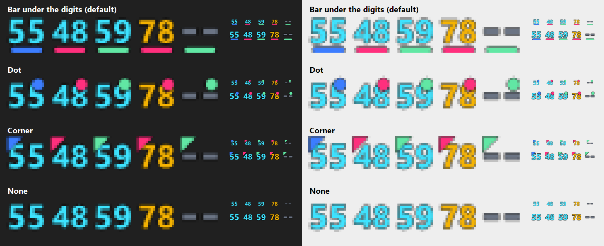
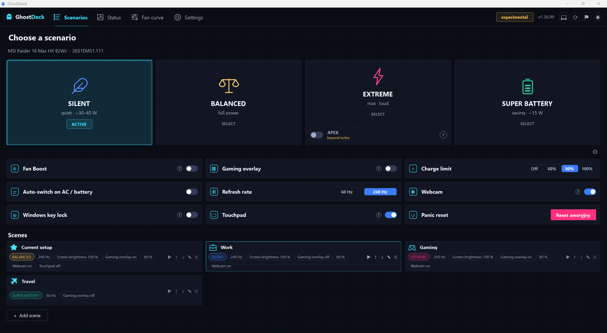
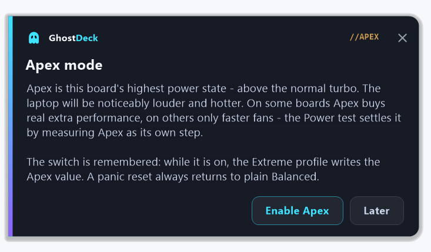
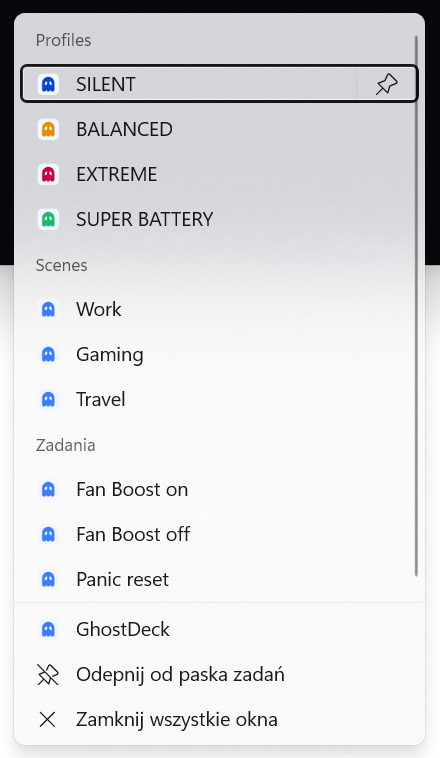

# GhostDeck - FAQ

Common questions about what GhostDeck can and can't do, and how it behaves next to MSI Center.

> *Unofficial project - not affiliated with or endorsed by MSI. "MSI", "MSI Center" and "Cooler Boost" are trademarks of Micro-Star International, used here descriptively only.*

---

## Can I control the fans in profiles other than Extreme?

Yes. GhostDeck has a **Fan curve** tab that runs a custom CPU/GPU curve on **Balanced, Extreme and Super Battery** (MSI Center only lets you in Extreme), and it's fully reversible. There's also **Fan Boost** (both fans to max) that works in any profile, via a click, a tray entry or a hotkey.

The one exception is **Silent**: on this EC the Silent power cap and the "custom curve" mode share the same byte (`0xD4`), so enabling a curve in Silent necessarily drops it to Balanced power - the app warns you first. If what you want is *quiet and low power*, that is exactly what Silent already gives you, and a curve can't beat it without giving up the cap.

## Can I set an exact wattage (a power slider / PL1 / PL2)?

Not the way this app works - and that's actually the core reason it exists. The app doesn't set watts directly: it flips MSI's built-in EC power *modes* (the Silent / Balanced / Extreme presets), and the firmware decides the wattage for each mode. Setting an arbitrary PL1/PL2 number would mean writing Intel's power-limit registers - but on these MSI laptops those are **locked** (MSR is BIOS-locked, MMIO is overridden by Intel DTT). That's exactly why ThrottleStop and Intel XTU can't cap wattage on most of these machines either. MSI's EC doesn't expose a writable power-limit register, and the msi-ec maps don't show one for the boards I've checked - so from software, on a locked machine, a free slider isn't on the table. In practice, **"Silent" is the low-PL policy MSI removed** - on the boards where that cap is real it drops package power from ~100 W to ~30 W under load, verifiable in HWiNFO - so the profiles *are* your power control here. On some models Silent only slows the fans; see [Does Silent lower power on every laptop?](#does-silent-lower-power-on-every-laptop) for how to tell which one you have.

**There is one route to a real slider, though - outside this app.** If your model lets you disable **Overclocking Lock / CFG Lock** in the hidden Advanced BIOS, the MSR power-limit registers open up, and **ThrottleStop** (or Intel XTU) can then set PL1/PL2 directly - that's your actual watt slider. Caveats: (1) on many 13th-gen MSI these BIOS options are greyed out or locked by microcode, so it's not guaranteed; (2) it's a manual, at-your-own-risk change in an unofficial BIOS menu; (3) even after the MSR is unlocked, Intel DTT can still override the limit via MMIO.

## Why don't my changes show up in MSI Center? Can I run both?

You can run both. MSI Center caches its own UI state and doesn't live-read the EC, so it **won't reflect** changes made by anything else - but that's purely a display thing: the change still applies (GhostDeck writes the *exact same* EC bytes MSI Center writes; verify it in HWiNFO). Each app only touches the EC when you actually do something, so they don't fight over it. GhostDeck also **reads live state**, so if you switch a profile in MSI Center, GhostDeck syncs on its own. The only niche caveat: if you enable automatic AC/battery profile switching in **both** apps at once, their automations could ping-pong - but that's off by default here.

## Does GhostDeck work on business laptops with MSI Center Pro?

Yes, the same way as on gaming laptops. Some business laptops (Modern, Prestige, Summit, Creator) come with a separate MSI app, **MSI Center Pro**, which does not install on gaming laptops; others, and all gaming laptops, use **MSI Center**. GhostDeck uses neither of them: it talks to the laptop's embedded controller through MSI's interface in the firmware, and that works the same on both lines. The MSI app only serves as the reference for which values each profile writes on your model.

Business laptops are in the [model list](SUPPORTED_MODELS.md) like any other, five of them are confirmed on hardware by their owners, and GhostDeck has run on MSI Center Pro machines with profiles switching normally ([#77](../../../issues/77), [#170](../../../issues/170)). Where a board's MSI app writes a different value than the usual set, the model's entry writes that value too: on the Modern 14 B11MOU, MSI Center Pro's top scenario uses a different performance value, and GhostDeck uses the same one.

## My MSI app names the scenarios differently. Which one is which?

The names depend on the app, its version and sometimes the model. This is how they match GhostDeck's profiles:

| GhostDeck | MSI Center up to 2.0.48 | MSI Center 2.0.49 and newer | MSI Center Pro |
|---|---|---|---|
| **Silent** | Silent | missing on most models | Silent |
| **Balanced** | Balanced | Balanced | Balanced |
| **Extreme** | Extreme Performance | Extreme Performance | High Performance |
| **Super Battery** | Super Battery | ECO-Silent | Super Battery |

- **ECO-Silent is the old Super Battery**, the lowest-power mode, despite "Silent" in its name. It is not the classic Silent that GhostDeck brings back.
- **MSI AI Engine** is not one of the four, so do not use it for a capture.
- Some models show an **Apex** switch inside the top scenario - see [What is the APEX switch](#what-is-the-apex-switch-on-my-extreme-tile-why-dont-i-see-it).
- If your app has only three of the four, capture the ones it has and say in your report which one is missing.

## GhostDeck worked before, but after a clean Windows install it says "unsupported". Is my laptop no longer supported?

Your laptop is fine - a freshly installed Windows is just missing one piece. Windows needs a small description file (the **MSI WMI schema**, `msiapcfg.dll`) before it will expose MSI's hardware interface as the WMI class GhostDeck talks to, and MSI ships that file **only with its own software** - it is not in the firmware and there is no standalone download.

**The fix: install MSI Center once.** The schema is deployed during installation and the interface appears; after that you can keep MSI Center or uninstall it - measurements show the schema stays behind (it even survives MSI's own cleanup tool), and GhostDeck never needs MSI Center running. GhostDeck deliberately does not deploy the file itself: it is an MSI-signed system component, and redistributing it is not the project's call to make. Full write-up with sources and measurements: [MSI-WMI-SCHEMA.md](MSI-WMI-SCHEMA.md); the original report: [discussion #56](../../../discussions/56).

## Can GhostDeck control my keyboard backlight? Why not on my laptop?

It depends on which of the two backlight designs your machine has, and the difference is in the hardware, not in the app.

**Single-colour or zone backlight.** Brightness is one register in the Embedded Controller, exactly like a power profile, and msi-ec documents it per model. GhostDeck ships that control: off / low / mid / high as a tile on the Scenarios tab, an assignable hotkey (`Ctrl+Alt+F6`, disabled by default), `--kbd` on the command line and a field in scenes. It follows your Fn key, so both stay in sync. Around 82 firmware families are covered; if yours is one of them, the tile simply appears.

**Per-key RGB backlight** (SteelSeries, e.g. Raider GE78HX). The tile does not appear, and that is deliberate. On these machines the keyboard is a **separate device with its own processor**: the Fn brightness key is handled inside that firmware and never tells Windows anything. This was measured, not assumed - the key changes no EC byte, sends no report on any interface with SteelSeries GG both running and closed, and reading the controller's state returns nothing. Tellingly, **SteelSeries' own software has no brightness control either**, and no tool in the world implements one. The only way to try would be to send undocumented commands to the keyboard, and there is a documented case of exactly that permanently killing a laptop's backlight, which reflashing the BIOS did not repair. We are not willing to risk your keyboard for a feature your Fn key already performs perfectly. The full evidence is in [LIGHTING.md](LIGHTING.md).

## What about colours, effects or RGB in general?

Not supported, and it is a stated non-goal of the project. GhostDeck is a power, thermal and fan tool; RGB is a large, per-model, per-keyboard-generation problem with excellent dedicated software already available (SteelSeries GG or MSI Center on Windows, OpenRGB cross-platform). Setting colours on per-key keyboards *is* technically within reach - the protocol is confirmed on real hardware - so ideas like "keyboard colour follows the active profile" sit on the roadmap as a possible future extra. But it would always be opt-in, because writing colours replaces whatever effect your lighting software is running until you re-apply it.

## Can GhostDeck switch the MUX - discrete-GPU direct mode ("独显直连")?

Not yet - and the mechanism deserves a real explanation, because the question keeps coming back (first asked in [#70](../../../issues/70), again in [discussion #88](../../../discussions/88)).

**What the switch actually is.** Discrete / Hybrid on MSI machines is a hardware **MUX** (multiplexer): it physically routes the laptop panel's signal path either through the integrated GPU (hybrid) or straight to the discrete one. MSI documents mode changes as reboot-to-apply ([MSI FAQ](https://us.msi.com/faq/8805), [MSI's MUX explainer](https://uk.msi.com/blog/what-is-mux-switch-what-It-can-do-for-you)), and the reboot is inherent, not laziness: which GPU owns the panel is negotiated between the firmware and the graphics drivers during platform init, so re-routing the panel needs one - on every brand's manual MUX.

**"But ASUS switches without a reboot"** - that is a different mechanism, not a faster MUX. G-Helper's instant Eco/Standard toggle powers the discrete GPU off and on while **staying** in hybrid routing, so no display re-routing happens; its "Ultimate" mode - the actual ASUS MUX - requires a reboot exactly like MSI's ([G-Helper docs](https://deepwiki.com/seerge/g-helper/3.2-gpu-mode-management), [Linux asus-wmi patch](https://lkml.rescloud.iu.edu/2208.1/05680.html)). The only true no-reboot display switching is NVIDIA **Advanced Optimus** - a driver-plus-panel feature on specifically wired laptops, not something a third-party app can trigger.

**Where GhostDeck stands.** The toggle does not live in the Embedded Controller register space this project works in, and none of the community register maps this app builds on (msi-ec, MControlCenter) document it - MSI Center flips it through a different, undocumented mechanism of its own and then asks for the reboot. Writing guesses into hardware is the one thing this project refuses to do, so for a long time the honest answer was "out of scope". That answer is outdated in one respect: **reverse-engineering work on this exact mechanism has been underway here for some time.** It is too early for details or dates - but the topic is no longer closed. Until then, set the mode in MSI Center if you need it; GhostDeck does not touch that mechanism, so the two do not conflict.

## Can it auto-clear RAM when I launch a game?

No, and it's not planned. "Freeing" RAM (trimming working sets or the standby list) doesn't really help modern games: Windows already evicts cached pages on demand, and dumping the standby list can actually *cause* stutter as that data gets re-read. It's also outside what GhostDeck is - an EC power/fan controller, not a system/RAM tweaker.

## I turned on the temperature icons in the tray and nothing appeared

They are there, Windows just hid them. Windows 11 puts every newly registered notification icon into the hidden overflow area (the `^` arrow next to the clock) until you say otherwise. Click the arrow, then drag the temperature icons down onto the taskbar and they stay there. The same happens to the GhostDeck ghost icon on a fresh install. If the overflow area has no temperature icons at all, check Settings -> System, card "Temperature in the tray": the card is hidden entirely on machines whose temperatures the app cannot read.

To tell the icons apart without hovering over them, each one carries a small mark in its own colour - by default a bar under the digits, blue for CPU, pink for GPU and green for SSD (the SSD icon shows the hottest drive). The same card lets you pick a dot, a corner or no mark instead, and change the colours.



## Does Silent lower power on every laptop?

No, and it is worth knowing which kind of machine you have.

Silent writes one byte (`0xD4 = 0x1D`). What the firmware does with it differs by board. On a Raider
GE78HX the profile is a real power policy: package power drops from ~100 W to ~30 W under load and the
machine is measurably slower. On an MSI Sword 16 HX B13V, an owner's power test measured the CPU doing
**the same work in Silent as in Balanced** at the same clocks - the two differed by 0.04 %, against a
second-to-second variation of about 2 % inside each phase - while only the fans came down (3053 vs
3665 rpm) and the CPU ran 3 °C cooler. Same byte, same app, different firmware behaviour.

Neither is a fault, and nothing is being written differently. It matters because it tells you what to
expect: on a "power" board Silent buys quiet by giving up speed, on a "fan-only" board it buys quiet
for free.

One limit of the method is worth stating: each profile is held for 60 s and the last 25 s are averaged,
so a cap that only tightened after several minutes would not show up. What the test does prove on the
spot is that it *can* see a difference - in that same run Extreme came out 12 % ahead, far outside the
noise.

**How to tell, in about five minutes:** tray menu → **Report / verify** → **Power test**. It runs the
same all-core load in Silent, Balanced and Extreme and prints the work each profile completed. If the
Silent row does the same work as Balanced, your board is the fan-only kind. The report says so in as
many words, and it measures Balanced twice so you can see whether the machine simply got hot during
the run.

## What is the APEX switch on my Extreme tile? Why don't I see it?

Some newer boards have one more power state **above** Extreme's normal turbo - the one some MSI Center
versions present as an "Apex" switch inside their top scenario. It is a fifth value of the same EC
register the profiles already use, so GhostDeck treats it the same way: on boards whose database entry
records that value, the Extreme tile grows an **APEX row with a toggle**. While it is on, the Extreme
profile writes the Apex value instead of the normal turbo one, the tile and the on-screen display carry
an APEX badge, and the choice is remembered for that machine. A panic reset always returns to plain
Balanced, Apex or not.



The first time the switch is turned on, one card says what it writes and asks before anything changes:



Whether Apex buys real performance differs by board, and the app measures rather than promises: the
Power test runs Apex as its own step. On the first boards measured it only spun the fans faster
(the Stealth 16 AI+ and Vector 16 HX AI did exactly Extreme's work), but on a Raider 16 Max HX an
owner's clean run measured **+34 % more completed work than Balanced** with Apex, against +16 % for
plain Extreme ([#226](https://github.com/wygodad/ghostdeck/issues/226)) - so on some boards it is the
only way to reach the machine's top state. Expect it to be noticeably louder and hotter either way;
the first enable shows a short explainer card.

If you don't see the row: your board's entry has no recorded fourth value yet. It arrives like every
other model-database update - from an owner's capture, without waiting for a release. If your MSI
Center shows an Apex switch and GhostDeck doesn't, open a model report and we will register it.

## Can GhostDeck turn CPU turbo boost off? What is the Windows power card?

Settings → Power → **Windows power** holds two controls that have nothing to do with the EC. Both are
ordinary Windows power settings, driven through documented Windows APIs, so they work on **any** laptop -
including the ones where GhostDeck cannot reach the EC at all.

**CPU turbo boost.** The switch edits *Processor performance boost mode*, a setting of the active Windows
power plan that Windows ships hidden from its own power options. With it off the processor stays at its
base clock: noticeably cooler and quieter under load, slower at peak. Two things to know:

- **The change lives in the Windows power plan, not in GhostDeck.** Unlike the profiles (which the EC
  forgets on a cold boot), it survives a reboot and stays in effect when the app is closed.
- **Nothing is lost.** Before writing "off" the app saves the plan's previous plugged-in and battery
  values, shows them in the card under *Saved*, and turning the switch back on writes exactly those
  values. The two power sources can also be switched separately - turbo off on battery only, full speed
  when plugged in. *Restore Windows settings* (it appears only while the app holds something to restore)
  puts back every saved plan value and the power mode at once, and lists what comes back before it does.

**Windows power mode.** The same choice as Windows 11's *Settings → System → Power → Power mode*: best
power efficiency, balanced, best performance. Pick one directly, or pick **Auto: profile** and the mode
follows the GhostDeck profile (Silent and Super Battery → efficiency, Balanced → balanced, Extreme →
performance; the pencil next to *Profile mapping* changes that). Windows may override the mode for a
while on its own (battery saver, for instance) - the card then says which mode Windows is applying.

**I removed GhostDeck while turbo was off.** The setting stays off, because it belongs to the Windows
plan. Either start GhostDeck once more and use *Restore Windows settings* (or `GhostDeck.exe --turbo on`),
or put it back from an administrator terminal - `2` is "Aggressive", the usual Windows default:

```
powercfg -setacvalueindex scheme_current sub_processor perfboostmode 2
powercfg -setdcvalueindex scheme_current sub_processor perfboostmode 2
powercfg -setactive scheme_current
```

The footer link *Show it there* makes the hidden setting visible in the Windows power options as well
(Control Panel → Power Options → Change advanced power settings → Processor power management). That is
a permanent change to Windows itself, optional, and GhostDeck does not need it to work.

## The fan speed shows "--" instead of a percentage or RPM. Is it broken?

Usually not, and MSI Center does the same thing on the same machine. Two separate causes:

**The fan is not spinning.** On a cool laptop the firmware stops a fan completely - most often the GPU fan on battery or at idle. A stopped fan has no speed to report: the controller returns nothing, so the app shows "--" rather than inventing a zero. Load the machine for a minute and both numbers come back. A discrete GPU that has powered down also reports no temperature, which is why its whole row can read "--" at once.

**The fan is spinning slower than the register can express.** The tachometer register does not hold RPM, it holds a divisor: RPM = 478000 / value, in a single byte. The lowest speed that can be expressed at all is therefore 478000/255 = **1874 RPM** - below that, whatever sits in the register is not a reading. GhostDeck used to divide it anyway and reported speeds around 9958 RPM (issue #92); since v1.34.0 anything above 8000 RPM - well past the fastest fan ever logged on any model, 7206 - is treated as no reading and shown as "--".

If a fan is audibly roaring and still shows "--", that is worth reporting: open an issue with your model, firmware and what MSI Center or HWiNFO64 shows at that moment.

## The "curve target" ring says 85 %, but the fan speed changes with the profile. Which one is right?

Both are right - they answer different questions. The rpm number under the rings ("CPU: 3581 RPM") is the **measured** fan speed, read from the fan's tachometer; it matches HWiNFO64. The ring ("CPU curve target", "GPU curve target") is the **target from the fan curve**: the curve is a small table "at this temperature, run the fan at this percentage", and the controller shows which entry of that table it picked for the current temperature.

The profile you choose (Silent, Balanced, Extreme) then limits how fast the fan may actually go. Example from a GE76 Raider under the same heavy load: the ring stays at 85 % in all three profiles, while the fan runs at about 2800 rpm in Silent, 3580 rpm in Balanced and 5065 rpm in Extreme. On many boards Balanced stops the CPU fan at about 3560 rpm whatever the curve asks for. When the curve asks for less than that limit, the fan follows the ring.

The ring's scale goes up to 150 %, the same scale MSI's own fan settings use, and the "?" next to each ring repeats this explanation.

So: for "how fast is my fan spinning", read the rpm. For "how hard does the curve want it to spin at this temperature", read the ring. Up to v1.37 the rings were labelled "CPU fan" / "GPU fan", which suggested a speed; the value itself has not changed. Details and the data behind this: [TECHNICAL.md §76](TECHNICAL.md#76-the-fan-rings-show-the-curve-target-not-the-fan-speed-v138).

## Why does my laptop boot with a different profile than the one I picked? Do settings survive a reboot?

They are not supposed to survive, and that is by design, not a fault. Profiles, fan curves and Fan Boost live in the Embedded Controller's working memory, which is **volatile**: every shutdown or reboot clears it, and the firmware starts the machine with its own defaults, exactly as if no tool had ever run. GhostDeck deliberately flashes nothing permanent - that is what keeps every change fully reversible.

To get your chosen profile back automatically, turn on **Settings → Power → "Restore profile after wake / at startup"** (there is a twin toggle for the fan curve). With it on, the app re-applies the last profile you picked every time it starts and after the machine wakes from sleep; combined with **Start with Windows**, the laptop lands on your profile at every boot. The **"Startup profile"** picker next to the toggle can also pin one fixed profile that wins at every app start, regardless of what ran last (waking from sleep still restores what was active before sleep). One exception: when the AC/battery auto-switch is enabled it takes precedence, since it already decides the profile for each power source.

## Is there any risk of damaging my laptop?

Very low. The app uses MSI's **official WMI interface** (the same channel MSI Center uses), writes only the exact register values MSI's own profiles use, and EC writes are **volatile** - a reboot resets the EC to firmware defaults (nothing is flashed). On an **unrecognized firmware it stays read-only** and writes nothing. The CPU also keeps its own hardware thermal protection that no EC write can disable. Experimental models are opt-in and write only documented mode registers.

## My antivirus / VirusTotal flags GhostDeck.exe - is it malware?

No - but the flag is understandable, and here is how to verify it yourself. GhostDeck ticks several boxes that antivirus heuristics dislike: it's a self-contained single-file exe (it self-extracts the .NET runtime), asks for administrator rights, talks to the Embedded Controller, registers global hotkeys and can update itself. Occasionally a single engine (typically a small one, via a generic "W32.Malware.*" heuristic name) flags it on VirusTotal while all the major engines stay clean - a classic false positive pattern.

One thing GhostDeck **never** does: it does not install or load any kernel driver of its own, and it does not bundle third-party low-level drivers of the WinRing0 class (a known-vulnerable driver family that Microsoft's own security tooling flags on sight in other hardware utilities). The only hardware path is MSI's own signed ACPI/WMI interface, carried by Windows' built-in `wmiacpi.sys` - deployed once by MSI's software, as described in the clean-install question above. If your antivirus ever reports a *driver* alongside GhostDeck, it did not come from us.

Since **v1.24.0 every release is digitally signed**: right-click the exe → Properties → **Digital Signatures** should show **"WYGODA DAWID FENIX INSPIRE"** (the developer's registered business) with a valid timestamp. A correct signature proves the file is an untampered official build; signing also gradually builds SmartScreen reputation, so "unknown publisher" warnings fade over time. Releases before 1.24.0 were unsigned.

Additional checks: compare the SHA-256 with the asset on the [Releases](../../../releases) page (`certutil -hashfile GhostDeck.exe SHA256` in a terminal) - every release is built from the public source by GitHub Actions, so the code that produced the exe is fully auditable, and you can always build it yourself (see the README). If a file claiming to be GhostDeck has no signature (v1.24.0+) or a *majority* of engines flag it, don't run it and tell us - that would not be our build.

## I pinned GhostDeck to the taskbar and Windows blocks it ("An App Control policy has blocked this file")

Nothing is broken - you have run into **Smart App Control**, a Windows 11 security feature that ships enabled on fresh installations. One of the things it blocks is **shortcut files (.lnk) that carry the "downloaded from the internet" marker**, and pinning an app creates exactly such a shortcut behind the taskbar button when the exe still carries that marker. That is why the app starts fine directly while the pinned button fails ([Microsoft's description](https://support.microsoft.com/en-us/windows/security/threat-malware-protection/smart-app-control-has-blocked-an-app-with-a-dangerous-file-extension)).

The fix: unpin the app, right-click the GhostDeck exe → **Properties** → tick **Unblock** at the bottom of the General tab → OK, then pin it again. If the button still fails, also delete the leftover shortcut: Win+R → `%AppData%\Microsoft\Internet Explorer\Quick Launch\User Pinned\TaskBar` → delete `GhostDeck.lnk` → pin again. (First reported in discussion #106.)

## I pinned GhostDeck to the taskbar. Where is the jump list, and why does the pin show a plain icon?

Right-click the GhostDeck taskbar button (or the pinned icon) and the jump list is there: the profiles in your order, every scene, Fan Boost on / off and the panic reset. The button exists while the main window is open; the pinned icon works at any time, also through Win+Alt+<its position on the taskbar>. The tray icon has no jump list - Windows offers that only on the taskbar.



Since 1.38 a pinned GhostDeck shows the icon style you chose in Settings (*Application icon*). A pin made with an older version keeps the plain exe icon and may show up next to the running window as a second button until the next sign-in - GhostDeck brings such a pin under its new identity when it starts, and Windows reads pins again when you sign in. Unpinning and pinning again does it at once.

## Can a Stream Deck, AutoHotkey or a browser bookmark switch my profile?

Yes - as a link: `ghostdeck://profile/silent`, `ghostdeck://scene/Gaming` (spaces as `%20`), `ghostdeck://fanboost/on/300`, `ghostdeck://refresh/max`, `ghostdeck://panic` and every other state-changing command of the [CLI](CLI.md). A Stream Deck *Open* or *Website* action, AutoHotkey's `Run`, the Run dialog (Win+R) or a shortcut launch it directly; a browser asks once whether to open GhostDeck, as it does for any such link. With the app running there is no administrator prompt. The registration lives in your own user profile (Settings → System → *ghostdeck:// links* removes it); `--status`, `--diag` and the maintainer commands are deliberately not reachable from a link, so a web page can never make GhostDeck write a file.

## Why does it ask for administrator (UAC)?

EC access via WMI requires elevation. Launching the app manually shows one UAC prompt; the *Start with Windows* option uses an elevated scheduled task so there's **no UAC nag at every logon**. Since 1.38 the exe no longer demands administrator rights by itself: the app asks for them when it starts for real, and a launch that only hands a command to the already running app (a jump-list entry, a `ghostdeck://` link, `GhostDeck.exe --profile Silent` from a script, a second double-click on the exe) runs without any prompt. A command run with no app running still prompts once, because it has to talk to the EC itself.

## Print Screen / screenshot tools do nothing while the GhostDeck window is focused

A side effect of the answer above. GhostDeck runs elevated, and Windows isolates elevated windows from normal-privilege programs: keys you press while an elevated window has focus are invisible to the helpers that make screenshots happen (the Print Screen → Snipping Tool trigger, clipboard managers, capture hotkeys of other tools). Click the desktop, the taskbar or any other window first and the same key works again - or run your screenshot tool as administrator. The window itself is perfectly capturable; only the key press is being isolated.
