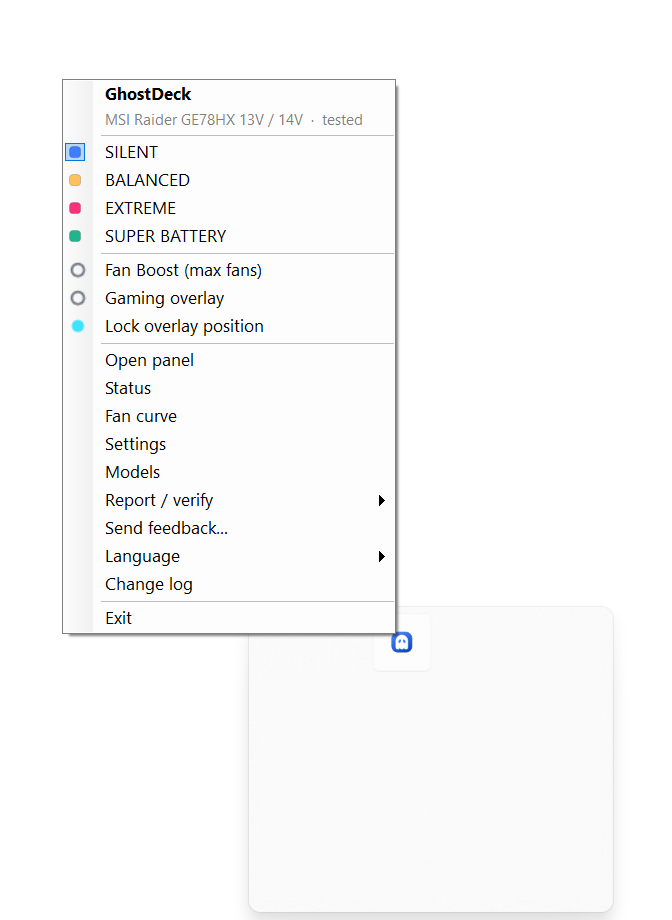
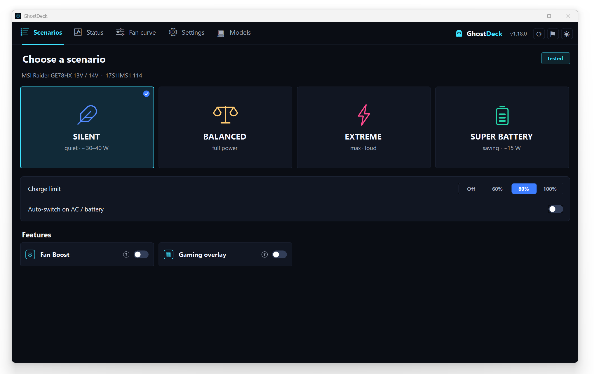
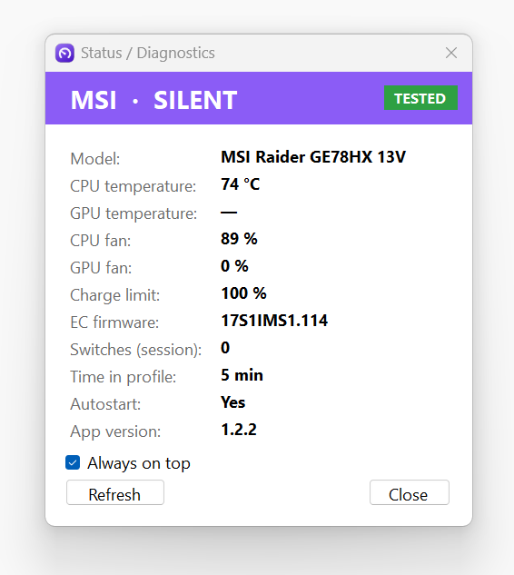
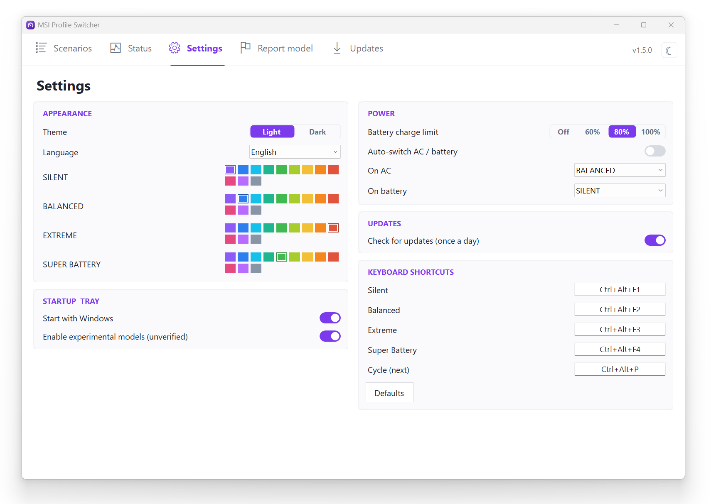
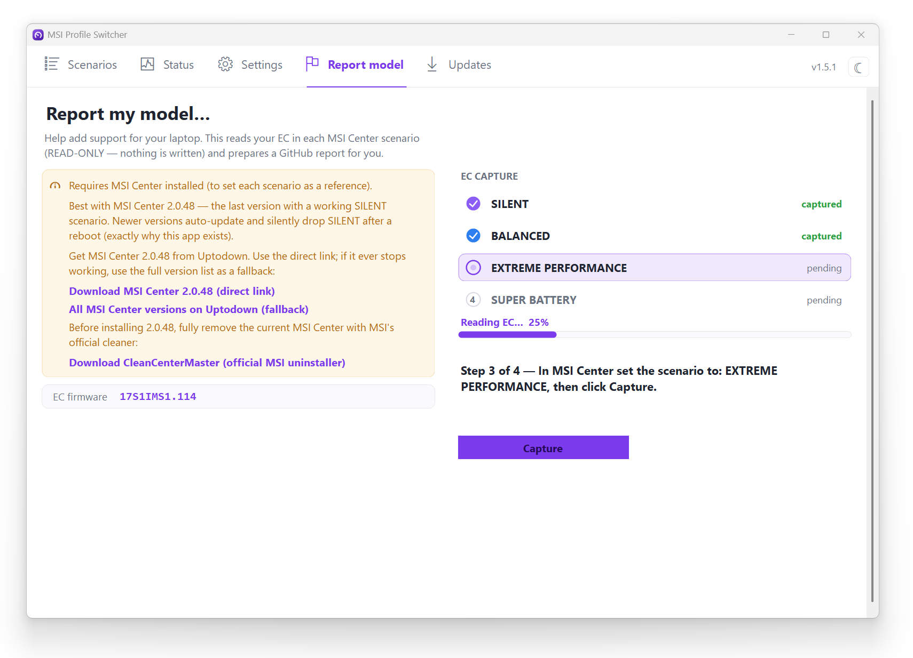
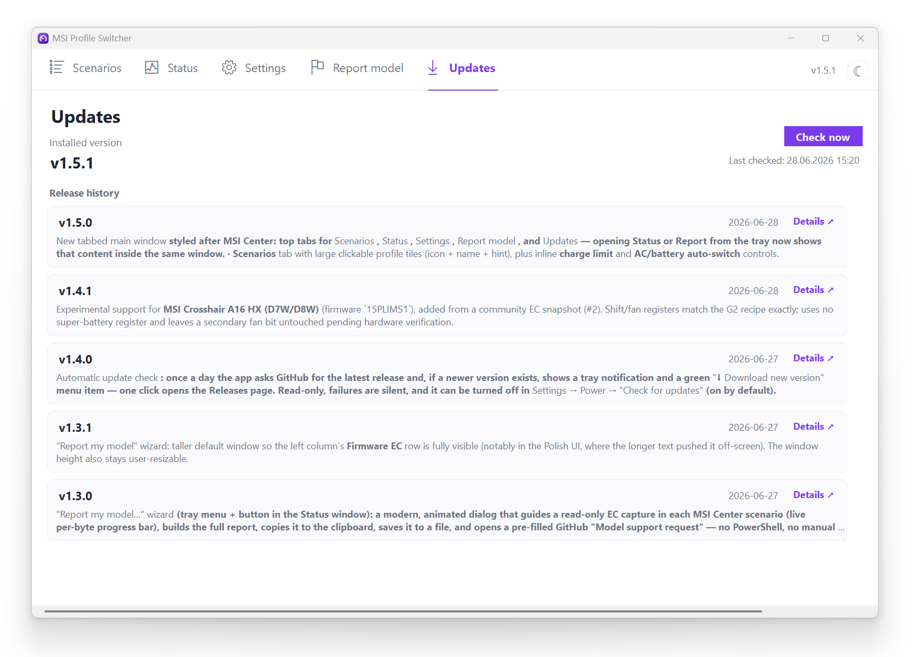
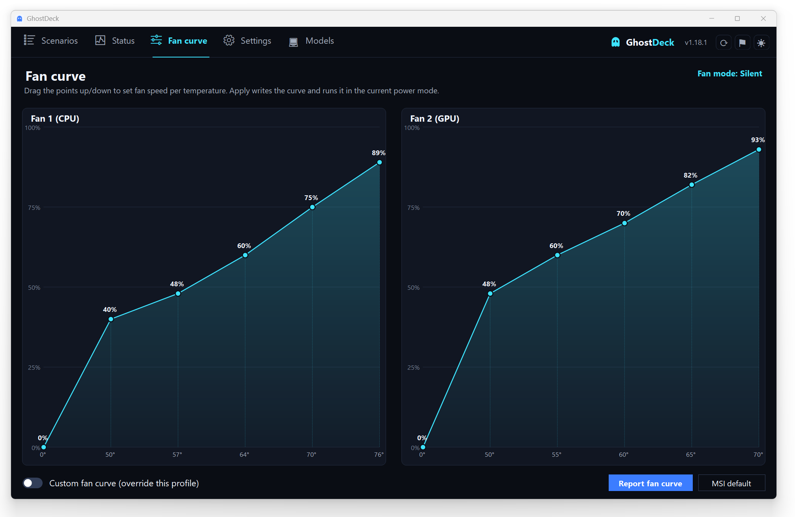
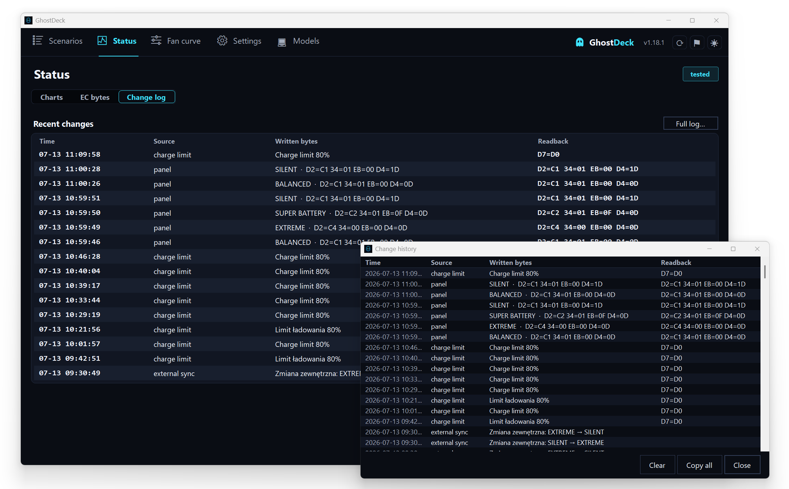
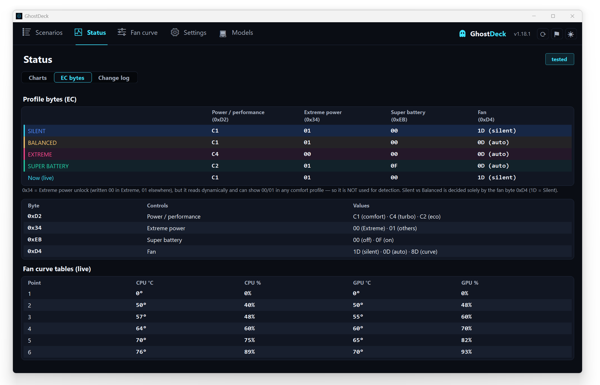

# MSI GE78HX — Restoring the "Silent" profile via the WMI EC interface

> Full per-firmware list of every recognised model: [SUPPORTED_MODELS.md](SUPPORTED_MODELS.md).
>
> *Unofficial project - not affiliated with or endorsed by MSI. "MSI", "MSI Center" and "Cooler Boost" are trademarks of Micro-Star International, used here descriptively only.*

Full documentation of the problem, the diagnostics, and the solution.
Work date: **2026-06-25**.

---

## 0. TL;DR

- **The problem:** MSI Center 2.0 (a regression from ~February 2025) removed the **Silent** profile. Only these were left: Super Battery (~15 W, too slow), Balanced (~62–75 W, fans scream), Extreme (loud). A quiet-but-usable ~38 W profile was missing.
- **Why ThrottleStop didn't help:** on this laptop the firmware holds a hard lock — the MSR power-limit register is locked by the BIOS, and MMIO is overwritten by Intel DTT. From Windows you cannot cap power with the classic tools.
- **Interim fix:** downgrade to **MSI Center 2.0.48** (still has Silent) + a durable block on auto-update.
- **Final solution (this repo):** set Silent **directly through MSI's official WMI interface** (`root\wmi` → `MSI_ACPI` → `Set_Data`), writing to the EC exactly the bytes MSI Center writes for Silent. Works on **any MSI Center version**, **without a driver**, **without RW-Everything**, **without disabling any security**.
- **Confirmed result:** under load PKG Power drops from **104 W → ~30 W**, fully reversible.

---

## 1. Hardware and system

| | |
|---|---|
| Model | **MSI Raider GE78HX 13VH** |
| Board | MS-17S1 |
| CPU | Intel Core **i9-13950HX** |
| BIOS | **E17S1IMS.114** (2025-10-16) |
| EC firmware | **17S1IMS1.114** |
| OS | Windows 11 Home 26200 |
| Environment | Docker Desktop + WSL2 active (→ hypervisor/VBS on) |

---

## 2. The problem

In **MSI Center 2.0**, MSI changed "User Scenario" and **cut the Silent profile**, replacing the lot with the "MSI AI Engine" etc. On the GE78HX, three extremes remained — all useless for quiet office/dev work:

| MSI profile | Real CPU draw | Problem |
|---|---|---|
| ECO-Silent / **Super Battery** | ~15 W | too slow, unusable for work |
| **Balanced** | ~62–75 W | fans scream |
| **Extreme Performance** | max | very loud; a manual fan curve doesn't help (CPU hits ~95 °C) |

Goal: get back **Silent** ≈ PL ~40 W, quiet, without daily BIOS fiddling.

This is a **known MSI regression** (confirmed on the MSI forum and in reviews), not a defect of this unit.

---

## 3. What we tried and why it did NOT work (firmware diagnostics)

Everything below was confirmed by measurement on the machine:

### 3.1 ThrottleStop — no real control
From `ThrottleStop.ini` and the TPL window:
- `NoSetPL=0xF` — TS had **power-limit setting disabled** (read-only).
- `MSRLock=0x1` — the **MSR power-limit register is BIOS-locked** (MSR PL1/PL2 stuck at 220 W).
- `SpeedShift=0` — EPP control in TS disabled (hence EPP attempts had no effect).
- Even after enabling TPL and writing via MMIO: **MMIO PL1 reverted to ~113–122 W**, because **Intel DTT overwrites it**. The entered 35/45 W was ignored.

**Conclusion:** MSR locked + MMIO owned by DTT → TS physically cannot cap power.

### 3.2 Stopping Intel DTT services — no effect
`ipfsvc` (Intel Innovation Platform Framework) and `dptftcs` stopped (`Stop-Service`) — **power still overwritten**. The policy is enforced in the kernel/EC, not in the user-mode service.

### 3.3 powercfg — frequency ceiling ignored
The "Maximum processor frequency" (PROCFREQMAX) setting **does not work under Intel Speed Shift / HWP** — the CPU manages its own p-states and ignores the OS limit.

### 3.4 EPP via powercfg — no audible effect
Setting EPP (PERFEPP) to ~75 didn't noticeably change behavior (DTT rules anyway).

### 3.5 RW-Everything — blocked by Windows
Trying the EC tool `RW-Everything` failed with "Driver cannot be loaded".
- Cause: `VulnerableDriverBlocklistEnable = 1` (Microsoft Vulnerable Driver Blocklist).
- Log: CodeIntegrity **Event 3077** — `RwDrv.sys ... did not meet ... code integrity policy`.
- `RwDrv.sys` and old `WinRing0` are on the vulnerable-driver list (abused by ransomware, incl. Akira 2025). They **cannot be loaded** without disabling the protection — which we deliberately avoided.

### 3.6 VBS/Hyper-V context (checked, NOT the cause)
`VirtualizationBasedSecurityStatus=2` (on), `HyperVisorPresent=True` — but because of **Docker Desktop + WSL2**, not Memory Integrity (HVCI off). VBS may affect undervolting (FIVR), **not** power limits. We didn't touch virtualization (the dev environment must keep working).

**Stage conclusion:** without unlocking the OC-lock in the hidden BIOS, you cannot cap power "by force" from Windows. So we took the path of the **legitimate MSI interface**.

---

## 4. Interim solution — downgrade to MSI Center 2.0.48

The Silent profile is not BIOS magic — it's **a ready-made policy that older MSI Center exposed as a button**.

1. Uninstall MSI Center 2.0.70.
2. Install **MSI Center 2.0.48.0** (has Silent → ~38 W, 66–74 °C, quiet).
3. Block auto-update (3 layers):
   - **Durable Store policy:** `HKLM\SOFTWARE\Policies\Microsoft\WindowsStore` → `AutoDownload` (DWORD) = `2`.
     (The in-app Store toggle is non-durable — Windows re-enables it. That was the source of "it updates itself".)
   - In MSI Center: uncheck Auto update for "MSI Center Update (SDK)" and "Features"; "Always update" off.
   - Firewall block on MSI servers.
   - Revert auto-update: `AutoDownload = 4`.

> MSI Center is a **Microsoft Store** app (`9426MICRO-STARINTERNATION.MSICenter`) — that's why blocking MSI's servers didn't stop updates. The UAC prompt at MSI Center launch (publisher Micro-Star, local `MSI Center.exe`) is normal elevation, not an update.

**Backup:** keep the 2.0.48 installer = a "restore button" in a minute.

---

## 5. The breakthrough — MSI's official WMI interface to the EC

Instead of fighting drivers, we checked **how MSI Center talks to the firmware**. It turned out to be **WMI** — no third-party driver at all.

### 5.1 Discovering the classes
In `root\wmi` there is a family of **`MSI_*`** classes: `MSI_ACPI`, `MSI_AP`, `MSI_CPU`, `MSI_Power`, `MSI_System`, `MSI_Device`, `MSI_Software`.

### 5.2 MSI_ACPI methods
Instance: `ACPI\PNP0C14\0_0`. Methods include:
```
Get_EC, Set_EC, Get_Data, Set_Data, Get_Range, Set_Range,
Get_Fan, Set_Fan, Get_Power, Set_Power, Get_Thermal, Set_Thermal, ...
```
- **`Get_Data`** (in/out) = **read** an addressed EC byte.
- **`Set_Data`** (in/out) = **write** an addressed EC byte.
- `Get_EC` (out-only) = returns the **EC firmware version string** (e.g. `17S1IMS1.114` + date/time), not registers.

### 5.3 The buffer format — `Package_32`
The `Data` parameter is the embedded class **`Package_32`** = a single property **`Bytes` : UInt8[32]** (a 32-byte buffer).

**Decoded format:**
- **Read (`Get_Data`):** input `Bytes[0] = address`. Output `Bytes[0] = 01` (OK flag), **`Bytes[1] = value`**.
- **Write (`Set_Data`):** `Bytes[0] = address`, `Bytes[1] = value`.
- Requires administrator privileges.

### 5.4 EC register map (source: the msi-ec project, block `CONF_G2_10`, firmware 17S1IMS1.114)
| Function | Address | Values |
|---|---|---|
| **Shift Mode** | `0xD2` | Eco `0xC2`, Comfort `0xC1`, Turbo `0xC4` |
| **Fan Mode** | `0xD4` | Auto `0x0D`, **Silent `0x1D`**, Advanced `0x8D` |
| **Super Battery** | `0xEB` | mask `0x0F` |
| **Cooler Boost** | `0x98` | bit 7 |

> msi-ec is a Linux kernel driver — we use it **only as hardware documentation** (the EC address map is a property of the chip, not the OS). Nothing from Linux is run.

---

## 6. Measurements — what each scenario actually sets

### 6.1 Snapshot of 4 key addresses (after switching in MSI Center)
| Scenario | 0xD2 | 0xD4 | 0xEB | 0x98 |
|---|---|---|---|---|
| **Silent** | C1 | **1D** | 00 | 02 |
| Balanced | C1 | 0D | 00 | 02 |
| Extreme | C4 | 0D | 00 | 02 |
| Super Battery | C2 | 0D | 0F | 02 |

### 6.2 Full 256-byte EC diff (Silent vs the rest, sensor noise filtered out)
Stable (non-sensor) differences **Silent vs Balanced**:
| Address | Silent | Balanced | role |
|---|---|---|---|
| `0x34` | **00** | 01 | co-flag (see note) |
| `0x89` | **30** | 3C | (later: fan-speed sensor — see §8) |
| `0x91` | **50** | 5F | (later: fan-speed sensor — see §8) |
| `0xD4` | **1D** | 0D | fan mode = Silent |

> **Historical snapshot.** This is the original 2.0.x measurement (Silent `0x34=00`). Later work found `0x34` **floats dynamically** (`00`/`01` in the same profile) and is not what caps Silent — `0xD4=0x1D` is. The current canonical recipe is `0x34=00` **only in Extreme**, `0x01` elsewhere. See §17 and the reviewer notes in §19; do not treat this §6 value as authoritative.

> Purely sensor bytes (change on their own): e.g. `0x46/0x48/0x4A` (voltages/counters), `0x68`, `0x80` (temp), `0xC9/0xCB` (RPM), `0xF4` (temp). Ignored.

### 6.3 Complete scenario "recipes" (corrected — see §8; `0x34` canonicalised per §19)
| Scenario | 0xD2 | 0x34 | 0xEB | 0xD4 |
|---|---|---|---|---|
| **SILENT** | C1 | 01 | 00 | **1D** |
| **BALANCED** | C1 | 01 | 00 | 0D |
| **EXTREME** | C4 | 00 | 00 | 0D |
| **SUPER BATTERY** | C2 | 01 | 0F | 0D |

> `0x34` is dynamic and not what caps Silent (`0xD4=0x1D` is). Values shown are the canonical recipe (`00` only in Extreme); the original 2.0.x measurement caught Silent at `00`. See §19.1.

---

## 7. Write test — proof the power cap lives in the EC

A reversible test script (auto-revert) wrote the Silent recipe in phases while physically on **Balanced**, under **TS Bench** load, watching PKG Power in ThrottleStop:

| Phase | Written | PKG Power | Clock | Temp | Noise |
|---|---|---|---|---|---|
| 1 | `0xD4=1D` | **32 W** | 2.1 GHz | 65 °C | quiet |
| 2 | +`0x34=00` | 28 W | 2.0 GHz | 65 °C | quiet |
| 3 | +`0x89=30,0x91=50` | 27 W | 2.1 GHz | 65 °C | quiet |
| revert | Balanced values | **104 W** | 3.76 GHz | **95 °C** | loud |

**Conclusions:**
- The power cap is **in the EC** and we control it fully via WMI: 104 W → ~30 W under identical load.
- **The key lever is `0xD4=0x1D`** (fan mode = Silent) — the EC firmware ties it to the power cap. Phase 1 alone did it; the rest only fine-tunes.
- Fully **reversible**; during the test MSI Center **did not overwrite** the writes (it doesn't poll the EC in a loop, only on events).

---

## 8. Correction — `0x89`/`0x91` are sensors, not settings

Analysis of msi-ec (CONF_G2_10) showed that `0x89` and `0x91` are **fan-speed read registers** (CPU fan `0x71`, GPU fan `0x89`), **not** settings. In the dumps they differed only because the fans were spinning differently in each scenario. **They were removed from the recipes.** The power cap comes from `0xD4=1D` (+ `0x34`), so Silent works identically and the write is clean (no more false "not accepted").

Extra EC addresses (for the app's Status window): CPU temp `0x68`, GPU temp `0x80`, CPU fan `0x71` (%), GPU fan `0x89` (%), **charge limit `0xD7` = `0x80 | percent`** (10–100).

---

## 9. Final solution — files and usage

Standalone scripts (in the repo: `scripts/`):

| File | Role |
|---|---|
| `Silent.cmd` | double-click → UAC → sets **Silent** |
| `Balanced.cmd` | double-click → UAC → sets **Balanced** |
| `Silent.ps1` / `Balanced.ps1` | logic (EC write via MSI WMI, self-elevation, readback) |
| `Set-MsiProfile.ps1` | `-Mode Silent\|Balanced\|Extreme\|SuperBattery` (set profile from the command line) |
| `diagnostics/msi_ec_snapshot.ps1` | read 4 addresses in each mode (for re-verification) |
| `diagnostics/msi_ec_fulldump.ps1` | full 256-byte EC dump in each mode (for diffing) |
| `diagnostics/msi_silent_TEST.ps1` | phased test with auto-revert (for re-validation) |

**Usage:** double-click `Silent.cmd` → "Yes" at UAC → a window flashes, shows the written bytes, and closes. Profile set, **independent of the MSI Center version**.

### Technical core (to reproduce manually)
```powershell
$inst = Get-CimInstance -Namespace root\wmi -ClassName MSI_ACPI
function WriteEC([byte]$a,[byte]$v){
  $b = New-Object byte[] 32; $b[0]=$a; $b[1]=$v
  $pkg = New-CimInstance -Namespace root\wmi -ClassName Package_32 -ClientOnly -Property @{Bytes=$b}
  [void](Invoke-CimMethod -InputObject $inst -MethodName Set_Data -Arguments @{Data=$pkg})
}
# SILENT:  (0x34 is dynamic; canonical is 0x01 here, 0x00 only in Extreme — see §19.1. 0xD4=1D is what caps power)
WriteEC 0xD2 0xC1; WriteEC 0x34 0x01; WriteEC 0xEB 0x00; WriteEC 0xD4 0x1D
```

---

## 10. Limitations and notes

- **The profile may revert** after clicking a scenario in MSI Center or after sleep/resume. Fix: run Silent again (or use the app, which re-syncs).
- **After a BIOS/EC firmware update** the addresses may change — you must **re-derive the recipe** (procedure below). So: don't update the BIOS without need.
- Requires administrator privileges (hence UAC).
- This is the EC, not flashing — a bad write clears on reboot; the CPU has an independent thermal guard (PROCHOT 95 °C).

---

## 11. Re-derivation procedure after a BIOS update

> **Shortcut:** for adding a *new model* (not re-deriving after a BIOS update), the app's tray
> menu → **Report my model…** automates steps 2–3 below: it captures a full read-only EC dump in
> each MSI Center scenario, diffs them, and opens a pre-filled GitHub issue. The manual flow below
> stays the reference for analysis and for re-derivation after a firmware change.

1. Install MSI Center with a working Silent (or use 2.0.48) — you need a live reference.
2. `pwsh -ExecutionPolicy Bypass -File scripts/diagnostics/msi_ec_fulldump.ps1` → switch scenarios (Silent/Balanced/Extreme/Super Battery).
3. Compare `[SILENT]` vs `[BALANCED]`, filter out sensor noise → new values for `0x34/0xD4` (and possibly new addresses from the current msi-ec).
4. Put the new values into the recipes (`Profiles.cs` in the app, or `Silent.ps1`/`Balanced.ps1`).

---

## 12. Why this solution is safe

- It writes **only the values MSI Center itself sets** for a given scenario — like clicking the button, but over the same channel.
- It uses the **official MSI WMI interface** (ACPI/firmware), not a suspicious driver.
- It **does not disable** the Vulnerable Driver Blocklist or any other security.
- It **does not touch** the BIOS, VBS, Hyper-V, or the Docker/WSL2 environment.
- After each write it **reads back** for verification; it is fully reversible.

---

## 13. Sources

- BeardOverflow/msi-ec — driver and EC register maps: https://github.com/BeardOverflow/msi-ec
- msi-ec.c (config for 17S1IMS1.114, block CONF_G2_10): https://github.com/BeardOverflow/msi-ec/blob/main/msi-ec.c
- Issue #542 — Raider GE78 HX 13V, EC 17S1IMS1.114: https://github.com/BeardOverflow/msi-ec/issues/542
- MSI forum — "MSI Center update has removed silent mode": https://forum-en.msi.com/index.php?threads/msi-center-update-has-removed-silent-mode.409919/
- Microsoft Vulnerable Driver Blocklist: https://learn.microsoft.com/en-us/windows/security/application-security/application-control/app-control-for-business/design/microsoft-recommended-driver-block-rules
- Akira ransomware abuses rwdrv.sys (GuidePoint): https://www.guidepointsecurity.com/newsroom/akira-ransomware-abuses-cpu-tuning-tool-to-disable-microsoft-defender/
- PawnIO (clean alternative ring0 driver, if ever needed): https://poorlydocumented.com/2025/09/replacing-winring0-in-fan-control-with-pawnio/

---

## 14. EC value cheat sheet

```
Addr   Silent  Balanced  Extreme  SuperBattery   Meaning
0xD2    C1       C1        C4        C2            shift mode (Comfort/Turbo/Eco)
0x34    01       01        00        01            dynamic, inferred "Extreme unlock" (00 only in Extreme) — see §19
0xD4    1D       0D        0D        0D            fan mode (Silent/Auto)  <-- KEY (this is what caps Silent)
0x89    —        —         —         —             SENSOR: GPU fan speed (%) - NOT a setting
0x91    —        —         —         —             SENSOR (dynamic) - ignore
0xEB    00       00        00        0F            super battery (mask 0x0F)
0x98    02       02        02        02            (cooler boost bit7 — constant)
```

---

## 15. The native app — `GhostDeck.exe` (C# .NET 8)

A full-featured program that supersedes the PS scripts (kept as a backend/reference).

> **UI rendering internals** (how the Status tab and gaming overlay stay sharp + smooth at any DPI,
> and how the other tabs are drawn) are documented separately in [RENDERING.md](RENDERING.md).

**Download:** the latest `GhostDeck.exe` from the repo's **Releases**. Single-file, self-contained (~154 MB), no install, no .NET required. Build: `dotnet publish -c Release -r win-x64 --self-contained -p:PublishSingleFile=true`.

**Features:**
- Tray icon (color = active profile), menu with 4 profiles, left-click = cycle.
- **8 languages** (EN/PL/DE/FR/ES/中文/PT-BR/RU) — "Language" menu + dropdown in Settings.
- **Per-profile color** — 12 swatches (Settings → Colors); affects the OSD and the icon.
- **Global hotkeys**, rebindable (default Ctrl+Alt+F1–F4 + Ctrl+Alt+P).
- **OSD** "MSI · PROFILE" (profile color, no focus stealing, fade-out).
- **Status window** — live: CPU/GPU temp (`0x68`/`0x80`), fan % (`0x71`/`0x89`), charge limit (`0xD7`), EC firmware, switch count, time in profile, autostart, version.
- **Autostart** = scheduled task (ONLOGON, RL HIGHEST) created/removed from Settings.
- **AC/battery auto-switch** — OFF by default (so it won't collide with MSI), with a profile choice for AC and battery.
- **External sync** — polls the EC every 3 s; if MSI Center/anything changes the profile, the tray/OSD/menu re-sync automatically.
- **Battery charge limit** — Don't change / 100% / 80% / 60% (`0xD7 = 0x80 | %`).
- `requireAdministrator` manifest (EC write); settings in `%AppData%\GhostDeck\settings.json`.

**EC in C#:** `System.Management` → `ManagementClass("root\\wmi","Package_32")` + `MSI_ACPI.Get_Data/Set_Data` (the same channel as the scripts).

**Screenshots:**

| Tray menu | Scenarios |
|:---:|:---:|
|  |  |
| Status | Settings |
|  |  |
| Report my model | Updates |
|  |  |
| Fan curve | Change log |
|  |  |

## 16. Hidden test / discovery tools (Ctrl+Shift+T)

The main window has a hidden developer dialog for probing the EC on new hardware. It is intentionally not shown in the UI; open it with **Ctrl+Shift+T** while the main window is focused (`TestDialog.cs`, wired in `MainForm`).

It provides, all gated on the normal write-safety rules (Tested / opted-in Experimental):

- **RPM finder** — two read-only EC scans at different fan speeds. The fan tachometer is the address whose value changes between scans; `RPM = 478000 / value`. Verified on the Raider GE78HX 13V (`17S1IMS1`): **`0xC9` = CPU fan (Fan 1)**, **`0xCB` = GPU fan (Fan 2)**, within ~1% of MSI Center.
- **Live RPM** — continuous read of `0xC9` / `0xCB` for comparing against MSI Center.
- **Save EC dump to file** — read-only 256-byte dump, used to locate fan-curve table addresses.
- **Silent + Advanced experiment** — writes `0xD4=0x8D` on top of the Silent recipe to check whether the EC honours Advanced fan control outside Extreme (it does on the GE78HX), plus a one-click revert.

Fan-curve tables discovered on `17S1IMS1` (6 points each): CPU temps `0x6A–0x6F`, CPU speeds `0x73–0x78`; GPU temps `0x82–0x87`, GPU speeds `0x8B–0x90`. Advanced fan mode = `0xD4=0x8D`.

## 17. Profile bytes, fan modes, and the fan-curve overlay

This section documents exactly which EC bytes define a profile, how the fan bytes relate to them, and the design problem we hit when adding a custom fan curve (with the fix).

The app surfaces all of this live: the Status tab shows the profile-byte matrix, a legend and the live fan-curve tables, and the Fan curve tab lets you edit the curve.

| | |
|:---:|:---:|
|  |  |
| Status — live profile-byte matrix, legend and fan-curve tables | Fan curve — editable CPU/GPU curve applied on the current profile |

### 17.1 The bytes that make a profile (tested, `17S1IMS1` / GE78HX 13V)

| Byte | Name | What it does |
|------|------|--------------|
| `0xD2` | **Shift mode** (performance level) | The main power/performance state. `0xC1` = comfort, `0xC4` = turbo (max), `0xC2` = eco. |
| `0x34` | **Extreme power unlock** | Written `0x00` in Extreme (lets turbo draw full power) and `0x01` elsewhere — but it reads **dynamically** and can momentarily show `00`/`01` in any comfort profile (e.g. Silent has been observed as both). It is NOT a Silent/Balanced marker and the app never uses it for detection. **Caveat:** the exact firmware purpose of `0x34` is *not officially documented* — "Extreme power unlock" is our empirical label from the observed values (`00` only in Extreme); no msi-ec / MControlCenter source names this byte, so treat the meaning as inferred, not confirmed. |
| `0xEB` | **Super-battery flag** | `0x0F` = deepest battery throttle (lowest performance, longest runtime); `0x00` = off. Not about lighting — it is a performance/power throttle. |
| `0xD4` | **Fan mode / scenario** | Which fan behaviour the firmware runs (see 17.2). On this firmware it also carries the **Silent power policy** — see 17.4. |

Each profile is just a specific combination (verified by diffing full EC dumps of all four MSI Center 2.0.48 scenarios):

| Profile | `0xD2` shift | `0x34` Extreme-unlock | `0xEB` super-batt | `0xD4` fan |
|---------|-------------|------------------|-------------------|------------|
| **Silent** | `0xC1` comfort | `0x01` | `0x00` | `0x1D` silent |
| **Balanced** | `0xC1` comfort | `0x01` | `0x00` | `0x0D` auto |
| **Extreme** | `0xC4` turbo | `0x00` | `0x00` | `0x0D` auto |
| **Super Battery** | `0xC2` eco | `0x01` | `0x0F` on | `0x0D` auto |

The key fact: **Silent and Balanced differ in `0x34`? No — they differ ONLY in `0xD4`** (`1D` vs `0D`). Every other byte, `0x34` included, is identical between them. This is central to the fan-curve story below.

### 17.2 Fan mode values (`0xD4`)

| Value | Meaning |
|-------|---------|
| `0x1D` | **Silent fan** — firmware's built-in quiet fan preset. |
| `0x0D` | **Auto fan** — firmware's normal automatic fan logic. |
| `0x8D` | **Advanced** — firmware reads the editable **curve tables** instead of its built-in logic. |

The fan byte is independent of the profile: you can pair any profile's power bytes with any fan value. For example, Balanced power (`0xC1` + `0x34=0x01`) with the quiet fan preset (`0x1D`) gives "more power, quiet fans" — a mix MSI Center does not offer.

### 17.3 The fan-curve tables

Advanced mode (`0xD4=0x8D`) makes the firmware follow a **single shared curve** stored in EC (NOT per-profile). Two fans, 6 points each, first point is `0°C→0%`:

| Fan | Temp table | Speed table |
|-----|-----------|-------------|
| CPU (Fan 1) | `0x69–0x6E` | `0x72–0x77` |
| GPU (Fan 2) | `0x81–0x86` | `0x8A–0x8F` |

MSI factory default curve (what we measured): CPU `0→0, 50→40, 57→48, 64→60, 70→75, 76→89`; GPU `0→0, 50→48, 55→60, 60→70, 65→82, 70→93`.

There are **no per-profile curve values** — the four profiles use the built-in fan logic via `0x1D`/`0x0D`, not the tables.

### 17.4 What the EC dumps revealed (technical)

We captured full 256-byte EC dumps in all four MSI Center 2.0.48 scenarios and diffed them, ignoring sensor bytes (temps `0x68`/`0x80`, fan duty `0x71`/`0x89`/`0xF4`, tach RPM `0xC9`/`0xCB`, etc.). Two findings settled the design:

1. **`0x34` is the Extreme-unlock flag, not a Silent cap.** It reads `0x00` only in Extreme and `0x01` in Silent, Balanced and Super Battery. An earlier attempt to tell Silent from Balanced by `0x34` was therefore wrong, and our recipes had it backwards (Silent `0x00`, Extreme `0x01`) — now corrected to match (Silent `0x01`, Extreme `0x00`).

2. **Silent's power cap lives in `0xD4` itself.** Silent and Balanced differ in exactly one stable byte — `0xD4` (`1D` vs `0D`). Since Silent measurably caps CPU package power (~100 W → ~30 W) and the only thing that changes is `0xD4`, the cap is bundled into `0xD4=1D`. That byte is not merely "quiet fans" — it is the firmware's Silent *scenario*, power policy included.

The consequence for a custom curve is unavoidable: the curve needs `0xD4=0x8D`, but Silent's power cap *is* `0xD4=0x1D`. **One byte cannot be both.** Applying a curve in Silent necessarily overwrites `1D`, dropping the Silent power policy — the machine genuinely becomes Balanced power with your fan curve. So "a quiet custom curve that still keeps Silent's power cap" is physically impossible on this EC.

### 17.5 The resulting design

- **Profile detection uses `0xD4` only**: `0x1D` = Silent, anything else (`0x0D` auto or `0x8D` curve) = Balanced (with `0xD2` still selecting Extreme `0xC4` / Super Battery `0xC2`). No `0x34` heuristic. When a curve runs, the app correctly shows Balanced — because that is the truth.
- **Recipes match MSI 2.0.48** (`0x34` = `0x00` in Extreme, `0x01` elsewhere) so Extreme actually unlocks full power.
- **The fan curve is positioned as manual fan control that replaces the firmware fan scenario**, not as an add-on to a profile:
  - On **Balanced / Extreme / Super Battery** applying a curve only changes the fans; their power policy (shift / super-battery) is untouched, so it is lossless.
  - On **Silent** applying a curve unavoidably leaves Silent. The app warns the user and switches the profile to Balanced explicitly, so the state stays honest.

### 17.6 In plain language

A profile is two dials: a **power dial** (how much performance and heat the laptop allows) and a **fan dial** (how hard the fans blow). The catch on this laptop is that **"Silent" stores its power dial inside the fan dial** — the same single byte. There is no separate Silent power switch.

A custom fan curve has to take over that same byte. So the moment you set your own curve, the "Silent" setting is gone — the laptop runs at Balanced power with your fans. That is not a bug, it is how the chip is wired; one byte can't hold both "Silent power" and "your curve" at once.

So the app is honest about it: on Balanced, Extreme or Super Battery a curve just changes the fans and nothing is lost; on Silent it warns you that turning on a curve will leave Silent and move you to Balanced. If what you want is quiet *and* low power, that is exactly Silent already, and a curve can't beat it without giving up the cap.

---

### 17.7 Fan Boost / max fans (MSI "Cooler Boost")

> **Naming:** the UI label is **"Fan Boost"** (generic), to avoid using MSI's *Cooler Boost* trademark
> as our own feature name. The register/behaviour below is the same; internal identifiers
> (`DeviceProfile.CoolerBoost`, `cooler_boost` keys) keep the technical name.

Independent of the profile, MSI's **Cooler Boost** forces both fans to full speed for a burst of
cooling (render, a long game). It is a single EC bit: **`0x98`, bit 7 (mask `0x80`)** — the address
msi-ec documents (`cooler_boost`) across the whole G1/G2 range, matching MSI Center's Cooler Boost
button. The app toggles it with a read-modify-write of that one bit (`DeviceProfile.CoolerBoost` /
`CoolerBoostMask`), so no other byte is touched. It is fully reversible (toggle off, or a reboot
resets the EC) and orthogonal to the power/fan profile bytes, so it layers on top of any profile.

Exposed as a checkable tray item, a hotkey (`Cooler Boost`, default `Ctrl+Alt+F5`), an OSD toast and
a small **feature "brick"** on the Scenarios tab (a compact toggle card, extensible for future
per-function toggles). The background poll re-reads `0x98` so the tray checkmark stays in sync if the
firmware or another tool clears it.

**Hardware-confirmed on `17S1IMS1` (GE78HX 13V).** Diagnosed with the hidden test tool (Ctrl+Shift+T
→ "Cooler Boost: snapshot A / compare B") against MSI's own hardware toggle **Fn+↑**: `0x98` reads
`02` normally and `82` with Cooler Boost on (bit 7 set), returning to `02` when off — exactly the
`0x80` mask the code uses. Note the CPU fan **spins down gradually** after switching off (≈10–25 s on
this EC); the disable is immediate at the register, the mechanical wind-down is not. The app's
tooltip warns about this.

## 18. Supported model families (bulk import)

Beyond the tested GE78HX, the app recognises **~134 MSI models**, seeded in bulk from the [msi-ec](https://github.com/BeardOverflow/msi-ec) EC register maps (`msi-ec.c`, the `CONF_*` config blocks) and cross-checked against [MControlCenter](https://github.com/dmitry-s93/MControlCenter), a working Linux app that drives the same EC interface. They fall into two EC families:

| | **G2 family** (~101) | **G1 family** (~33) |
|---|---|---|
| Shift mode | `0xD2` | `0xF2` |
| Fan mode | `0xD4` | `0xF4` |
| Charge limit | `0xD7` | `0xEF` |
| Super-battery | `0xEB` (mask `0x0F`) | usually none (address unknown) |
| Examples | Raider/Vector/Titan HX (13V–14V), Stealth 16-18, Sword/Pulse/Crosshair 16, Katana, Cyborg, Bravo, Modern/Prestige/Summit | older GS/GF/GE/GP, Modern, Alpha, Bravo, Delta, Creator |

The per-profile recipes are the documented MSI shift + fan values (`comfort 0xC1 / turbo 0xC4 / eco 0xC2`, fan `silent 0x1D / auto 0x0D`), identical in shape to §17.1. Every imported model is **`Tier.Experimental`** — opt-in, firmware-gated, never written on an unrecognised firmware.

### 18.1 Fan curve

The G2 family shares one fixed curve-table layout, the same addresses MControlCenter reads/writes for all its models (`src/operate.cpp`): **CPU temp `0x6A` / speed `0x72`, GPU temp `0x82` / speed `0x8A`** (matching the `0x69`/`0x72` + `0x81`/`0x8A` tables measured on `17S1IMS1` in §17.3, the one-byte offset being the `0°C→0%` point). Every G2 model gets the curve tab; `FanCurveSpec.Verified = false` means the **addresses are not yet eyeballed on that exact model**, so the tab shows a caution and marks it unverified. It does **not** block writing (see §19.2 for the rationale): editing is allowed once the Experimental flag is on, exactly like profile switching, and the live preview is the sanity check. The G1 family has a different EC layout and no confirmed curve addresses, so those models are **profiles-only** (no curve tab).

### 18.2 What was deliberately left out

Some msi-ec configs (e.g. several GF75 Thin, GP65/GL65 & GP75/GL75 Leopard, GS75 Stealth, GE63, GT72) document **no Silent fan value** — only auto/basic/advanced. Since restoring Silent is this project's entire reason to exist, those were **not** imported rather than guessing a Silent value (rule: never write an unconfirmed register).

> **Note on `16V1EMS1` (GS66 Stealth):** an earlier import had it as a G2 device (`0xD2`/`0xD4`); msi-ec's `CONF_G1_3` shows it is a **G1** board, so it was corrected to `0xF2`/`0xF4`. A reminder that picking the wrong family writes to the wrong EC registers — hence the conservative, source-driven import.

The full per-firmware list (friendly name → firmware prefix → registers → curve) is the single source of truth in [`Devices.cs`](../Core/Devices.cs).

## 19. Design decisions and rationale (read this before reviewing)

Several things in this codebase look like bugs but are deliberate, decided with the maintainer after hardware testing. A reviewer without this context has already filed findings that were based on wrong assumptions. Read this section first.

### 19.1 `0x34` is dynamic and its purpose is inferred

`0x34` **floats on its own** — the same profile has been read as both `00` and `01` seconds apart. It is **never** used to detect the profile. Its meaning is not documented anywhere (msi-ec / MControlCenter do not name it); "Extreme power unlock" is our empirical label because it reads `00` only in Extreme. The **canonical recipe is `0x34=00` in Extreme, `0x01` in the other three profiles** (matches MSI Center 2.0.48). Older sections (§6/§7/§14 history) recorded Silent `0x34=00`; that was a point-in-time snapshot, not authoritative. Crucially, **`0x34` does not cap Silent — `0xD4=0x1D` does** (§7). So its exact value is functionally irrelevant; we keep it consistent only for tidiness. Do not "fix" it again.

### 19.2 The fan curve is writable on unverified models, by design

`FanCurveSpec.Verified` is **a UI confidence marker, not a write gate.** When `false`, the curve tab shows a caution ("addresses not verified on this model, compare with MSI Center, reversible") and the Models tab shows "unverified", but editing/writing is still allowed once the user enables **Experimental** in Settings, identical to how profile switching is gated. This was a deliberate loosening (earlier the block was hard). Rationale: (1) opt-in Experimental already means the user accepts unverified writes; (2) the fan curve is **fully reversible** — toggle it off and fans return to the profile's automatic control, and a reboot resets the EC; (3) the **live preview is the verification** — if the curve addresses were wrong for a model, the previewed table would be nonsense (non-monotonic, values > 100), and if right it matches MSI Center. The only real risk is 24 bytes landing on wrong EC addresses on a model whose curve layout differs from G2, which the preview surfaces before any write. Do not re-add a hard `Verified` write block.

### 19.3 Silent vs Balanced, and why enabling a curve shows "Balanced"

On this hardware Silent and Balanced differ in **only one byte, `0xD4`** (`1D` vs `0D`); every other byte, `0x34` included, is identical. So the app detects Silent purely by `0xD4=0x1D`. A custom curve sets `0xD4=0x8D`, which erases that single marker, so the profile can no longer be read as Silent. This is a **hardware limit, not a bug**: the fan byte holds either "Silent preset" or "curve", never both. Therefore enabling a curve **intentionally switches the profile to Balanced** (the UI warns first). While a curve runs, the background poll deliberately does not re-guess Silent/Balanced from the EC (it would wrongly flip to Balanced anyway). A known, low-priority gap: external switches to Extreme/Super Battery during an active curve are not synced (they are unambiguous by `0xD2` and could be, if wanted).

### 19.4 No write readback, on purpose

`Ec.Apply` does not read back and verify each byte. This was tried and removed: several target/adjacent bytes are dynamic (`0x34` floats, sensor and RPM registers change on their own), so a readback+compare produced **false "write not accepted" errors**. Do not add blanket readback verification.

### 19.5 `17S2IMS2` shares the Tested `17S1IMS1` entry

`17S2IMS2` (GE78 HX 14V) is grouped with the tested 13V as `Tier.Tested`. It is the **same board** with an identical EC layout (per-scenario dumps confirmed 1:1) and a **14V owner confirmed profile switching works on real hardware** (GitHub issues #3/#4 are the Crosshair A16; the 14V confirmation came via the model thread). It is intentionally not gated behind Experimental. If a future dump shows a divergence, split it into its own entry.

### 19.6 Legacy PowerShell scripts

`scripts/*.ps1` are historical / GE78HX-only diagnostics, kept for reference. They are **not** the backend — the C# app is. They have no firmware gate, so they must not be promoted for general use. Their recipes are kept in sync with `Devices.cs` for consistency only.

### 19.7 The change-history log records a readback, but it is informational

The history log (`ChangeLog`, surfaced in the Status tab and a full-log window) records, per change:
time, source (hotkey / tray / panel / auto AC / fan curve / external sync / charge / cooler boost /
firmware), the **written bytes**, and a **readback** of those same addresses. This readback does
**not** contradict §19.4: it is displayed for diagnostics only and a mismatch is never treated as an
error or retried. Several bytes are dynamic (`0x34` floats, the fan byte can already have moved), so
the readback column is expected to differ sometimes; it exists to help triage model-support reports,
not to verify the write. Do not turn it into a write-verification gate. The log is a bounded ring
buffer persisted to `changelog.json` so it survives a restart and can be attached to a report.

### 19.8 Firmware-change guard blocks only automatic writes

The app stores the last-seen EC firmware (`AppSettings.LastFirmware`). If, on the next start, the EC
firmware string differs, it sets a "firmware changed" state that **pauses automatic writes**
(charge-limit-on-start and AC/battery auto-switch — everything gated by `AutoWritable`) and shows an
"EC firmware changed, verify model again" warning plus a red tray item to acknowledge. Rationale: a
BIOS/EC update can move registers, so silently re-applying auto policies to possibly-shifted
addresses is the risk we avoid. **Manual** profile switches stay enabled — they are an explicit user
action, and the whole point is to let the user re-verify against MSI Center. Acknowledging (or a
first run with no stored firmware) records the current firmware and re-enables auto-writes. This is
deliberately a *soft* guard (auto only), not a full lockout; do not widen it to block manual
switching without discussing the trade-off.

---

## 20. Gaming overlay and extra hardware metrics

### 20.1 The overlay

A detachable, always-on-top HUD (Scenarios tab tile / hotkey `Ctrl+Shift+O`) for use while gaming: a
compact **card** or horizontal **bar** showing live temps, fan RPM, fan %, active profile, Cooler
Boost, CPU/GPU load, RAM/VRAM, battery, CPU clock and the charge limit. Fully configurable in
Settings → **Gaming overlay**: which metrics to show, opacity and size (quick preset chips **and** a
free-drag slider), layout (card/bar), corner position or free drag, background on/off + colour, and
options (always-on-top, lock/click-through, accent = profile colour). All layout is DPI-aware
(scaled by `DeviceDpi`) so it stays correct at 125 % / 150 % etc.

- **Lock / click-through** (`Ctrl+Shift+L`): sets `WS_EX_TRANSPARENT` so the mouse passes to the game
  and the panel can't be dragged. Note the window opacity is capped at `0.99` so WinForms keeps
  `WS_EX_LAYERED` — without it, at 100 % opacity click-through is silently ignored.
- **Background off** uses the form `TransparencyKey` (colour-key the fill) so only text/icons show.
- **Position is remembered** (`OverlayX/Y`); drag or snap to a corner.

### 20.2 Where each metric comes from (and the "no kernel driver" rule)

This project's promise is **no kernel driver, no lowering of Windows security**. That constrains how
we read extra metrics, and it matters doubly for a *gaming* overlay (anti-cheat).

| Metric | Source | Notes |
|--------|--------|-------|
| CPU/GPU temp, fan RPM, fan % | MSI EC via WMI | already the app's core |
| CPU load | `GetSystemTimes` | driver-free |
| RAM used | `GlobalMemoryStatusEx` | driver-free |
| Battery % / charging | `SystemInformation.PowerStatus` | driver-free |
| **GPU load %** | PDH counter `\GPU Engine(*engtype_3D)\Utilization Percentage` (summed) | same source as Task Manager; driver-free |
| **VRAM used** | PDH counter `\GPU Adapter Memory(*)\Dedicated Usage` (summed) | driver-free |
| **CPU clock (approx.)** | PDH `\Processor Information(_Total)\% Processor Performance` × base MHz (registry `~MHz`) | estimate, not an MSR read; driver-free |

All PDH counters are added via **`PdhAddEnglishCounter`** (see `Perf.cs`), so the paths resolve on a
Polish (or any localized) Windows — the English counter names are locale-independent. Everything is
guarded: on any failure the getter returns `-1` and the UI shows `—`. Values are throttled to ~700 ms.

### 20.3 What we did NOT use, and why

Options considered for the "full" set (GPU core clock, exact CPU per-core clock, FPS, frametime):

- **Vendor SDKs (NVAPI / AMD ADLX)** — user-mode, no kernel driver; would give exact GPU core clock,
  VRAM and load. **Deferred**, not rejected: two per-vendor native code paths for a marginal gain
  over the PDH values we already show. Revisit if exact GPU clock is wanted.
- **CPU per-core exact clock (MSR)** — requires a kernel driver (WinRing0). **Rejected**: violates
  the no-driver rule and WinRing0 is flagged by some anti-cheat (Vanguard/EAC) → ban risk in games.
  The PDH `% Processor Performance` estimate covers "is the CPU boosting / throttling?" without it.
- **LibreHardwareMonitor** — one library with rich sensors, but it **loads the WinRing0 kernel
  driver** for CPU/board sensors (same anti-cheat/no-driver conflict), is MPL-2.0 (file-level
  copyleft), heavier, and **provides no FPS/frametime**. **Rejected** as the default path; PDH covers
  GPU load/VRAM driver-free, and NVAPI/ADLX would be the cleaner route for clocks if needed.
- **FPS / frametime** — there is no simple API for another process's FPS. Realistic routes: read
  **RTSS shared memory** (needs the user to run RivaTuner/Afterburner) or **PresentMon/ETW**
  (system-wide Present capture, admin only, no injection). Both are a separate, larger effort;
  **not implemented**. Own Present-hooking is rejected (fragile, anti-cheat risk).

**Implemented now:** GPU load %, VRAM used, CPU clock (approx.), battery — all driver-free (PDH +
Windows APIs). **Planned/optional:** FPS+frametime (RTSS or PresentMon), exact GPU clock (NVAPI/ADLX).

### 20.4 Per-pixel layered rendering (independent background vs content alpha)

The overlay renders **per-pixel** via `UpdateLayeredWindow` onto a 32-bpp premultiplied-ARGB bitmap
(`OverlayForm.RenderLayered`), not through the normal `OnPaint`. `WS_EX_LAYERED` is permanent (set in
`CreateParams`); `Form.Opacity`/`TransparencyKey` are **not** used. This gives, in one design:

- **Independent alpha for background vs content** — two separate sliders (`OverlayOpacity` = content,
  `OverlayBgOpacity` = background), each with quick preset chips. The content is drawn opaque onto its
  own layer, then composited at `contentAlpha`; the rounded background is filled at `bgAlpha`. So you
  can have a barely-there background with fully readable text.
- **Smooth anti-aliased edges** on any game background (grayscale AA on the content layer produces
  correct per-pixel alpha — no chroma-key fringing).
- **A soft drop-shadow** behind the content (the content layer re-drawn as a black silhouette at ~½
  alpha, offset by ~1 px) so text stays legible even with the background off, on light or dark scenes.
- **Perfect rounded corners** from the alpha shape (no `Region` clipping).
- **Natural click-through** — fully transparent pixels pass the mouse to the game by themselves; the
  lock (`WS_EX_TRANSPARENT`) additionally makes the whole window transparent to the mouse.

Compositing order per frame: background (rounded, `bgAlpha`) → shadow → content (`contentAlpha`) →
frame + drag grip. Layout is measured on a screen-DPI `Graphics` and the content/final bitmaps get
`SetResolution(dpi, dpi)`, so point-size fonts render identically to the measured size at any scaling.

**Move vs display mode:** while unlocked (draggable) the panel forces a visible, grabbable surface
(minimum ~43 % fill regardless of the background setting) plus a stronger accent frame and a 3×3 dot
grip, so it can be found and dragged even with the background off; locking restores the configured
background and enables click-through.

### 20.5 Bold-text option for the metric labels

Metric **values** are already `FontStyle.Bold`, but the small **labels** (`CPU`, `GPU`, `Load`, `RAM`
…) render in a muted grey at 9 pt, which becomes hard to read once the overlay is scaled down — users
compared it unfavourably with NVIDIA's HUD. `OverlayBoldText` (settings toggle **Bold text**, default
**on**) switches only the label font family from `Segoe UI` to **`Segoe UI Semibold`**. Semibold is a
distinct installed family, so this is a genuine weight step *lighter* than `FontStyle.Bold` — enough to
lift legibility without making the labels shout over the values. Values/header stay `Bold` either way.
The toggle lives in the overlay **Options** group and is reset by "Restore defaults".

## 21. Sub-tabs and the two report/verify flows

**Sub-tabs (`SubTabs.cs`).** A reusable themed segmented control that splits a page into a few
sub-pages without adding top-level tabs. It's a child control that raises `Changed(int)`; the host
re-lays-out and shows only the active sub-page. Used in two places:

- **Status** — the heavy hand-painted canvas (§4 in RENDERING.md) is split into three sub-pages:
  `Charts` (rings, RAM, metric boxes, details card), `EC bytes` (profile-byte matrix + legend + live
  curve tables) and `Change log`. `SectionHeight(width, sub)` sizes the canvas to the active section
  only, and `Render` branches to `RenderBytes` / `RenderLog` (charts is the default). Content starts at
  a fixed `SecTop` below the title + sub-tab bar; the "Full log…" button is only shown on the log sub-page.
- **Report** — split into `Profiles` (the existing 4-scenario capture) and `Fan curve` (below).

**Report is an icon, not a tab.** To free space in the main strip, Report was moved out of the tab row
to a `⚑` glyph button on the right (next to the theme toggle). `MainForm.ShowReport(sub)` deep-links a
sub-tab; the Models page ("Verify my model" CTA) opens sub 0, the Fan-curve page ("Report fan curve")
opens sub 1, and the tray groups both under a "Report / verify" submenu.

**Fan-curve verification by tracer (`ReportPage`, `curve-support.yml`).** MSI Center only exposes the
curve editor in **Extreme Performance**, so the wizard guides the user there, then asks them to set a
**distinctive, non-default** curve: Fan 1 = `25 35 45 55 65 75`, Fan 2 = `20 30 40 50 60 70`. Because
MSI Center writes the curve into the same EC bytes we read, a single read-only 256-byte dump then
contains those sequences. `FindTracer` scans the whole dump for each run (exact 6-value, else the first
5) and returns the address — this **discovers** the per-model speed-table base, not just confirms a
guess. If the found addresses equal the shipped `FanCurveSpec` (`CpuSpeedBase` / `GpuSpeedBase`) the
model's curve can be marked verified; otherwise the real addresses are reported for review. Using
distinct sequences per fan is what lets us tell the CPU table from the GPU table and rules out a
coincidental match against the (static) default curve.

## 22. Design tokens & brand palette (v1.18)

The UI follows the ghostdeck.dev site palette. Dark mode: bg `#05070B`, surface `#0A0D14`,
card `#111622`, text `#F3F7FF`, muted `#A4ADBD`, border `#232C40`, green `#61E7A4`,
amber `#FFC15D`, danger/pink `#FF2F7D`, violet `#8D63FF`. Light mode keeps the neutral
greys with a blue accent.

Two accent tokens in `Theme.cs` — do not merge them:

- **`Theme.Accent`** — indicator colour (neon cyan `#3DE3FF` dark / blue `#3C7DFF` light).
  For things drawn ON a surface: icons, tab underline, ring gauges, links, badges, wordmark.
- **`Theme.AccentFill`** — fill colour (blue `#3C7DFF`, both modes) for interactive controls
  that carry white text or a white knob: primary buttons, checkboxes, toggles, slider fill,
  segmented controls, drop-down selection. White on cyan fails contrast, hence the split.

`Theme.Violet` (`#8D63FF`) is the secondary data colour (GPU-side gauges). Status badges
(`Ui.Pill`) are outlined chips (1px border + ~10% tint), matching the site's table chips:
tested/positive = Accent, experimental/limited = Amber, unsupported/negative = Red.

Profile colour defaults (Profiles.cs): Silent `#3C7DFF` (blue), Balanced `#FFC15D` (amber),
Extreme `#FF2F7D` (pink), Super Battery `#61E7A4` (green). The swatch palette must
contain every default (the selected-marker compares live `ColorFor`, so "Restore default
colors" in Settings moves the markers without a rebuild). Icon vector sources live in
`assets/icons/*.svg` (32-unit grid) and MUST be kept in sync with `IconPainter.cs` /
`TrayIconFactory.cs` when an icon changes.

**Tables.** `Theme.RowAlt` is a one-step-off-`Card` wash for zebra striping. The shared
table drawer `DrawGrid` stripes odd rows by default (`zebra`), and takes `rowTint` (explicit
per-row fill, wins over zebra) and `rowBar` (per-row left accent bar). The EC-bytes matrix
uses `rowTint` for a gentle per-profile wash (stronger on the active row) + `rowBar` for a
solid profile-colour edge; the active row's bar switches to `Theme.Accent`. The Charts detail
card stripes odd rows the same way (no more divider lines).

## 23. In-app updates (`Updater.cs`, Updates tab)

The daily background check (`Updater.CheckAsync`) compares the GitHub `releases/latest` tag to
the running assembly version. As of v1.18 it also reads the `GhostDeck.exe` **asset** URL + size
so the app can install the update itself instead of only opening the download page.

**Install flow (Updates tab):** *Install vX.Y.Z* → `DownloadAsync` streams the asset next to the
running exe as `GhostDeck.update.exe` (progress bar; size is checked against the release asset
size) → `StartSelfUpdate` → `Application.Exit()`.

**The swap is version-independent — this is the key design point.** A running exe can't overwrite
itself, and the *downloaded* exe can't do the swap either (it might be any version, including one
that predates this feature — an early attempt to run the swap inside the downloaded exe via a
`--finish-update` arg failed exactly because the older downloaded build didn't know that arg and
was killed by the single-instance mutex). So `StartSelfUpdate` writes a tiny **cmd script** to
`%TEMP%\ghostdeck-update.cmd` and launches it hidden (`cmd.exe /d /c`, `CreateNoWindow`). The
script: waits for our PID to exit (`tasklist /fi "PID eq <pid>" /fo csv | find`), `move`s the old
exe to `<target>.bak`, `move`s the downloaded exe onto `<target>`, `start`s it, and deletes
itself. `Program.CleanupAfterUpdate` (delayed 5 s on the next normal start) removes the leftover
`.bak` / `.update.exe`. Failure at any point → fall back to opening the releases page.

**Single instance UX.** Launching the exe while GhostDeck is already running can't start a second
process (named mutex `GhostDeck_SingleInstance`); the second launch instead `Set`s the named event
`GhostDeck_ShowMainWindow`, and a background thread in `TrayContext` brings up the main window — so
double-clicking the exe (or the freshly-swapped one) always shows something.

## 24. Settings backup, thermal alert, panic reset (v1.20)

**Settings export / import (Settings → Backup).** Export serialises the live `AppSettings` to a
user-chosen JSON file (same shape as `settings.json`). Import validates the file first (root must
be a JSON object with a `Language` property — an arbitrary JSON object would otherwise deserialise
into a defaults instance and silently wipe the user's settings), then calls
`AppSettings.ImportFrom`, which mutates the **live** instance in place (the tray context and all
pages hold references to it). Machine-local state is deliberately **not** imported: `LastFirmware`
(the firmware-change guard must keep judging against this machine), the update-check timestamp,
seen notice ids, and the window geometry. After a successful import the page applies language,
theme, autostart, hotkeys/tray menu (`SettingsChanged`), charge limit, and overlay settings, then
rebuilds itself.

**Thermal alert (Settings → Notifications; off by default).** Runs on the existing 3 s tray poll,
*before* the `Writable` gate, so it also works on known-but-locked (Experimental) models; it is a
pure EC read. The read runs off the UI thread (`Task.Run` + `SynchronizationContext.Post`, guarded
by an `Interlocked` busy flag — same reasoning as the Status page's `RefreshAsync`). Trigger:
`max(CpuTemp, GpuTemp)` must stay at/above `TempAlertDegrees` (default 90 °C; UI offers
70–100 °C — the 70/75 steps exist mainly so the alert can be tried without heating the laptop
up first) continuously for
`TempAlertSeconds` (default 10 s); then an OSD toast + tray balloon fire and a `Thermal` entry is
logged. A fixed 5-minute cool-down between alerts keeps a hot gaming session from spamming.
`EnsureDefaults` clamps hand-edited values (60–105 °C, 3–120 s).

**Panic reset hotkey (default Ctrl+Alt+F10).** One press back to a safe stock state: clears the
Fan Boost bit, then applies the **Balanced** recipe. No separate fan write is needed — the recipe
rewrites the fan-mode byte to auto (`0x0D`), which by design also releases a custom fan curve
(`0x8D`) and the Silent cap (`0x1D`). User-initiated, so it works even while the firmware-change
guard is blocking automatic writes. Shows an OSD confirmation and logs under the Hotkey source.
