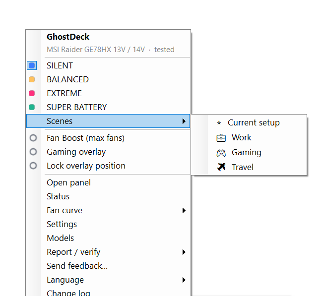
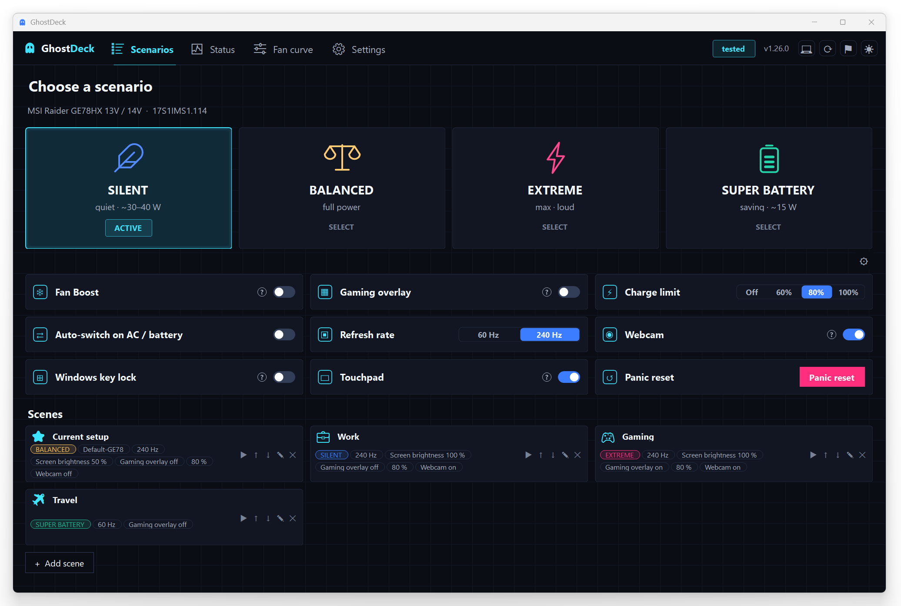
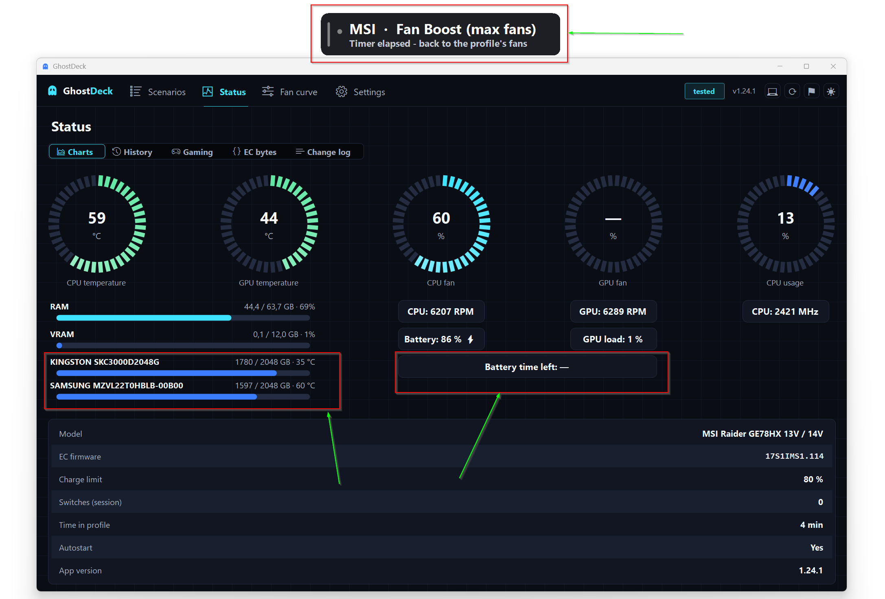
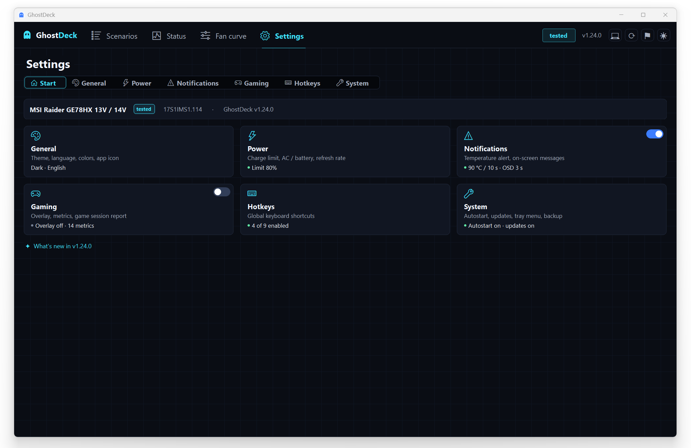
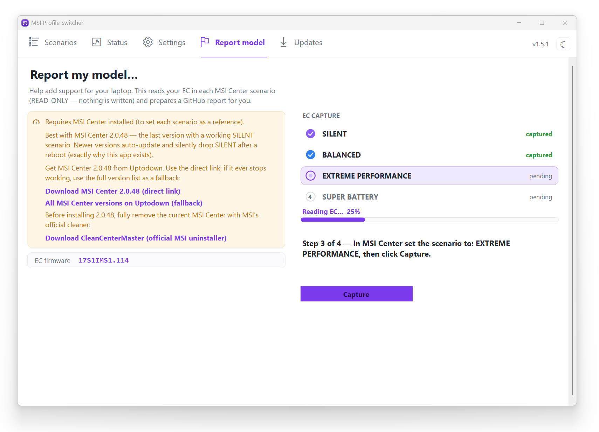
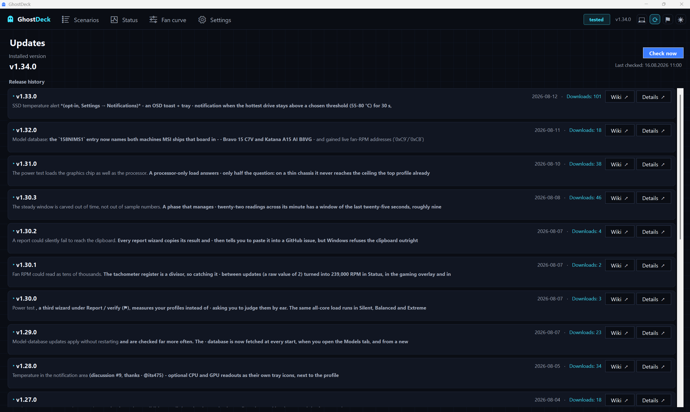
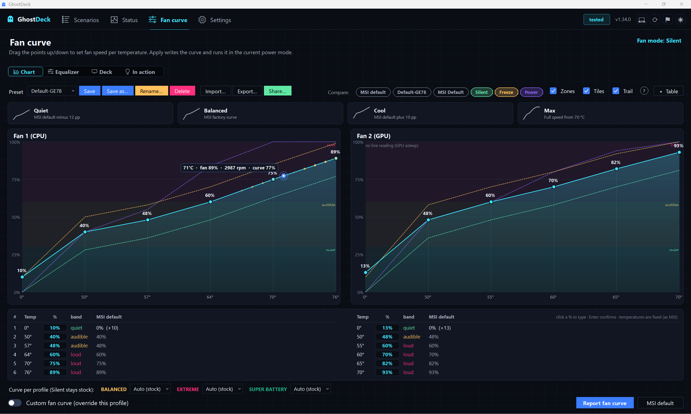
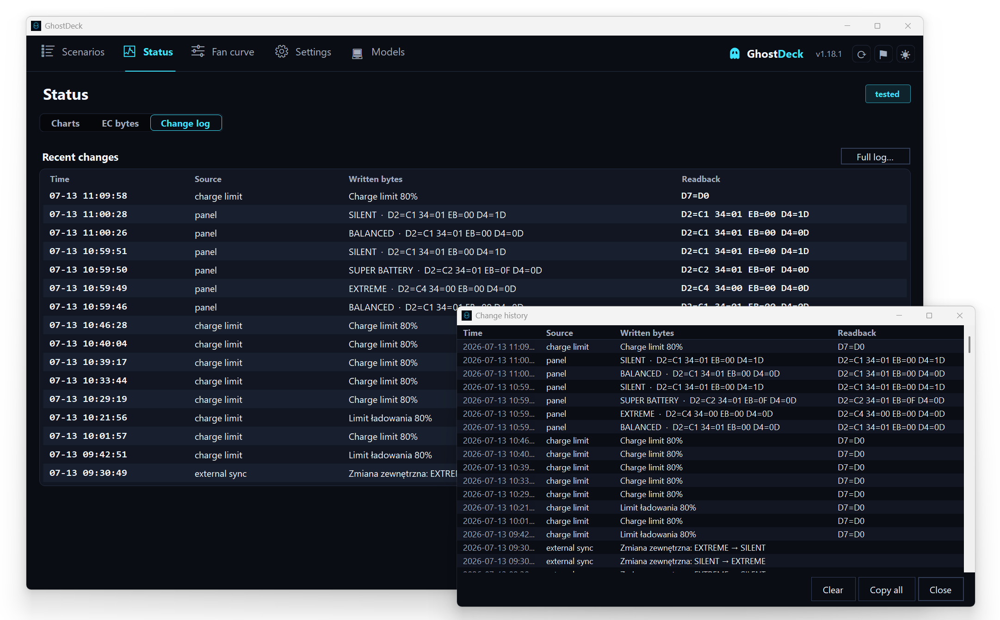
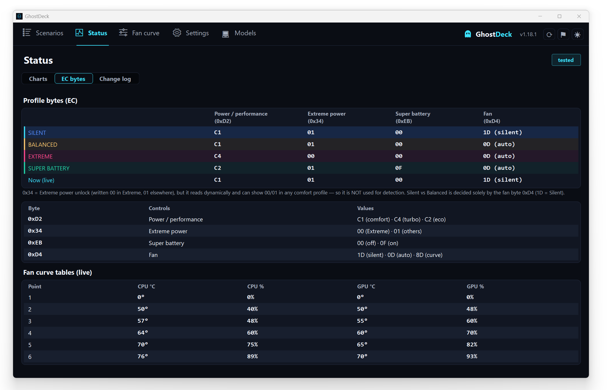

# MSI GE78HX — Restoring the "Silent" profile via the WMI EC interface

> Full per-firmware list of every recognised model: [SUPPORTED_MODELS.md](SUPPORTED_MODELS.md).
>
> *Unofficial project - not affiliated with or endorsed by MSI. "MSI", "MSI Center" and "Cooler Boost" are trademarks of Micro-Star International, used here descriptively only.*

Full documentation of the problem, the diagnostics, and the solution.
Work date: **2026-06-25**.

---

## 0. TL;DR

- **The problem:** MSI Center 2.0 (a regression from ~February 2025) removed the **Silent** profile. Only these were left: Super Battery (~15 W, too slow), Balanced (~62–75 W, fans scream), Extreme (loud). A quiet-but-usable ~38 W profile was missing.
- **Why ThrottleStop didn't help:** on this laptop the firmware holds a hard lock — the MSR power-limit register is locked by the BIOS, and MMIO is overwritten by Intel DTT. From Windows you cannot cap power with the classic tools.
- **Interim fix:** downgrade to **MSI Center 2.0.48** (still has Silent) + a durable block on auto-update.
- **Final solution (this repo):** set Silent **directly through MSI's official WMI interface** (`root\wmi` → `MSI_ACPI` → `Set_Data`), writing to the EC exactly the bytes MSI Center writes for Silent. Works on **any MSI Center version**, **without a driver**, **without RW-Everything**, **without disabling any security**.
- **Confirmed result:** under load PKG Power drops from **104 W → ~30 W**, fully reversible.

---

## 1. Hardware and system

| | |
|---|---|
| Model | **MSI Raider GE78HX 13VH** |
| Board | MS-17S1 |
| CPU | Intel Core **i9-13950HX** |
| BIOS | **E17S1IMS.114** (2025-10-16) |
| EC firmware | **17S1IMS1.114** |
| OS | Windows 11 Home 26200 |
| Environment | Docker Desktop + WSL2 active (→ hypervisor/VBS on) |

---

## 2. The problem

In **MSI Center 2.0**, MSI changed "User Scenario" and **cut the Silent profile**, replacing the lot with the "MSI AI Engine" etc. On the GE78HX, three extremes remained — all useless for quiet office/dev work:

| MSI profile | Real CPU draw | Problem |
|---|---|---|
| ECO-Silent / **Super Battery** | ~15 W | too slow, unusable for work |
| **Balanced** | ~62–75 W | fans scream |
| **Extreme Performance** | max | very loud; a manual fan curve doesn't help (CPU hits ~95 °C) |

Goal: get back **Silent** ≈ PL ~40 W, quiet, without daily BIOS fiddling.

This is a **known MSI regression** (confirmed on the MSI forum and in reviews), not a defect of this unit.

---

## 3. What we tried and why it did NOT work (firmware diagnostics)

Everything below was confirmed by measurement on the machine:

### 3.1 ThrottleStop — no real control
From `ThrottleStop.ini` and the TPL window:
- `NoSetPL=0xF` — TS had **power-limit setting disabled** (read-only).
- `MSRLock=0x1` — the **MSR power-limit register is BIOS-locked** (MSR PL1/PL2 stuck at 220 W).
- `SpeedShift=0` — EPP control in TS disabled (hence EPP attempts had no effect).
- Even after enabling TPL and writing via MMIO: **MMIO PL1 reverted to ~113–122 W**, because **Intel DTT overwrites it**. The entered 35/45 W was ignored.

**Conclusion:** MSR locked + MMIO owned by DTT → TS physically cannot cap power.

### 3.2 Stopping Intel DTT services — no effect
`ipfsvc` (Intel Innovation Platform Framework) and `dptftcs` stopped (`Stop-Service`) — **power still overwritten**. The policy is enforced in the kernel/EC, not in the user-mode service.

### 3.3 powercfg — frequency ceiling ignored
The "Maximum processor frequency" (PROCFREQMAX) setting **does not work under Intel Speed Shift / HWP** — the CPU manages its own p-states and ignores the OS limit.

### 3.4 EPP via powercfg — no audible effect
Setting EPP (PERFEPP) to ~75 didn't noticeably change behavior (DTT rules anyway).

### 3.5 RW-Everything — blocked by Windows
Trying the EC tool `RW-Everything` failed with "Driver cannot be loaded".
- Cause: `VulnerableDriverBlocklistEnable = 1` (Microsoft Vulnerable Driver Blocklist).
- Log: CodeIntegrity **Event 3077** — `RwDrv.sys ... did not meet ... code integrity policy`.
- `RwDrv.sys` and old `WinRing0` are on the vulnerable-driver list (abused by ransomware, incl. Akira 2025). They **cannot be loaded** without disabling the protection — which we deliberately avoided.

### 3.6 VBS/Hyper-V context (checked, NOT the cause)
`VirtualizationBasedSecurityStatus=2` (on), `HyperVisorPresent=True` — but because of **Docker Desktop + WSL2**, not Memory Integrity (HVCI off). VBS may affect undervolting (FIVR), **not** power limits. We didn't touch virtualization (the dev environment must keep working).

**Stage conclusion:** without unlocking the OC-lock in the hidden BIOS, you cannot cap power "by force" from Windows. So we took the path of the **legitimate MSI interface**.

---

## 4. Interim solution — downgrade to MSI Center 2.0.48

The Silent profile is not BIOS magic — it's **a ready-made policy that older MSI Center exposed as a button**.

1. Uninstall MSI Center 2.0.70.
2. Install **MSI Center 2.0.48.0** (has Silent → ~38 W, 66–74 °C, quiet).
3. Block auto-update (3 layers):
   - **Durable Store policy:** `HKLM\SOFTWARE\Policies\Microsoft\WindowsStore` → `AutoDownload` (DWORD) = `2`.
     (The in-app Store toggle is non-durable — Windows re-enables it. That was the source of "it updates itself".)
   - In MSI Center: uncheck Auto update for "MSI Center Update (SDK)" and "Features"; "Always update" off.
   - Firewall block on MSI servers.
   - Revert auto-update: `AutoDownload = 4`.

> MSI Center is a **Microsoft Store** app (`9426MICRO-STARINTERNATION.MSICenter`) — that's why blocking MSI's servers didn't stop updates. The UAC prompt at MSI Center launch (publisher Micro-Star, local `MSI Center.exe`) is normal elevation, not an update.

**Backup:** keep the 2.0.48 installer = a "restore button" in a minute.

---

## 5. The breakthrough — MSI's official WMI interface to the EC

Instead of fighting drivers, we checked **how MSI Center talks to the firmware**. It turned out to be **WMI** — no third-party driver at all.

### 5.1 Discovering the classes
In `root\wmi` there is a family of **`MSI_*`** classes: `MSI_ACPI`, `MSI_AP`, `MSI_CPU`, `MSI_Power`, `MSI_System`, `MSI_Device`, `MSI_Software`.

> Where these class definitions come from - a signed MSI resource DLL deployed with MSI
> Center, which is why a fresh Windows install lacks them until MSI Center is installed
> once - is covered in §62 and [MSI-WMI-SCHEMA.md](MSI-WMI-SCHEMA.md).

### 5.2 MSI_ACPI methods
Instance: `ACPI\PNP0C14\0_0`. Methods include:
```
Get_EC, Set_EC, Get_Data, Set_Data, Get_Range, Set_Range,
Get_Fan, Set_Fan, Get_Power, Set_Power, Get_Thermal, Set_Thermal, ...
```
- **`Get_Data`** (in/out) = **read** an addressed EC byte.
- **`Set_Data`** (in/out) = **write** an addressed EC byte.
- `Get_EC` (out-only) = returns the **EC firmware version string** (e.g. `17S1IMS1.114` + date/time), not registers.

### 5.3 The buffer format — `Package_32`
The `Data` parameter is the embedded class **`Package_32`** = a single property **`Bytes` : UInt8[32]** (a 32-byte buffer).

**Decoded format:**
- **Read (`Get_Data`):** input `Bytes[0] = address`. Output `Bytes[0] = 01` (OK flag), **`Bytes[1] = value`**.
- **Write (`Set_Data`):** `Bytes[0] = address`, `Bytes[1] = value`.
- Requires administrator privileges.

### 5.4 EC register map (source: the msi-ec project, block `CONF_G2_10`, firmware 17S1IMS1.114)
| Function | Address | Values |
|---|---|---|
| **Shift Mode** | `0xD2` | Eco `0xC2`, Comfort `0xC1`, Turbo `0xC4` |
| **Fan Mode** | `0xD4` | Auto `0x0D`, **Silent `0x1D`**, Advanced `0x8D` |
| **Super Battery** | `0xEB` | mask `0x0F` |
| **Cooler Boost** | `0x98` | bit 7 |

> msi-ec is a Linux kernel driver — we use it **only as hardware documentation** (the EC address map is a property of the chip, not the OS). Nothing from Linux is run.

---

## 6. Measurements — what each scenario actually sets

### 6.1 Snapshot of 4 key addresses (after switching in MSI Center)
| Scenario | 0xD2 | 0xD4 | 0xEB | 0x98 |
|---|---|---|---|---|
| **Silent** | C1 | **1D** | 00 | 02 |
| Balanced | C1 | 0D | 00 | 02 |
| Extreme | C4 | 0D | 00 | 02 |
| Super Battery | C2 | 0D | 0F | 02 |

### 6.2 Full 256-byte EC diff (Silent vs the rest, sensor noise filtered out)
Stable (non-sensor) differences **Silent vs Balanced**:
| Address | Silent | Balanced | role |
|---|---|---|---|
| `0x34` | **00** | 01 | co-flag (see note) |
| `0x89` | **30** | 3C | (later: fan-speed sensor — see §8) |
| `0x91` | **50** | 5F | (later: fan-speed sensor — see §8) |
| `0xD4` | **1D** | 0D | fan mode = Silent |

> **Historical snapshot.** This is the original 2.0.x measurement (Silent `0x34=00`). Later work found `0x34` **floats dynamically** (`00`/`01` in the same profile) and is not what caps Silent — `0xD4=0x1D` is. The current canonical recipe is `0x34=00` **only in Extreme**, `0x01` elsewhere. See §17 and the reviewer notes in §19; do not treat this §6 value as authoritative.

> Purely sensor bytes (change on their own): e.g. `0x46/0x48/0x4A` (voltages/counters), `0x68`, `0x80` (temp), `0xC9/0xCB` (RPM), `0xF4` (temp). Ignored.

### 6.3 Complete scenario "recipes" (corrected — see §8; `0x34` canonicalised per §19)
| Scenario | 0xD2 | 0x34 | 0xEB | 0xD4 |
|---|---|---|---|---|
| **SILENT** | C1 | 01 | 00 | **1D** |
| **BALANCED** | C1 | 01 | 00 | 0D |
| **EXTREME** | C4 | 00 | 00 | 0D |
| **SUPER BATTERY** | C2 | 01 | 0F | 0D |

> `0x34` is dynamic and not what caps Silent (`0xD4=0x1D` is). Values shown are the canonical recipe (`00` only in Extreme); the original 2.0.x measurement caught Silent at `00`. See §19.1.

---

## 7. Write test — proof the power cap lives in the EC

A reversible test script (auto-revert) wrote the Silent recipe in phases while physically on **Balanced**, under **TS Bench** load, watching PKG Power in ThrottleStop:

| Phase | Written | PKG Power | Clock | Temp | Noise |
|---|---|---|---|---|---|
| 1 | `0xD4=1D` | **32 W** | 2.1 GHz | 65 °C | quiet |
| 2 | +`0x34=00` | 28 W | 2.0 GHz | 65 °C | quiet |
| 3 | +`0x89=30,0x91=50` | 27 W | 2.1 GHz | 65 °C | quiet |
| revert | Balanced values | **104 W** | 3.76 GHz | **95 °C** | loud |

**Conclusions:**
- The power cap is **in the EC** and we control it fully via WMI: 104 W → ~30 W under identical load.
- **The key lever is `0xD4=0x1D`** (fan mode = Silent) — the EC firmware ties it to the power cap. Phase 1 alone did it; the rest only fine-tunes.
- Fully **reversible**; during the test MSI Center **did not overwrite** the writes (it doesn't poll the EC in a loop, only on events).

---

## 8. Correction — `0x89`/`0x91` are sensors, not settings

Analysis of msi-ec (CONF_G2_10) showed that `0x89` and `0x91` are **fan-speed read registers** (CPU fan `0x71`, GPU fan `0x89`), **not** settings. In the dumps they differed only because the fans were spinning differently in each scenario. **They were removed from the recipes.** The power cap comes from `0xD4=1D` (+ `0x34`), so Silent works identically and the write is clean (no more false "not accepted").

Extra EC addresses (for the app's Status window): CPU temp `0x68`, GPU temp `0x80`, CPU fan `0x71` (%), GPU fan `0x89` (%), **charge limit `0xD7` = `0x80 | percent`** (10–100).

---

## 9. Final solution — files and usage

Standalone scripts (in the repo: `scripts/`):

| File | Role |
|---|---|
| `Silent.cmd` | double-click → UAC → sets **Silent** |
| `Balanced.cmd` | double-click → UAC → sets **Balanced** |
| `Silent.ps1` / `Balanced.ps1` | logic (EC write via MSI WMI, self-elevation, readback) |
| `Set-MsiProfile.ps1` | `-Mode Silent\|Balanced\|Extreme\|SuperBattery` (set profile from the command line) |
| `diagnostics/msi_ec_snapshot.ps1` | read 4 addresses in each mode (for re-verification) |
| `diagnostics/msi_ec_fulldump.ps1` | full 256-byte EC dump in each mode (for diffing) |
| `diagnostics/msi_silent_TEST.ps1` | phased test with auto-revert (for re-validation) |

**Usage:** double-click `Silent.cmd` → "Yes" at UAC → a window flashes, shows the written bytes, and closes. Profile set, **independent of the MSI Center version**.

### Technical core (to reproduce manually)
```powershell
$inst = Get-CimInstance -Namespace root\wmi -ClassName MSI_ACPI
function WriteEC([byte]$a,[byte]$v){
  $b = New-Object byte[] 32; $b[0]=$a; $b[1]=$v
  $pkg = New-CimInstance -Namespace root\wmi -ClassName Package_32 -ClientOnly -Property @{Bytes=$b}
  [void](Invoke-CimMethod -InputObject $inst -MethodName Set_Data -Arguments @{Data=$pkg})
}
# SILENT:  (0x34 is dynamic; canonical is 0x01 here, 0x00 only in Extreme — see §19.1. 0xD4=1D is what caps power)
WriteEC 0xD2 0xC1; WriteEC 0x34 0x01; WriteEC 0xEB 0x00; WriteEC 0xD4 0x1D
```

---

## 10. Limitations and notes

- **The profile may revert** after clicking a scenario in MSI Center or after sleep/resume. Fix: run Silent again (or use the app, which re-syncs).
- **After a BIOS/EC firmware update** the addresses may change — you must **re-derive the recipe** (procedure below). So: don't update the BIOS without need.
- Requires administrator privileges (hence UAC).
- This is the EC, not flashing — a bad write clears on reboot; the CPU has an independent thermal guard (PROCHOT 95 °C).

---

## 11. Re-derivation procedure after a BIOS update

> **Shortcut:** for adding a *new model* (not re-deriving after a BIOS update), the app's tray
> menu → **Report my model…** automates steps 2–3 below: it captures a full read-only EC dump in
> each MSI Center scenario, diffs them, and opens a pre-filled GitHub issue. The manual flow below
> stays the reference for analysis and for re-derivation after a firmware change.

1. Install MSI Center with a working Silent (or use 2.0.48) — you need a live reference.
2. `pwsh -ExecutionPolicy Bypass -File scripts/diagnostics/msi_ec_fulldump.ps1` → switch scenarios (Silent/Balanced/Extreme/Super Battery).
3. Compare `[SILENT]` vs `[BALANCED]`, filter out sensor noise → new values for `0x34/0xD4` (and possibly new addresses from the current msi-ec).
4. Put the new values into the recipes (`Profiles.cs` in the app, or `Silent.ps1`/`Balanced.ps1`).

---

## 12. Why this solution is safe

- It writes **only the values MSI Center itself sets** for a given scenario — like clicking the button, but over the same channel.
- It uses the **official MSI WMI interface** (ACPI/firmware), not a suspicious driver.
- It **does not disable** the Vulnerable Driver Blocklist or any other security.
- It **does not touch** the BIOS, VBS, Hyper-V, or the Docker/WSL2 environment.
- After each write it **reads back** for verification; it is fully reversible.

---

## 13. Sources

- BeardOverflow/msi-ec — driver and EC register maps: https://github.com/BeardOverflow/msi-ec
- msi-ec.c (config for 17S1IMS1.114, block CONF_G2_10): https://github.com/BeardOverflow/msi-ec/blob/main/msi-ec.c
- Issue #542 — Raider GE78 HX 13V, EC 17S1IMS1.114: https://github.com/BeardOverflow/msi-ec/issues/542
- MSI forum — "MSI Center update has removed silent mode": https://forum-en.msi.com/index.php?threads/msi-center-update-has-removed-silent-mode.409919/
- Microsoft Vulnerable Driver Blocklist: https://learn.microsoft.com/en-us/windows/security/application-security/application-control/app-control-for-business/design/microsoft-recommended-driver-block-rules
- Akira ransomware abuses rwdrv.sys (GuidePoint): https://www.guidepointsecurity.com/newsroom/akira-ransomware-abuses-cpu-tuning-tool-to-disable-microsoft-defender/
- PawnIO (clean alternative ring0 driver, if ever needed): https://poorlydocumented.com/2025/09/replacing-winring0-in-fan-control-with-pawnio/

---

## 14. EC value cheat sheet

```
Addr   Silent  Balanced  Extreme  SuperBattery   Meaning
0xD2    C1       C1        C4        C2            shift mode (Comfort/Turbo/Eco)
0x34    01       01        00        01            dynamic, inferred "Extreme unlock" (00 only in Extreme) — see §19
0xD4    1D       0D        0D        0D            fan mode (Silent/Auto)  <-- KEY (this is what caps Silent)
0x89    —        —         —         —             SENSOR: GPU fan speed (%) - NOT a setting
0x91    —        —         —         —             SENSOR (dynamic) - ignore
0xEB    00       00        00        0F            super battery (mask 0x0F)
0x98    02       02        02        02            (cooler boost bit7 — constant)
```

---

## 15. The native app — `GhostDeck.exe` (C# .NET 8)

A full-featured program that supersedes the PS scripts (kept as a backend/reference).

> **UI rendering internals** (how the Status tab and gaming overlay stay sharp + smooth at any DPI,
> and how the other tabs are drawn) are documented separately in [RENDERING.md](RENDERING.md).

**Download:** the latest `GhostDeck-win-x64.exe` from the repo's **Releases**. Single-file, framework-dependent (~2.5 MB), no install; requires the .NET 8 Desktop Runtime. Build: `dotnet publish -c Release -r win-x64 --self-contained false -p:PublishSingleFile=true`.

**Features:**
- Tray icon (color = active profile), menu with 4 profiles, left-click = cycle.
- **15 languages** (EN/PL/DE/FR/ES/中文简体/PT-BR/RU + since v1.34 日本語/한국어/中文繁體/TR/VI/ID/IT) — "Language" menu + dropdown in Settings.
- **Per-profile color** — 12 swatches (Settings → Colors); affects the OSD and the icon.
- **Global hotkeys**, rebindable (default Ctrl+Alt+F1–F4 + Ctrl+Alt+P).
- **OSD** "MSI · PROFILE" (profile color, no focus stealing, fade-out).
- **Status window** — live: CPU/GPU temp (`0x68`/`0x80`), fan % (`0x71`/`0x89`), charge limit (`0xD7`), EC firmware, switch count, time in profile, autostart, version.
- **Autostart** = scheduled task (ONLOGON, RL HIGHEST) created/removed from Settings.
- **AC/battery auto-switch** — OFF by default (so it won't collide with MSI), with a profile choice for AC and battery.
- **External sync** — polls the EC every 3 s; if MSI Center/anything changes the profile, the tray/OSD/menu re-sync automatically.
- **Battery charge limit** — Don't change / 100% / 80% / 60% (`0xD7 = 0x80 | %`).
- `requireAdministrator` manifest (EC write); settings in `%AppData%\GhostDeck\settings.json`.

**EC in C#:** `System.Management` → `ManagementClass("root\\wmi","Package_32")` + `MSI_ACPI.Get_Data/Set_Data` (the same channel as the scripts).

**Screenshots:**

| Tray menu | Scenarios |
|:---:|:---:|
|  |  |
| Status | Settings |
|  |  |
| Report my model | Updates |
|  |  |
| Fan curve | Change log |
|  |  |

## 16. Hidden test / discovery tools (Ctrl+Shift+T)

The main window has a hidden developer dialog for probing the EC on new hardware. It is intentionally not shown in the UI; open it with **Ctrl+Shift+T** while the main window is focused (`TestDialog.cs`, wired in `MainForm`).

It provides, all gated on the normal write-safety rules (Tested / opted-in Experimental):

- **RPM finder** — two read-only EC scans at different fan speeds. The fan tachometer is the address whose value changes between scans; `RPM = 478000 / value`. Verified on the Raider GE78HX 13V (`17S1IMS1`): **`0xC9` = CPU fan (Fan 1)**, **`0xCB` = GPU fan (Fan 2)**, within ~1% of MSI Center.

  **Plausibility ceiling (v1.34.0, issue #92).** Because the divisor is one byte, the register
  cannot express anything below `478000/255` = **1874 RPM**: once a fan slows past that, the value
  left in it is not a reading, and dividing it anyway produced ~9958 RPM in Status and in reports.
  Readings above **8000 RPM** are therefore dropped (shown as "--"); the fastest fan ever logged on
  any model is 7206 RPM, on a GE66 under load with Fan Boost.
- **Live RPM** — continuous read of `0xC9` / `0xCB` for comparing against MSI Center.
- **Save EC dump to file** — read-only 256-byte dump, used to locate fan-curve table addresses.
- **Silent + Advanced experiment** — writes `0xD4=0x8D` on top of the Silent recipe to check whether the EC honours Advanced fan control outside Extreme (it does on the GE78HX), plus a one-click revert.

Fan-curve tables discovered on `17S1IMS1` (6 points each): CPU temps `0x6A–0x6F`, CPU speeds `0x73–0x78`; GPU temps `0x82–0x87`, GPU speeds `0x8B–0x90`. Advanced fan mode = `0xD4=0x8D`.

## 17. Profile bytes, fan modes, and the fan-curve overlay

This section documents exactly which EC bytes define a profile, how the fan bytes relate to them, and the design problem we hit when adding a custom fan curve (with the fix).

The app surfaces all of this live: the Status tab shows the profile-byte matrix, a legend and the live fan-curve tables, and the Fan curve tab lets you edit the curve.

| | |
|:---:|:---:|
|  |  |
| Status — live profile-byte matrix, legend and fan-curve tables | Fan curve — editable CPU/GPU curve applied on the current profile |

### 17.1 The bytes that make a profile (tested, `17S1IMS1` / GE78HX 13V)

| Byte | Name | What it does |
|------|------|--------------|
| `0xD2` | **Shift mode** (performance level) | The main power/performance state. `0xC1` = comfort, `0xC4` = turbo (max), `0xC2` = eco. |
| `0x34` | **Extreme power unlock** | Written `0x00` in Extreme (lets turbo draw full power) and `0x01` elsewhere — but it reads **dynamically** and can momentarily show `00`/`01` in any comfort profile (e.g. Silent has been observed as both). It is NOT a Silent/Balanced marker and the app never uses it for detection. **Caveat:** the exact firmware purpose of `0x34` is *not officially documented* — "Extreme power unlock" is our empirical label from the observed values (`00` only in Extreme); no msi-ec / MControlCenter source names this byte, so treat the meaning as inferred, not confirmed. |
| `0xEB` | **Super-battery flag** | `0x0F` = deepest battery throttle (lowest performance, longest runtime); `0x00` = off. Not about lighting — it is a performance/power throttle. |
| `0xD4` | **Fan mode / scenario** | Which fan behaviour the firmware runs (see 17.2). On this firmware it also carries the **Silent power policy** — see 17.4. |

Each profile is just a specific combination (verified by diffing full EC dumps of all four MSI Center 2.0.48 scenarios):

| Profile | `0xD2` shift | `0x34` Extreme-unlock | `0xEB` super-batt | `0xD4` fan |
|---------|-------------|------------------|-------------------|------------|
| **Silent** | `0xC1` comfort | `0x01` | `0x00` | `0x1D` silent |
| **Balanced** | `0xC1` comfort | `0x01` | `0x00` | `0x0D` auto |
| **Extreme** | `0xC4` turbo | `0x00` | `0x00` | `0x0D` auto |
| **Super Battery** | `0xC2` eco | `0x01` | `0x0F` on | `0x0D` auto |

The key fact: **Silent and Balanced differ in `0x34`? No — they differ ONLY in `0xD4`** (`1D` vs `0D`). Every other byte, `0x34` included, is identical between them. This is central to the fan-curve story below.

Three shift values cover the four profiles, and on most boards that is the whole set. Some newer
boards accept a **fourth** value in the same register, which their MSI Center build presents as a
switch inside the top scenario rather than as a scenario of its own; see §60.

### 17.2 Fan mode values (`0xD4`)

| Value | Meaning |
|-------|---------|
| `0x1D` | **Silent fan** — firmware's built-in quiet fan preset. |
| `0x0D` | **Auto fan** — firmware's normal automatic fan logic. |
| `0x8D` | **Advanced** — firmware reads the editable **curve tables** instead of its built-in logic. |

The fan byte is independent of the profile: you can pair any profile's power bytes with any fan value. For example, Balanced power (`0xC1` + `0x34=0x01`) with the quiet fan preset (`0x1D`) gives "more power, quiet fans" — a mix MSI Center does not offer.

### 17.3 The fan-curve tables

Advanced mode (`0xD4=0x8D`) makes the firmware follow a **single shared curve** stored in EC (NOT per-profile). Two fans, 6 points each, first point is `0°C→0%`:

| Fan | Temp table | Speed table |
|-----|-----------|-------------|
| CPU (Fan 1) | `0x69–0x6E` | `0x72–0x77` |
| GPU (Fan 2) | `0x81–0x86` | `0x8A–0x8F` |

MSI factory default curve (what we measured): CPU `0→0, 50→40, 57→48, 64→60, 70→75, 76→89`; GPU `0→0, 50→48, 55→60, 60→70, 65→82, 70→93`.

There are **no per-profile curve values** — the four profiles use the built-in fan logic via `0x1D`/`0x0D`, not the tables.

### 17.4 What the EC dumps revealed (technical)

We captured full 256-byte EC dumps in all four MSI Center 2.0.48 scenarios and diffed them, ignoring sensor bytes (temps `0x68`/`0x80`, fan duty `0x71`/`0x89`/`0xF4`, tach RPM `0xC9`/`0xCB`, etc.). Two findings settled the design:

1. **`0x34` is the Extreme-unlock flag, not a Silent cap.** It reads `0x00` only in Extreme and `0x01` in Silent, Balanced and Super Battery. An earlier attempt to tell Silent from Balanced by `0x34` was therefore wrong, and our recipes had it backwards (Silent `0x00`, Extreme `0x01`) — now corrected to match (Silent `0x01`, Extreme `0x00`).

2. **Silent's power cap lives in `0xD4` itself.** Silent and Balanced differ in exactly one stable byte — `0xD4` (`1D` vs `0D`). Since Silent measurably caps CPU package power (~100 W → ~30 W) and the only thing that changes is `0xD4`, the cap is bundled into `0xD4=1D`. That byte is not merely "quiet fans" — it is the firmware's Silent *scenario*, power policy included.

The consequence for a custom curve is unavoidable: the curve needs `0xD4=0x8D`, but Silent's power cap *is* `0xD4=0x1D`. **One byte cannot be both.** Applying a curve in Silent necessarily overwrites `1D`, dropping the Silent power policy — the machine genuinely becomes Balanced power with your fan curve. So "a quiet custom curve that still keeps Silent's power cap" is physically impossible on this EC.

### 17.5 The resulting design

- **Profile detection uses `0xD4` only**: `0x1D` = Silent, anything else (`0x0D` auto or `0x8D` curve) = Balanced (with `0xD2` still selecting Extreme `0xC4` / Super Battery `0xC2`). No `0x34` heuristic. When a curve runs, the app correctly shows Balanced — because that is the truth.
- **Recipes match MSI 2.0.48** (`0x34` = `0x00` in Extreme, `0x01` elsewhere) so Extreme actually unlocks full power.
- **The fan curve is positioned as manual fan control that replaces the firmware fan scenario**, not as an add-on to a profile:
  - On **Balanced / Extreme / Super Battery** applying a curve only changes the fans; their power policy (shift / super-battery) is untouched, so it is lossless.
  - On **Silent** applying a curve unavoidably leaves Silent. The app warns the user and switches the profile to Balanced explicitly, so the state stays honest.

### 17.6 In plain language

A profile is two dials: a **power dial** (how much performance and heat the laptop allows) and a **fan dial** (how hard the fans blow). The catch on this laptop is that **"Silent" stores its power dial inside the fan dial** — the same single byte. There is no separate Silent power switch.

A custom fan curve has to take over that same byte. So the moment you set your own curve, the "Silent" setting is gone — the laptop runs at Balanced power with your fans. That is not a bug, it is how the chip is wired; one byte can't hold both "Silent power" and "your curve" at once.

So the app is honest about it: on Balanced, Extreme or Super Battery a curve just changes the fans and nothing is lost; on Silent it warns you that turning on a curve will leave Silent and move you to Balanced. If what you want is quiet *and* low power, that is exactly Silent already, and a curve can't beat it without giving up the cap.

---

### 17.7 Fan Boost / max fans (MSI "Cooler Boost")

> **Naming:** the UI label is **"Fan Boost"** (generic), to avoid using MSI's *Cooler Boost* trademark
> as our own feature name. The register/behaviour below is the same; internal identifiers
> (`DeviceProfile.CoolerBoost`, `cooler_boost` keys) keep the technical name.

Independent of the profile, MSI's **Cooler Boost** forces both fans to full speed for a burst of
cooling (render, a long game). It is a single EC bit: **`0x98`, bit 7 (mask `0x80`)** — the address
msi-ec documents (`cooler_boost`) across the whole G1/G2 range, matching MSI Center's Cooler Boost
button. The app toggles it with a read-modify-write of that one bit (`DeviceProfile.CoolerBoost` /
`CoolerBoostMask`), so no other byte is touched. It is fully reversible (toggle off, or a reboot
resets the EC) and orthogonal to the power/fan profile bytes, so it layers on top of any profile.

Exposed as a checkable tray item, a hotkey (`Cooler Boost`, default `Ctrl+Alt+F5`), an OSD toast and
a small **feature "brick"** on the Scenarios tab (a compact toggle card, extensible for future
per-function toggles). The background poll re-reads `0x98` so the tray checkmark stays in sync if the
firmware or another tool clears it.

**Hardware-confirmed on `17S1IMS1` (GE78HX 13V).** Diagnosed with the hidden test tool (Ctrl+Shift+T
→ "Cooler Boost: snapshot A / compare B") against MSI's own hardware toggle **Fn+↑**: `0x98` reads
`02` normally and `82` with Cooler Boost on (bit 7 set), returning to `02` when off — exactly the
`0x80` mask the code uses. Note the CPU fan **spins down gradually** after switching off (≈10–25 s on
this EC); the disable is immediate at the register, the mechanical wind-down is not. The app's
tooltip warns about this.

## 18. Supported model families (bulk import)

Beyond the tested GE78HX, the app recognises **145 MSI models**, seeded in bulk from the [msi-ec](https://github.com/BeardOverflow/msi-ec) EC register maps (`msi-ec.c`, the `CONF_*` config blocks) and cross-checked against [MControlCenter](https://github.com/dmitry-s93/MControlCenter), a working Linux app that drives the same EC interface. They fall into two EC families:

| | **G2 family** (110) | **G1 family** (35) |
|---|---|---|
| Shift mode | `0xD2` | `0xF2` |
| Fan mode | `0xD4` | `0xF4` |
| Charge limit | `0xD7` | `0xEF` |
| Super-battery | `0xEB` (mask `0x0F`) | usually none (address unknown) |
| Examples | Raider/Vector/Titan HX (13V–14V), Stealth 16-18, Sword/Pulse/Crosshair 16, Katana, Cyborg, Bravo, Modern/Prestige/Summit | older GS/GF/GE/GP, Modern, Alpha, Bravo, Delta, Creator |

The per-profile recipes are the documented MSI shift + fan values (`comfort 0xC1 / turbo 0xC4 / eco 0xC2`, fan `silent 0x1D / auto 0x0D`), identical in shape to §17.1. Every imported model is **`Tier.Experimental`** — opt-in, firmware-gated, never written on an unrecognised firmware.

### 18.1 Fan curve

The G2 family shares one fixed curve-table layout, the same addresses MControlCenter reads/writes for all its models (`src/operate.cpp`): **CPU temp `0x6A` / speed `0x72`, GPU temp `0x82` / speed `0x8A`** (matching the `0x69`/`0x72` + `0x81`/`0x8A` tables measured on `17S1IMS1` in §17.3, the one-byte offset being the `0°C→0%` point). Every G2 model gets the curve tab; `FanCurveSpec.Verified = false` means the **addresses are not yet eyeballed on that exact model**, so the tab shows a caution and marks it unverified. It does **not** block writing (see §19.2 for the rationale): editing is allowed once the Experimental flag is on, exactly like profile switching, and the live preview is the sanity check. The G1 family has a different EC layout and no confirmed curve addresses, so those models are **profiles-only** (no curve tab).

### 18.2 What was deliberately left out

Some msi-ec configs (e.g. several GF75 Thin, GP65/GL65 & GP75/GL75 Leopard, GS75 Stealth, GE63, GT72) document **no Silent fan value** — only auto/basic/advanced. Since restoring Silent is this project's entire reason to exist, those were **not** imported rather than guessing a Silent value (rule: never write an unconfirmed register).

> **Note on `16V1EMS1` (GS66 Stealth):** an earlier import had it as a G2 device (`0xD2`/`0xD4`); msi-ec's `CONF_G1_3` shows it is a **G1** board, so it was corrected to `0xF2`/`0xF4`. A reminder that picking the wrong family writes to the wrong EC registers — hence the conservative, source-driven import.

The full per-firmware list (friendly name → firmware prefix → registers → curve) is the single source of truth in [`Devices.cs`](../Core/Devices.cs).

## 19. Design decisions and rationale (read this before reviewing)

Several things in this codebase look like bugs but are deliberate, decided with the maintainer after hardware testing. A reviewer without this context has already filed findings that were based on wrong assumptions. Read this section first.

### 19.1 `0x34` is dynamic and its purpose is inferred

`0x34` **floats on its own** — the same profile has been read as both `00` and `01` seconds apart. It is **never** used to detect the profile. Its meaning is not documented anywhere (msi-ec / MControlCenter do not name it); "Extreme power unlock" is our empirical label because it reads `00` only in Extreme. The **canonical recipe is `0x34=00` in Extreme, `0x01` in the other three profiles** (matches MSI Center 2.0.48). Older sections (§6/§7/§14 history) recorded Silent `0x34=00`; that was a point-in-time snapshot, not authoritative. Crucially, **`0x34` does not cap Silent — `0xD4=0x1D` does** (§7). So its exact value is functionally irrelevant; we keep it consistent only for tidiness. Do not "fix" it again.

### 19.2 The fan curve is writable on unverified models, by design

`FanCurveSpec.Verified` is **a UI confidence marker, not a write gate.** When `false`, the curve tab shows a caution ("addresses not verified on this model, compare with MSI Center, reversible") and the Models tab shows "unverified", but editing/writing is still allowed once the user enables **Experimental** in Settings, identical to how profile switching is gated. This was a deliberate loosening (earlier the block was hard). Rationale: (1) opt-in Experimental already means the user accepts unverified writes; (2) the fan curve is **fully reversible** — toggle it off and fans return to the profile's automatic control, and a reboot resets the EC; (3) the **live preview is the verification** — if the curve addresses were wrong for a model, the previewed table would be nonsense (non-monotonic, values > 100), and if right it matches MSI Center. The only real risk is 24 bytes landing on wrong EC addresses on a model whose curve layout differs from G2, which the preview surfaces before any write. Do not re-add a hard `Verified` write block.

### 19.3 Silent vs Balanced, and why enabling a curve shows "Balanced"

On this hardware Silent and Balanced differ in **only one byte, `0xD4`** (`1D` vs `0D`); every other byte, `0x34` included, is identical. So the app detects Silent purely by `0xD4=0x1D`. A custom curve sets `0xD4=0x8D`, which erases that single marker, so the profile can no longer be read as Silent. This is a **hardware limit, not a bug**: the fan byte holds either "Silent preset" or "curve", never both. Therefore enabling a curve **intentionally switches the profile to Balanced** (the UI warns first). While a curve runs, the background poll deliberately does not re-guess Silent/Balanced from the EC (it would wrongly flip to Balanced anyway). A known, low-priority gap: external switches to Extreme/Super Battery during an active curve are not synced (they are unambiguous by `0xD2` and could be, if wanted).

### 19.4 No write readback, on purpose

`Ec.Apply` does not read back and verify each byte. This was tried and removed: several target/adjacent bytes are dynamic (`0x34` floats, sensor and RPM registers change on their own), so a readback+compare produced **false "write not accepted" errors**. Do not add blanket readback verification.

### 19.5 `17S2IMS2` shares the Tested `17S1IMS1` entry

`17S2IMS2` (GE78 HX 14V) is grouped with the tested 13V as `Tier.Tested`. It is the **same board** with an identical EC layout (per-scenario dumps confirmed 1:1) and a **14V owner confirmed profile switching works on real hardware** (GitHub issues #3/#4 are the Crosshair A16; the 14V confirmation came via the model thread). It is intentionally not gated behind Experimental. If a future dump shows a divergence, split it into its own entry.

### 19.6 Legacy PowerShell scripts

`scripts/*.ps1` are historical / GE78HX-only diagnostics, kept for reference. They are **not** the backend — the C# app is. They have no firmware gate, so they must not be promoted for general use. Their recipes are kept in sync with `Devices.cs` for consistency only.

### 19.7 The change-history log records a readback, but it is informational

The history log (`ChangeLog`, surfaced in the Status tab and a full-log window) records, per change:
time, source (hotkey / tray / panel / auto AC / fan curve / external sync / charge / cooler boost /
firmware), the **written bytes**, and a **readback** of those same addresses. This readback does
**not** contradict §19.4: it is displayed for diagnostics only and a mismatch is never treated as an
error or retried. Several bytes are dynamic (`0x34` floats, the fan byte can already have moved), so
the readback column is expected to differ sometimes; it exists to help triage model-support reports,
not to verify the write. Do not turn it into a write-verification gate. The log is a bounded ring
buffer persisted to `changelog.json` so it survives a restart and can be attached to a report.

### 19.8 Firmware-change guard blocks only automatic writes

The app stores the last-seen EC firmware (`AppSettings.LastFirmware`). If, on the next start, the EC
firmware string differs, it sets a "firmware changed" state that **pauses automatic writes**
(charge-limit-on-start and AC/battery auto-switch — everything gated by `AutoWritable`) and shows an
"EC firmware changed, verify model again" warning plus a red tray item to acknowledge. Rationale: a
BIOS/EC update can move registers, so silently re-applying auto policies to possibly-shifted
addresses is the risk we avoid. **Manual** profile switches stay enabled — they are an explicit user
action, and the whole point is to let the user re-verify against MSI Center. Acknowledging (or a
first run with no stored firmware) records the current firmware and re-enables auto-writes. This is
deliberately a *soft* guard (auto only), not a full lockout; do not widen it to block manual
switching without discussing the trade-off.

---

## 20. Gaming overlay and extra hardware metrics

### 20.1 The overlay

A detachable, always-on-top HUD (Scenarios tab tile / hotkey `Ctrl+Shift+O`) for use while gaming: a
compact **card** or horizontal **bar** showing live temps, fan RPM, fan %, active profile, Cooler
Boost, CPU/GPU load, RAM/VRAM, battery, CPU clock and the charge limit. Fully configurable in
Settings → **Gaming overlay**: which metrics to show, opacity and size (quick preset chips **and** a
free-drag slider), layout (card/bar), corner position or free drag, background on/off + colour, and
options (always-on-top, lock/click-through, accent = profile colour). All layout is DPI-aware
(scaled by `DeviceDpi`) so it stays correct at 125 % / 150 % etc.

- **Lock / click-through** (`Ctrl+Shift+L`): sets `WS_EX_TRANSPARENT` so the mouse passes to the game
  and the panel can't be dragged. Note the window opacity is capped at `0.99` so WinForms keeps
  `WS_EX_LAYERED` — without it, at 100 % opacity click-through is silently ignored.
- **Background off** uses the form `TransparencyKey` (colour-key the fill) so only text/icons show.
- **Position is remembered** (`OverlayX/Y`); drag or snap to a corner.

### 20.2 Where each metric comes from (and the "no kernel driver" rule)

This project's promise is **no kernel driver, no lowering of Windows security**. That constrains how
we read extra metrics, and it matters doubly for a *gaming* overlay (anti-cheat).

| Metric | Source | Notes |
|--------|--------|-------|
| CPU/GPU temp, fan RPM, fan % | MSI EC via WMI | already the app's core |
| CPU load | `GetSystemTimes` | driver-free |
| RAM used | `GlobalMemoryStatusEx` | driver-free |
| Battery % / charging | `SystemInformation.PowerStatus` | driver-free |
| **GPU load %** | PDH counter `\GPU Engine(*engtype_3D)\Utilization Percentage` (summed) | same source as Task Manager; driver-free |
| **VRAM used** | PDH counter `\GPU Adapter Memory(*)\Dedicated Usage` (summed) | driver-free |
| **CPU clock (approx.)** | PDH `\Processor Information(_Total)\% Processor Performance` × base MHz (registry `~MHz`) | estimate, not an MSR read; driver-free |

All PDH counters are added via **`PdhAddEnglishCounter`** (see `Perf.cs`), so the paths resolve on a
Polish (or any localized) Windows — the English counter names are locale-independent. Everything is
guarded: on any failure the getter returns `-1` and the UI shows `—`. Values are throttled to ~700 ms.

### 20.3 What we did NOT use, and why

Options considered for the "full" set (GPU core clock, exact CPU per-core clock, FPS, frametime):

- **Vendor SDKs (NVAPI / AMD ADLX)** — user-mode, no kernel driver; would give exact GPU core clock,
  VRAM and load. **Deferred**, not rejected: two per-vendor native code paths for a marginal gain
  over the PDH values we already show. Revisit if exact GPU clock is wanted.
- **CPU per-core exact clock (MSR)** — requires a kernel driver (WinRing0). **Rejected**: violates
  the no-driver rule and WinRing0 is flagged by some anti-cheat (Vanguard/EAC) → ban risk in games.
  The PDH `% Processor Performance` estimate covers "is the CPU boosting / throttling?" without it.
- **LibreHardwareMonitor** — one library with rich sensors, but it **loads the WinRing0 kernel
  driver** for CPU/board sensors (same anti-cheat/no-driver conflict), is MPL-2.0 (file-level
  copyleft), heavier, and **provides no FPS/frametime**. **Rejected** as the default path; PDH covers
  GPU load/VRAM driver-free, and NVAPI/ADLX would be the cleaner route for clocks if needed.
- **FPS / frametime** — there is no simple API for another process's FPS. Realistic routes: read
  **RTSS shared memory** (needs the user to run RivaTuner/Afterburner) or **PresentMon/ETW**
  (system-wide Present capture, admin only, no injection). Both are a separate, larger effort;
  **not implemented**. Own Present-hooking is rejected (fragile, anti-cheat risk).

**Implemented now:** GPU load %, VRAM used, CPU clock (approx.), battery — all driver-free (PDH +
Windows APIs). **Planned/optional:** FPS+frametime (RTSS or PresentMon), exact GPU clock (NVAPI/ADLX).

### 20.4 Per-pixel layered rendering (independent background vs content alpha)

The overlay renders **per-pixel** via `UpdateLayeredWindow` onto a 32-bpp premultiplied-ARGB bitmap
(`OverlayForm.RenderLayered`), not through the normal `OnPaint`. `WS_EX_LAYERED` is permanent (set in
`CreateParams`); `Form.Opacity`/`TransparencyKey` are **not** used. This gives, in one design:

- **Independent alpha for background vs content** — two separate sliders (`OverlayOpacity` = content,
  `OverlayBgOpacity` = background), each with quick preset chips. The content is drawn opaque onto its
  own layer, then composited at `contentAlpha`; the rounded background is filled at `bgAlpha`. So you
  can have a barely-there background with fully readable text.
- **Smooth anti-aliased edges** on any game background (grayscale AA on the content layer produces
  correct per-pixel alpha — no chroma-key fringing).
- **A soft drop-shadow** behind the content (the content layer re-drawn as a black silhouette at ~½
  alpha, offset by ~1 px) so text stays legible even with the background off, on light or dark scenes.
- **Perfect rounded corners** from the alpha shape (no `Region` clipping).
- **Natural click-through** — fully transparent pixels pass the mouse to the game by themselves; the
  lock (`WS_EX_TRANSPARENT`) additionally makes the whole window transparent to the mouse.

Compositing order per frame: background (rounded, `bgAlpha`) → shadow → content (`contentAlpha`) →
frame + drag grip. Layout is measured on a screen-DPI `Graphics` and the content/final bitmaps get
`SetResolution(dpi, dpi)`, so point-size fonts render identically to the measured size at any scaling.

**Move vs display mode:** while unlocked (draggable) the panel forces a visible, grabbable surface
(minimum ~43 % fill regardless of the background setting) plus a stronger accent frame and a 3×3 dot
grip, so it can be found and dragged even with the background off; locking restores the configured
background and enables click-through.

### 20.5 Bold-text option for the metric labels

Metric **values** are already `FontStyle.Bold`, but the small **labels** (`CPU`, `GPU`, `Load`, `RAM`
…) render in a muted grey at 9 pt, which becomes hard to read once the overlay is scaled down — users
compared it unfavourably with NVIDIA's HUD. `OverlayBoldText` (settings toggle **Bold text**, default
**on**) switches only the label font family from `Segoe UI` to **`Segoe UI Semibold`**. Semibold is a
distinct installed family, so this is a genuine weight step *lighter* than `FontStyle.Bold` — enough to
lift legibility without making the labels shout over the values. Values/header stay `Bold` either way.
The toggle lives in the overlay **Options** group and is reset by "Restore defaults".

## 21. Sub-tabs and the report/verify flows

**Sub-tabs (`SubTabs.cs`).** A reusable themed segmented control that splits a page into a few
sub-pages without adding top-level tabs. It's a child control that raises `Changed(int)`; the host
re-lays-out and shows only the active sub-page. Used in two places:

- **Status** — the heavy hand-painted canvas (§4 in RENDERING.md) is split into three sub-pages:
  `Charts` (rings, RAM, metric boxes, details card), `EC bytes` (profile-byte matrix + legend + live
  curve tables) and `Change log`. `SectionHeight(width, sub)` sizes the canvas to the active section
  only, and `Render` branches to `RenderBytes` / `RenderLog` (charts is the default). Content starts at
  a fixed `SecTop` below the title + sub-tab bar; the "Full log…" button is only shown on the log sub-page.
- **Report** — split into `Profiles` (the existing 4-scenario capture), `Fan curve` (below) and
  `Power test` (§60, the only one of the three that writes, and the only one that does not need
  MSI Center). Since v1.31 the strip carries glyphs and a fourth, leading `Start` segment: the page
  opens on a start screen of three tiles saying what each test answers, what it needs and whether it
  writes, because the difference (two are comparisons against MSI Center, one is a measurement that
  needs nothing) kept having to be explained in issues. Picking a tile activates the matching
  segment; the strip's `SetLabels` swaps captions in place on a language change (§21a).

**Language changes at runtime (§21a).** Text painted through `Lang.T` follows the language on the
next paint by itself; text *captured* into controls at construction (tab captions, sub-tab labels,
button text) does not. `MainForm.SyncStrip` therefore tracks the language it built the strip with
and, on drift, rebuilds the tab buttons and broadcasts `ThemedPage.OnLanguageChanged()` to every
page; Status and Report re-label their `SubTabs` (`SetLabels`) and re-derive captured captions
there. Pages created after the switch are simply built in the new language.

**Report is an icon, not a tab.** To free space in the main strip, Report was moved out of the tab row
to a `⚑` glyph button on the right (next to the theme toggle). `MainForm.ShowReport(sub)` deep-links a
sub-tab; the Models page ("Verify my model" CTA) opens sub 0, the Fan-curve page ("Report fan curve")
opens sub 1, and the tray groups all three under a "Report / verify" submenu.

**Fan-curve verification by tracer (`ReportPage`, `curve-support.yml`).** MSI Center only exposes the
curve editor in **Extreme Performance**, so the wizard guides the user there, then asks them to set a
**distinctive, non-default** curve: Fan 1 = `25 35 45 55 65 75`, Fan 2 = `20 30 40 50 60 70`. Because
MSI Center writes the curve into the same EC bytes we read, a single read-only 256-byte dump then
contains those sequences. `FindTracer` scans the whole dump for each run (exact 6-value, else the first
5) and returns the address — this **discovers** the per-model speed-table base, not just confirms a
guess. If the found addresses equal the shipped `FanCurveSpec` (`CpuSpeedBase` / `GpuSpeedBase`) the
model's curve can be marked verified; otherwise the real addresses are reported for review. Using
distinct sequences per fan is what lets us tell the CPU table from the GPU table and rules out a
coincidental match against the (static) default curve.

## 22. Design tokens & brand palette (v1.18)

The UI follows the ghostdeck.dev site palette. Dark mode: bg `#05070B`, surface `#0A0D14`,
card `#111622`, text `#F3F7FF`, muted `#A4ADBD`, border `#232C40`, green `#61E7A4`,
amber `#FFC15D`, danger/pink `#FF2F7D`, violet `#8D63FF`. Light mode keeps the neutral
greys with a blue accent.

Two accent tokens in `Theme.cs` — do not merge them:

- **`Theme.Accent`** — indicator colour (neon cyan `#3DE3FF` dark / blue `#3C7DFF` light).
  For things drawn ON a surface: icons, tab underline, ring gauges, links, badges, wordmark.
- **`Theme.AccentFill`** — fill colour (blue `#3C7DFF`, both modes) for interactive controls
  that carry white text or a white knob: primary buttons, checkboxes, toggles, slider fill,
  segmented controls, drop-down selection. White on cyan fails contrast, hence the split.

`Theme.Violet` (`#8D63FF`) is the secondary data colour (GPU-side gauges). Status badges
(`Ui.Pill`) are outlined chips (1px border + ~10% tint), matching the site's table chips:
tested/positive = Accent, experimental/limited = Amber, unsupported/negative = Red.

Profile colour defaults (Profiles.cs): Silent `#3C7DFF` (blue), Balanced `#FFC15D` (amber),
Extreme `#FF2F7D` (pink), Super Battery `#61E7A4` (green). The swatch palette must
contain every default (the selected-marker compares live `ColorFor`, so "Restore default
colors" in Settings moves the markers without a rebuild). Icon vector sources live in
`assets/icons/*.svg` (32-unit grid) and MUST be kept in sync with `IconPainter.cs` /
`TrayIconFactory.cs` when an icon changes.

**Tables.** `Theme.RowAlt` is a one-step-off-`Card` wash for zebra striping. The shared
table drawer `DrawGrid` stripes odd rows by default (`zebra`), and takes `rowTint` (explicit
per-row fill, wins over zebra) and `rowBar` (per-row left accent bar). The EC-bytes matrix
uses `rowTint` for a gentle per-profile wash (stronger on the active row) + `rowBar` for a
solid profile-colour edge; the active row's bar switches to `Theme.Accent`. The Charts detail
card stripes odd rows the same way (no more divider lines).

## 23. In-app updates (`Updater.cs`, Updates tab)

The daily background check (`Updater.CheckAsync`) compares the GitHub `releases/latest` tag to
the running assembly version. As of v1.18 it also reads the `GhostDeck.exe` **asset** URL + size
so the app can install the update itself instead of only opening the download page.

**Install flow (Updates tab):** *Install vX.Y.Z* → `DownloadAsync` streams the asset next to the
running exe as `GhostDeck.update.exe` (progress bar; size is checked against the release asset
size) → `StartSelfUpdate` → `Application.Exit()`.

**The swap is version-independent — this is the key design point.** A running exe can't overwrite
itself, and the *downloaded* exe can't do the swap either (it might be any version, including one
that predates this feature — an early attempt to run the swap inside the downloaded exe via a
`--finish-update` arg failed exactly because the older downloaded build didn't know that arg and
was killed by the single-instance mutex). So `StartSelfUpdate` writes a tiny **cmd script** to
`%TEMP%\ghostdeck-update.cmd` and launches it hidden (`cmd.exe /d /c`, `CreateNoWindow`). The
script: waits for our PID to exit (`tasklist /fi "PID eq <pid>" /fo csv | find`), `move`s the old
exe to `<target>.bak`, `move`s the downloaded exe onto `<target>`, `start`s it, and deletes
itself. `Program.CleanupAfterUpdate` (delayed 5 s on the next normal start) removes the leftover
`.bak` / `.update.exe`. Failure at any point → fall back to opening the releases page.

**Single instance UX.** Launching the exe while GhostDeck is already running can't start a second
process (named mutex `GhostDeck_SingleInstance`); the second launch instead `Set`s the named event
`GhostDeck_ShowMainWindow`, and a background thread in `TrayContext` brings up the main window — so
double-clicking the exe (or the freshly-swapped one) always shows something.

**Release history (v1.24).** `Updater.RecentAsync(20)` lists the last 20 published releases;
`ReleaseInfo.Downloads` = the sum of the release assets' `download_count` (in practice the one
`GhostDeck.exe` asset). Each `ReleaseRow` shows tag + date + download count + a real ghost-styled
"Details ↗" button (opens the release on GitHub); clicking anywhere else on the row toggles the
FULL release notes inline. The notes are rendered by a markdown-lite pass (`ParseNotes`):
`#`-headers and bare `Added`/`Fixed`/`Changed`… section words become accent-colored headers,
`-`/`*` lines become bullets, `**bold**` runs switch font, `[text](url)` collapses to its text,
"Full Changelog" lines are dropped. The expanded height is measured with the same word-wrap
routine that draws (`DrawWrapped` with `draw:false`), so it is DPI-exact; collapsing restores the
fixed two-line preview height. Rows re-read their button label in `Restyle()` so a language
switch reaches them without a rebuild.

**Fetch failure is not terminal (v1.24).** A failed `RecentAsync` used to latch: `_loaded` was
set before the fetch, so the empty "couldn't reach GitHub" state survived until app restart.
Now `_loaded` is only set on success; on failure the tab shows the error + a "Try again" button
(`upd_retry`), retries automatically every 30 s while the tab is visible (WinForms timer), and
retries on every tab entry. A `_loading` flag keeps the manual button, the timer and OnEnter
from overlapping.

## 24. Settings backup, thermal alert, panic reset (v1.20)

**Settings export / import (Settings → Backup).** Export serialises the live `AppSettings` to a
user-chosen JSON file (same shape as `settings.json`). Import validates the file first (root must
be a JSON object with a `Language` property — an arbitrary JSON object would otherwise deserialise
into a defaults instance and silently wipe the user's settings), then calls
`AppSettings.ImportFrom`, which mutates the **live** instance in place (the tray context and all
pages hold references to it). Machine-local state is deliberately **not** imported: `LastFirmware`
(the firmware-change guard must keep judging against this machine), the update-check timestamp,
seen notice ids, and the window geometry. After a successful import the page applies language,
theme, autostart, hotkeys/tray menu (`SettingsChanged`), charge limit, and overlay settings, then
rebuilds itself.

**Thermal alert (Settings → Notifications; off by default).** Runs on the existing 3 s tray poll,
*before* the `Writable` gate, so it also works on known-but-locked (Experimental) models; it is a
pure EC read. The read runs off the UI thread (`Task.Run` + `SynchronizationContext.Post`, guarded
by an `Interlocked` busy flag — same reasoning as the Status page's `RefreshAsync`). Trigger:
`max(CpuTemp, GpuTemp)` must stay at/above `TempAlertDegrees` (default 90 °C; UI offers
70–100 °C — the 70/75 steps exist mainly so the alert can be tried without heating the laptop
up first) continuously for
`TempAlertSeconds` (default 10 s); then an OSD toast + tray balloon fire and a `Thermal` entry is
logged. A fixed 5-minute cool-down between alerts keeps a hot gaming session from spamming.
`EnsureDefaults` clamps hand-edited values (60–105 °C, 3–120 s).

**OSD display time.** `OsdSeconds` (Settings → Notifications, 1–15 s, default 3) controls how long
every OSD toast stays fully visible (`OsdForm.HoldSeconds`; the fade in/out is unchanged). The
temperature alert passes `minSeconds: 5` to `ShowProfile`, so it stays up at least 5 s even when
the user prefers short OSDs for profile switches.

**Panic reset hotkey (default Ctrl+Alt+F10).** One press back to a safe stock state: clears the
Fan Boost bit, then applies the **Balanced** recipe. No separate fan write is needed — the recipe
rewrites the fan-mode byte to auto (`0x0D`), which by design also releases a custom fan curve
(`0x8D`) and the Silent cap (`0x1D`). User-initiated, so it works even while the firmware-change
guard is blocking automatic writes. Shows an OSD confirmation and logs under the Hotkey source.

## 25. Fan-curve presets and per-profile curves (v1.21)

**Storage.** `FanCurvePreset` (name + the four point tables, same shape as the EC tables) lives in
`settings.json` (`CurvePresets`), so the settings backup from §24 carries presets automatically.
`ProfileCurves` maps a profile key to a preset name. `EnsureDefaults` sanitises both (no nameless
or duplicate presets, no dangling assignments) and `FanCurvePreset.IsValid(points)` is checked
before **every** EC write - an imported file can never push out-of-range bytes.

**Per-profile auto-apply.** `TrayContext.SetProfile` applies the assigned preset right after the
profile recipe (write tables → set fan mode `0x8D`). Three deliberate exceptions:
- **Silent is never assignable** - its power cap is the same EC byte (`0xD4`) the curve mode uses
  (§17/§19), so Silent always keeps stock fans; the UI shows the three other profiles only.
- **Panic reset** passes `applyCurve:false` - panic means stock behaviour, not "your preset".
- **ExternalSync never applies presets** - a profile set by MSI software is not ours to re-style;
  the preset returns on the next switch made through GhostDeck.

**Quick switch.** The tray "Fan curve" entry becomes a submenu once presets exist (editor +
"Auto (stock)" + one item per preset); with none it stays the plain open-the-editor click.
Applying a preset while in Silent switches to Balanced first (same warning logic as the editor).

**Sharing.** *Share…* opens the browser on a prefilled GitHub Discussion (category `fan-curves`)
containing the preset JSON plus model/firmware/app version. Nothing is posted automatically -
the user reviews and submits. Import de-duplicates names by appending " (2)".
Note for maintainers: the `Fan curves` category must exist (otherwise GitHub falls back to the
category chooser) and must NOT have a `.github/DISCUSSION_TEMPLATE/fan-curves.yml` form - the
structured forms ignore the `body` query parameter, which would drop the prefilled JSON.

## 26. Local hardware history (Status → History)

`TrayContext.SampleHw` (the 3 s poll, before the `Writable` gate) reads one `HwSnapshot` on a
worker thread and feeds two consumers from the same read: the thermal alert (§24) and the
`HwHistory` ring buffer (1200 samples ≈ 60 min). The buffer is **memory-only by design** - no
file, no network, starts empty each launch - so the feature adds zero privacy surface.
The Status "History" sub-tab draws fixed-scale (0-100) line charts - CPU/GPU temperature and
CPU/GPU fan duty, plus fan RPM on models that report a tach (dynamic ceiling with ≥500 RPM of
headroom) - over a 5/15/30/60-minute window (SegControl on the canvas, like the log button).
Unknown reads (≤ 0) are skipped rather than plotted as zero. Each sample also records the active
profile, and the visible window can be **exported to CSV or JSON** (Export… button) for external
analysis - a plain local file write. The crosshair overlay pattern is described in
RENDERING.md §9.

## 27. Command-line interface (v1.21)

`Program.Main(args)`: any argument routes to `Cli.Run` before the single-instance mutex is taken.
Commands: `--profile <id>`, `--cycle`, `--fanboost on|off`, `--overlay on|off`,
`--curve <preset|auto>`, `--panic`, `--status`, `--help`. Output is deliberately English-only
(machine-readable). Exit codes: 0 OK, 1 failed, 2 bad usage. `AttachConsole(-1)` makes the WinExe
print into the parent terminal.

**Two execution paths:**
- **App running** → the args are sent over named pipe `GhostDeck_Cli` (tab-joined line); a
  background server thread in `TrayContext` posts the command to the UI thread and executes it
  through the same code paths as the UI (`SetProfile`, `SetCoolerBoostState`,
  `ApplyPresetFromTray`, `PanicReset`) - so every gate (tier, experimental opt-in) and every OSD /
  ChangeLog side effect behaves identically. Response format `<exitcode>|<message>`.
- **App not running** → one-shot mode: load settings, detect the device, same gates
  (`Tier.Tested` or per-model consent, below), apply directly via `Ec.*`, log to the shared
  ChangeLog file, exit. `--overlay` is the one command that requires the running app.

**Per-model experimental consent (1.36).** The old global `ExperimentalEnabled` switch is
replaced by `ExperimentalWriteFw`, a list of firmware prefixes the owner explicitly allowed
writes for. The gate compares against `DeviceProfile.MatchedPrefix(firmware)`, so consent is
tied to the exact prefix that matched: a BIOS update that changes the prefix drops the machine
back to read-only until the owner consents again. The Settings row only appears when the
detected machine is experimental, and it names the prefix it would unlock. Migration happens
once at startup: a legacy `true` narrows to the currently detected prefix (when that machine is
experimental) and the flag is cleared; the CLI still honours a not-yet-migrated legacy flag
read-only, so a one-shot call cannot disagree with a settings file the tray has not touched yet.

CLI profile changes count as user-initiated (the user ran the command), mirroring hotkeys; log
entries use the `Cli` source. Elevation is required for EC access exactly like the app itself.

## 28. Display refresh-rate auto-switch (v1.22, discussion #18)

Requested by @alibi90: high refresh on AC, 60 Hz on battery, remembered per power source
(Armoury Crate has it; MSI Center doesn't). Implementation is **pure Windows display API** -
`EnumDisplaySettings` / `ChangeDisplaySettingsEx` from user32 (`Core/Display.cs`) - with **no EC
involvement**, so unlike everything else in the app it runs OUTSIDE the `Writable` gates and
works on every machine, including unrecognised firmware.

Safety rails: only the **frequency** is changed (resolution and colour depth are copied from the
current mode); only modes the panel **actually reports** at the current resolution are ever
requested (`SupportedRates()` filters `EnumDisplaySettings` by the current width/height/bpp);
`CDS_UPDATEREGISTRY` persists the choice like the Windows Settings page would.

**Targeting (#69).** All three entry points (`Current` / `SupportedRates` / `SetRefresh`) act on
the laptop's **built-in panel**, not on "the primary display". `QueryDisplayConfig` (active paths
only) is scanned for a target whose `outputTechnology` is embedded - `INTERNAL` (0x80000000),
`DISPLAYPORT_EMBEDDED` (11), `UDI_EMBEDDED` (13) or `LVDS` (6) - and that path's source is
translated to its GDI device name (`DISPLAYCONFIG_DEVICE_INFO_GET_SOURCE_NAME` →
`viewGdiDeviceName`, e.g. `\\.\DISPLAY1`), which user32 accepts as the `deviceName` argument.
The connector type is the reliable "is this the laptop screen" signal: GDI device numbering and
the primary flag both move around with docking, the output technology never does. Resolution
happens fresh on every call (dock/undock remaps devices; calls are user-driven or ride the
AC/battery transition, so there is nothing worth caching). With no active internal path (lid
closed in clamshell mode, desktops) the device name stays `null`, which user32 treats as the
primary display. The Settings → Power card names the display being controlled
(`Display.Target()`); `DISPLAYCONFIG_DEVICE_INFO_GET_TARGET_NAME` supplies the panel's EDID
name when the panel reports one - many laptop panels do not, so the label falls back to a
localized "built-in panel" line. Scenes, the CLI and `--status` share the same choke point, so
a scene edited while docked stores the panel's rates, not the external monitor's.

The built UI follows topology changes live: MainForm listens to
`SystemEvents.DisplaySettingsChanged` (debounced 600 ms - the event also fires for the app's
own `SetRefresh`) and broadcasts `ThemedPage.OnDisplayChanged`. The Settings Display card
rebuilds only when the mode list or the resolved target actually changed (its snapshot is
`_dispRates`/`_dispTarget`), so a plain rate switch never yanks the scroll position; the
Scenarios rate brick lives in readonly fields, so when `RefreshTopologyChanged()` reports a
mismatch MainForm recreates the whole page (hidden recreations get `ForceHandles`, keeping the
next visit flash-free).

Scene rates carry a display identity: the editor stores `SceneDef.RefreshTarget` =
`monitorDevicePath` (from `DISPLAYCONFIG_DEVICE_INFO_GET_TARGET_NAME`) of the display whose
rate list it offered, and `SetRefresh(hz, expectedPath)` refuses the change when the resolved
target is a different physical display - a scene saved against an external monitor never
retunes the panel after undocking, and a panel scene never retunes an external in
second-screen-only mode. In the primary-display fallback the identity is read off the primary
path, recognised by its (0,0) desktop origin (trusted only when the driver set `DM_POSITION`).
The guard is best effort: a null identity on either side (older scenes, a display that reports
no path) leaves it open, and a rate the current target does not report is still refused softly
while the rest of the scene continues.

What the identifier is: `monitorDevicePath` is the monitor's device-interface path, e.g.
`\\?\DISPLAY#AUO18B8#5&2f...#{e6f07b5f-...}` - it encodes the EDID manufacturer/product id
plus the connector instance, so it stays stable for the same monitor on the same port across
reboots and re-plugs, and changes when the monitor moves to a different port (the scene then
skips its rate; re-saving the scene re-binds it). Lifecycle of the field
(`SceneDef.RefreshTarget`, JSON-persisted, null on scenes saved by older versions): the scene
editor stamps it in the same callback that sets `RefreshHz` (`Display.TargetPath()`), the
example scenes stamp it at creation, and the settings sanity pass clears it whenever
`RefreshHz` ends up null, so the identity always travels with the rate. In clone/duplicate
mode both paths share one GDI source, so the identity is whichever target enumerates first -
worst case the scene's rate is skipped, never applied to the wrong screen.

Wiring: `AppSettings.RefreshSwitchEnabled` (opt-in) + `RefreshOnAC` / `RefreshOnBattery`
(Hz, 0 = don't change; pickers in Settings → Power). `TrayContext.ApplyRefreshForPower` runs on
every AC/battery transition (in `Poll`, deliberately **before** the `Writable` early-return),
once at startup, and after a settings edit (`SettingsChanged`). Each switch shows an OSD toast
("240 Hz → 60 Hz") and logs a `Display`-source entry. `--status` (CLI) reports `refreshHz`.

## 29. FPS / frametime monitor and game-session reports (v1.23)

**Goal:** FPS and frametime of any game with zero footprint inside the game. **How:** a private
real-time **ETW session** (`Core/FpsMonitor.cs`, session name `GhostDeck-Present`) enabling two
user-mode providers - `Microsoft-Windows-DXGI` `{CA11C036-0102-4A2D-A6AD-F03CFED5D3C9}` (event 42
= `IDXGISwapChain::Present` start) and `Microsoft-Windows-D3D9` `{783ACA0A-790E-4D7F-8451-AA850511C6B9}`
(event 1) - and counting Present-start events per PID. This is the same source Intel PresentMon
uses. Raw P/Invoke to `advapi32` (`StartTraceW` / `EnableTraceEx2` / `OpenTraceW` / `ProcessTrace`),
**no NuGet dependency** (TraceEvent was rejected: a large package with native sub-dependencies
that would complicate the single-file publish), the same hand-rolled philosophy as `Perf.cs`.

**Design decisions:**
- **User-mode only, no injection.** ETW is a passive, official OS mechanism (PresentMon, CapFrameX
  and the Xbox Game Bar do the same), so it is anti-cheat-safe by construction - consistent with
  §21's "no kernel driver" rule. Hooking `Present` RTSS-style was rejected outright.
- **Runs only while watched.** `TrayContext.UpdateFpsActive()` starts the session when the overlay
  is visible with an FPS/frametime metric enabled, or when Status → Gaming is open
  (`MainDeps.SetFpsViewer`); it stops otherwise. Idle cost of the feature: zero.
- **Session hygiene.** ETW sessions outlive their process. `FpsMonitor.StopOrphan()` issues
  `ControlTrace(STOP)` by name at app start, and `StartSession` stops/retries on
  `ERROR_ALREADY_EXISTS` - a crashed instance can never wedge the feature.
- **QPC timestamps** (`Wnode.ClientContext = 1`) so frame deltas use `Stopwatch.Frequency`.
  `FlushTimer = 1` keeps real-time delivery within ~1 s.
- **Overlay follows the foreground PID** (`GetForegroundWindow` each 1 s tick); alt-tab shows "--"
  honestly. **Sessions are keyed by PID** and keep counting in the background, so alt-tabbing
  never splits a game session.
- **Session = sustained presenting.** A foreground PID that presents ≥ 5 FPS for 10 consecutive
  seconds is promoted; browsers / explorer / dwm / GhostDeck itself are excluded by process name
  (a YouTube tab presents 60 fps for hours and would otherwise "end a game session" on close).
  Reports require ≥ 45 s and ≥ 500 frames.
- **Metrics:** FPS = presents in the last second; frametime = average delta over that second;
  1% low = 1000 / p99 frametime over a rolling 30 s window (session-wide from a 0.25 ms-bucket
  histogram, so long sessions stay O(1) memory); stutter = frame > max(25 ms, 2× median).
  Present-start counting measures the *presented* rate (PresentMon's displayed-vs-dropped state
  machine is deliberately out of scope - irrelevant at overlay granularity).

**Surfaces:** overlay metrics `OverlayMetric.Fps` / `FrameTime` (FPS on by default for new
installs); Status → Gaming sub-tab (live boxes: FPS / frametime / 1% low / stutters; 60 s
frametime chart - per-2-px buckets, average line + red dots where the bucket max crosses the
stutter threshold, dashed median; last-session card); `HwSample.Fps` (-1 = no reading) feeding a
fourth History chart + CSV/JSON export column; CLI `--status` fields `fps` / `frameTimeMs` /
`game` (null when the monitor is off); ChangeLog source `Game` (enum **appended at the end** -
the JSON log stores ints).

**Game-session report:** `FpsMonitor` raises `SessionEnded` (worker thread) when a tracked
process exits; `TrayContext.OnGameSession` enriches the FPS summary with the EC side from the
`HwHistory` ring over the session's timespan (max CPU/GPU temp, average fan RPM, dominant
profile) - the FPS+EC pairing no plain FPS overlay can produce - then (on the UI thread) shows
the report popup, logs a `Game` entry and stores `FpsMonitor.LastSession` for the Gaming card.
The ring holds 60 min, so longer sessions summarise the last hour of EC data.

**Report popup (`Forms/SessionReportForm.cs`):** replaced the tray balloon (user request). A
borderless, per-pixel layered window (same UpdateLayeredWindow technique as the overlay), design
mixed from the mockup set: flat left edge with a cyan-to-violet gradient rail, square left /
rounded right corners, thin border on the other three sides, W4 speech-bubble tail aiming at the
tray, GhostDeck wordmark ("Deck" in accent cyan) and a "//SESSION-END" tag (deliberately
untranslated, like CLI output). Content: game + duration, four stat tiles (avg FPS / 1% low /
CPU max / fan RPM), a frametime sparkline with stutter dots (GameSession.Spark/SparkPeak - 120
averaged/peak buckets of the session's closing 30 s window, built in FinalizeDeadLocked), and
three actions: save the card as PNG (screenshot mode re-renders the same bitmap without buttons
/ tail / countdown), export the session as JSON (includes the spark series) or CSV, close.
Clicking the body deep-links to Status -> Gaming (MainForm.ShowStatusGaming -> SubTabs.SetActive).
Auto-hides after 60 s (countdown bar along the bottom edge, paused while hovered or while a save
dialog is open) and can be grabbed and dragged anywhere (a real move suppresses the body-click
action). WS_EX_NOACTIVATE - never steals focus from a game. Any deliberate interaction
(drag, PNG, export, the Gaming deep-link button) PINS the popup - the countdown (top edge, so
it never crosses the tail) stops and only the close button dismisses it. Visibility time and
an on/off switch live in Settings -> Notifications (20-60 s or 0 = until closed).

**Session store (`Core/GameSessions.cs`):** finished sessions persist to `sessions.json`
(newest first, trimmed to Settings -> Notifications "remembered sessions", 5-50, default 10).
Status -> Gaming shows a picker + per-session JSON/CSV export; the JSON/CSV serialisation is
shared with the popup (`GameSessions.ToJson/ToCsv/ExportWithDialog`).

## 30. Profile restore around sleep / startup (v1.23, opt-in)

Observed on the GE78HX: the EC sometimes comes back from S3/hibernation - and occasionally from
a cold boot - in **Super Battery** on its own, with no MSI software running. The poll's external
sync then faithfully ADOPTS that state (by design: don't fight external changes), which looks
like "the app switched by itself". Fix: `AppSettings.RestoreProfileOnResume` (Settings -> Power,
default OFF). The tray remembers the profile at `PowerModes.Suspend`, and 6 s after `Resume`
(EC needs a moment) re-asserts it via the normal `SetProfile` path (`ChangeSource.Restore`).
The last deliberate profile also persists (`AppSettings.LastProfile`, written on every
`SetProfile` - external syncs never land there) and is re-applied once at startup. Both paths
are skipped when the AC/battery auto-switch is enabled (it owns the choice) and both respect
`AutoWritable` (firmware guard).

**Fan-curve restore (v1.24.x, discussion #49).** The EC cold-boots into its factory fan mode,
so a custom curve never survives a restart; the per-profile preset only came back if something
called `SetProfile` at startup (auto-switch on, or profile restore with a *different* boot
profile). Now the app remembers the curve that is LIVE in the EC - `AppSettings.CurveActive` +
the four point arrays + the preset name for the log ("" = a manual curve from the editor) -
recorded by every apply path (`ApplyAssignedCurve`, tray preset quick-switch, editor
enable/re-apply) and cleared by every "back to profile fans" path (tray "Fan: profile", editor
revert, panic reset). `AppSettings.RestoreCurveOnResume` (Settings → Power, default OFF) makes
`TrayContext.TryRestoreCurve` re-write those tables + `SetFanMode(advanced)` at startup and
6 s after resume, always AFTER the profile logic (so a recipe cannot overwrite the fan byte),
gated by `AutoWritable`, skipped in Silent (shared `0xD4` byte) and validated against
`FanCurveSpec.Points`/`SingleFan`. The profile restore itself also lost its
"already on that profile" short-circuit: a cold boot loses fan state even when the EC wakes in
the same profile, so restore now always re-asserts the full recipe (identical bytes are
harmless).

## 31. Single-curve boards (v1.23.1, issue #22)

Some budget boards expose only ONE controllable fan curve: MSI Center shows a single slider
(the CPU fan) and the GPU-side tables in the EC are a dead field the firmware never reads. The
first confirmed case is the Thin GF63 12VE (`16R8IMS1`) - the owner's wizard dump had the CPU
test curve at the shipped `0x72` while MSI Center offered no Fan 2 to set, and the owner
confirmed the single slider (cross-checked with YAMDCC).

Implementation:
- `FanCurveSpec.SingleFan` (new flag; set per model, e.g. `ModernCurveVerified with
  { SingleFan = true }`). It is orthogonal to `Verified`.
- **Editor** (`FanCurvePage`): with `SingleFan` the CPU plot takes the full width (`GraphRect`
  returns one rectangle), the GPU plot is not drawn nor hit-tested, the hint line is prefixed
  with `fc_single_note`, and the low-peak warning checks the CPU curve only. Presets still
  carry both point sets - the GPU half is inert ballast on such boards, which keeps the preset
  JSON format unchanged.
- **EC writes** (`Ec.WriteFanCurve`): the GPU temp/speed tables are NOT written at all when
  `SingleFan` - no more touching a dead field. This covers every caller (editor, per-profile
  presets, tray quick-switch, CLI) in one place.
- **Fan-curve wizard** (`ReportPage`): the two tracers are now located INDEPENDENTLY
  (`_curveCpuAt` / `_curveGpuAt`, -1 = not found) instead of the old all-or-nothing pair. A
  partial find reports the located half with its address (`rep_curve_cpuonly` /
  `rep_curve_gpuonly`) and checks the match against the corresponding side of the shipped map,
  so single-fan boards verify cleanly instead of producing a misleading "not located". The
  generated text report and the prefilled issue URL carry the per-fan detail
  ("GPU test curve not found (single-fan model or Fan 2 not set)").

## 32. Surviving WMI read failures (`AppLifecycle.cs`, v1.23.2)

Every EC read is a WMI `Get_Data` call, and such a call can fail for reasons that have nothing
to do with the EC: the MSI ACPI provider host is being recycled, `Winmgmt` restarts, the machine
goes to sleep or resumes, the app itself is being torn down, or Windows is shutting down (WMI
stops serving before our process is killed). Typical results are `ManagementException`
(`ShuttingDown`, `CallCanceled`, `ServerTooBusy`, `Timedout`) and the RPC-unavailable
`COMException` HRESULTs.

**A transient WMI failure is a missing sample, not an error to report.** It must never reach the
message loop, and it must never be retried in a tight loop against a provider that is already
struggling: drop that reading, keep the last good one, try again on the next normal tick.

Reported on v1.23.1: the gaming overlay refreshed once a second straight on the UI thread with
no guard (`OverlayForm` tick -> `TrayContext.BuildOverlaySample` -> `Ec.ReadHw`), so the first
refused read escaped into the message loop and WinForms put up its `ThreadExceptionDialog`
("unhandled exception ... Continue / Quit") mid-session. Every other periodic reader (Status
`RefreshAsync`, `TrayContext.Poll`, `SampleHw`, Fan curve `RefreshMode`) already had a
`try/catch`, which is why only the overlay ever showed it.

The overlay did not even have to be switched on: `SetOverlay(false)` only calls `Hide()` (the
form is kept so position and layout survive a toggle), but the 1 s timer was tied to the form's
lifetime (`OnLoad` / `OnFormClosed`) instead of its visibility, so a hidden overlay went on
reading the EC every second until exit. `OnVisibleChanged` now starts and stops the timer.

Rules in force:

1. **The guard lives in the EC layer, not in the callers.** `Ec.TryReadHw(dev, out hw)` is the
   only public entry point for hardware sampling (`ReadHw` is private behind it); it absorbs
   `ManagementException` / `COMException` / `ObjectDisposedException` / `InvalidOperationException`
   and returns false. Callers keep their last good data and try again on their own next tick -
   the next call reconnects on its own, since every EC call opens its own WMI connection
   (`Ec.GetInstance`). The overlay sampler (`BuildOverlaySample`) returns null on a refused read
   and `OverlayForm.Sample` keeps the previous `OverlaySample`. New code cannot reintroduce the
   crash, because the throwing variant is not reachable from outside `Ec`.
2. **Last line of defense, not a substitute for local handling.**
   `Application.SetUnhandledExceptionMode(CatchException)` plus handlers on
   `Application.ThreadException` and `AppDomain.UnhandledException`. `AppLifecycle.IsTransient`
   drops the WMI noise listed above; anything else is appended to
   `%AppData%\GhostDeck\errors.log` (capped at 128 KB) and the app keeps running. A release build
   must never show the stock .NET exception dialog.
3. **Stop polling when the session really ends.** `AppLifecycle.ShuttingDown` is set by
   `SystemEvents.SessionEnding` / `SessionEnded` only, never by an exception (a WMI error code is
   not evidence about the machine's state, and latching on one would freeze every EC read for the
   rest of the session). `TrayContext.Poll` and the overlay timer stop on that flag.

`errors.log` is the file to ask for in a bug report; it is written only for real, unexpected
failures, so an empty or missing file is the normal state.

## 33. Settings shows live state (v1.24)

Settings controls are built once with build-time values, but two of those values can change
elsewhere while the page exists: the language (tray menu -> `TrayContext.ChangeLanguage`) and
the theme (header moon button -> `Theme.Toggle`). The page used to keep showing the stale
selection in both cases.

`SettingsPage.SyncExternal()` runs from `OnEnter` and `LiveRefresh` (the tray path calls
`UpdateUi` -> `MainForm.RefreshActive` -> `LiveRefresh` of the visible page, so a change made
while Settings is on screen lands immediately):

- **language drift** (`_uiLang != Lang.CurrentCode`): full `BuildForm()+Layout2()` inside
  `Ui.BatchRedraw` - every label changes anyway, and the rebuild re-reads all current values;
  `BuildForm` records the language it was built with.
- **theme drift**: `_themeSeg.Selected = Theme.Dark ? 1 : 0` - `SegControl.Selected` does NOT
  raise `SelectedChanged`, so re-pointing it cannot loop back into `Theme.Set`. Also done in
  `ApplyTheme`, which the header button triggers on every page via `Theme.Changed`.

`UpdatesPage` gets the same treatment for its build-time texts: `ApplyThemeText()` (re)sets the
button labels and per-row "Details" captions and is called from `OnEnter`, `ApplyTheme` and a
new `LiveRefresh` override.

## 34. Settings sub-tabs (v1.24)

Settings outgrew its two-column card dump (raised in discussion #9; layout chosen by the owner
from ten mockups - sub-tabs like the Status page, with icons and a tile start page).

- `SettingsPage` keeps per-group card lists (`_gLeft[]` / `_gRight[]`); groups: 0 = Start,
  then General, Power, Notifications, Gaming, Hotkeys, System. Only the active group's cards
  are visible and laid out; hidden groups' controls stay built, so the language-change rebuild
  path and all handlers are unchanged.
- `SubTabs` (same control the Status/Report pages use) gained optional per-segment glyphs
  drawn with Segoe MDL2 Assets, matching the main tab strip's icon language. Glyphs: Start
  E80F (Home), General E790 (Color), Power E945 (LightningBolt), Notifications E7BA (Warning),
  Gaming E7FC (Game), Hotkeys E765 (KeyboardClassic), System E90F (Repair).
- The Start page is a grid of `GroupTile`s (glyph + group name + one-line description; 3 per
  row, 2 on narrow windows). Clicking a tile equals clicking its strip segment.
- The active sub-tab persists in `AppSettings.SettingsSubTab` (0 = Start, the first-run
  default). `SelectSub` saves it, resets the scroll position and relayouts. So Settings
  reopens exactly where the user left off, across app restarts too.
- The full-width overlay panel IS the Gaming sub-page. The old Power card was split: battery
  side (charge limit, AC/battery profiles, restore-on-resume) stays `set_grp_power`; the
  refresh-rate rows moved to a new Display card (`set_grp_display`).
- Group assignment: General = Appearance, Interface, Application icon; Power = Power + Display;
  Notifications = alerts/OSD; Hotkeys = shortcuts; System = Startup & tray, Updates, Tray
  menu, Backup.

### 34.1 Start page dashboard + strip active state (v1.24)

The Start page is a dashboard, not just navigation:

- **Live tile state.** `SettingsPage.RefreshTiles()` (called from `OnEnter`, `LiveRefresh`,
  after builds and after tile toggles) writes each tile's third line from the CURRENT
  settings: General = theme + language; Power = charge limit (+ "AC x Hz / bat. y Hz" when the
  refresh switch is fully configured); Notifications = threshold/time or Off; Gaming =
  overlay on/off + enabled-metric count; Hotkeys = enabled count or Off; System = autostart +
  update-check state. A small dot (Theme.Green / Theme.Faint) encodes the group's main on/off;
  General has none.
- **Quick switches.** `GroupTile.AttachToggle(get, set)` embeds a ToggleSwitch top-right;
  used on Notifications (temp alert) and Gaming (overlay via `D.SetOverlay`). The toggle is a
  child control, so clicking it never triggers the tile's navigate click; `SyncToggle` uses
  the silent `Checked` setter, so re-syncing cannot loop into the action.
- **Status header.** `HomeHeader` draws model + tier pill (`Ui.Pill`) + firmware + version
  from `D.Status()` / `D.Firmware` / `D.AppVersion`. When `D.UpdateAvail()` (new MainDeps
  member; `TrayContext._updateAvail` is set by the daily check) returns a release, a filled
  accent chip appears; clicking it calls `D.OpenUpdates(tag)`.
- **What's new.** A link under the tiles calls `D.OpenUpdates("v" + AppVersion)`;
  `MainForm.ShowUpdates(tag)` -> `UpdatesPage.FocusRelease(tag)` expands (and scrolls to) the
  matching `ReleaseRow` once the release list is loaded - the deep link survives the list
  loading later (`_focusTag` is consumed in `TryFocusRelease` after a successful fetch).
- **Strip active state (user report).** Opening a page from an icon-only button (Report,
  Updates, or a tab collapsed to an icon) left NOTHING highlighted in the strip - TabButtons
  had an Active state but GlyphButtons did not. `GlyphButton.Active` now paints an AccentSoft
  fill + accent border + accent glyph, and `MainForm.ShowTab` updates `_tabIcons`,
  `_reportBtn` and `_updatesBtn` alongside the tab row.

## 35. Release code signing (v1.24)

Release binaries are Authenticode-signed in CI with **Azure Artifact Signing** (managed
short-lived certificates in a Microsoft HSM; publisher subject
`CN=WYGODA DAWID FENIX INSPIRE`). Nothing is signed locally - only the release workflow.

- `release.yml` runs in the GitHub environment `release` with `id-token: write`.
  `azure/login@v3` authenticates via an **OIDC federated credential** on the Entra app
  `ghostdeck-ci`, so the repo stores no passwords or secrets - only three non-secret Actions
  variables (`AZURE_TENANT_ID`, `AZURE_CLIENT_ID`, `AZURE_SUBSCRIPTION_ID`).
- The repo is opted in to GitHub's **immutable OIDC subject** format
  (`use_immutable_subject=true` via the REST API), so the credential matches on stable
  numeric IDs (`repo:wygodad@697658/ghostdeck@1281617924:environment:release`) instead of
  renameable account/repo names.
- `azure/artifact-signing-action@v2` signs `publish/GhostDeck.exe`: endpoint
  `https://eus.codesigning.azure.net/` (must match the signing account's region), account
  `ghostdeck-signing`, certificate profile `ghostdeck-public`, SHA-256 digest, RFC 3161
  timestamp from `timestamp.acs.microsoft.com`. The certificates are short-lived by design;
  the timestamp is what keeps signatures on old releases valid after the cert expires.
- A **hard gate** follows the signing step: `Get-AuthenticodeSignature` must report `Valid`
  and the signer subject must contain `FENIX INSPIRE`, otherwise the job fails before the
  release step - an unsigned or wrongly-signed exe can never be published.
- `workflow_dispatch` has a **dry-run** input: build + sign + upload the exe as a workflow
  artifact, with no release created. Used to validate the pipeline end to end.

## 36. msi-ec sync pipeline, stage 1 (2026-07-28)

`Core/Devices.cs` was seeded from [msi-ec](https://github.com/BeardOverflow/msi-ec), the
community-maintained Linux kernel driver whose per-model EC maps keep evolving. Stage 1 of
the sync pipeline is a **report-only watchdog**: `tools/msiec-sync.py` fetches upstream
`msi-ec.c`, parses every `CONF_*` block (shift/fan/charge/super-battery addresses, mode
values, firmware lists with their model-name comments) plus our `Devices.cs`, and diffs them.
`.github/workflows/msiec-sync.yml` runs it every Monday 06:00 UTC (plus manual dispatch,
`permissions: contents read / issues write` only) and opens or comments a "msi-ec sync
report" issue when anything changed. **It never edits code** - imports go through a normal
reviewed commit and reach users only with a release, always as `Tier.Experimental`. A parse
failure (upstream layout change) files a "parser needs an update" issue instead of guessing;
exit codes: 0 none / 10 diff / 2 parse failure.

Report sections: (a) new prefixes whose conf has a Silent fan value, with ready-to-paste C#
lines; (b) new prefixes WITHOUT a Silent fan value - human design decision, never blind
import (our Silent/Balanced detection keys off the Silent fan byte, see §17/§19); (c) address
mismatches for prefixes we already ship - the early-warning channel for upstream corrections
(this is how the 15P4EMS1 confirmation would have surfaced automatically); (d) firmware
version strings missing from `tools/msiec-fw-baseline.txt` (informational; refresh with
`--update-baseline` after handling a report).

Known equivalences and acks encoded in the script:
- `CHARGE_EQUIV {(0xD7, 0xEF)}` - msi-ec standardises charge control on `0xEF` everywhere,
  while the G2 family also accepts `0xD7 = 0x80|percent`, which is what we ship and have
  verified on real hardware (§7). Not a divergence worth chasing weekly.
- `NOSILENT_ACK` - the 14 prefixes found in the 2026-07-28 review (CONF_G1_1: 16U7/17E7/
  17E8/17F2-17F6 = GP65/GL65/GP75/GL75/GF75 Thin; CONF_G1_9: 17G1EMS1/2, 17G3EMS1 = GS75
  Stealth / P75 Creator; CONF_G1_10: 16P5, 1782 = GE63 Raider 8RE / GT72, old gen with fan
  values 0x0C/4C/8C). All three confs lack `FM_SILENT` and G1_1/G1_9 carry an extra Sport
  shift value (0xC0) we do not model - which is exactly why the original import skipped
  them. They are parked in a tracking issue until a no-Silent handling design lands (the
  owner's own GS75 is the planned hardware pilot); remove a prefix from the ack set when it
  gets imported. `--include-acked` prints them again.

Stage 2 (not built): generating a ready PR instead of an issue - deliberately deferred until
the report has earned trust, since these maps drive EC writes.

First live report handled (#59, 2026-08-04): the 10 section-(a) prefixes were imported as
Experimental (recognition 145 models, 128 experimental), the four new no-Silent G1
prefixes (1799/17E9/17F4/17H1EMS1 - same CONF_G1_1/9/10 families) joined `NOSILENT_ACK`,
and the baseline was refreshed to 372 ids. The report format worked as designed.

## 37. One-click diagnostic package (v1.24.x, roadmap #30)

Settings → System → Diagnostics → "Save diagnostic package…" builds one zip
(`SettingsPage.SaveDiagnostics`, `System.IO.Compression`):

- `report.txt` - app version, EC firmware, detected model + tier, Windows version;
- `ec-dump.txt` - a fresh read-only `Ec.DumpAll()` in the wizard's hex format, or - when the
  read fails - the `AppLifecycle.DescribeEcFailure` text plus the raw exception message (that
  failure text is itself the diagnostic, see issue #48);
- copies of `settings.json`, `changelog.json` and `errors.log` (only when present) from
  `%AppData%\GhostDeck`.

None of these files carry personal data (settings hold colors/hotkeys/toggles/window
geometry). Half of issue triage used to be requesting exactly these pieces one by one.

## 38. Battery health, battery-time estimate, SSD temperature (v1.24.x, roadmap #14/#15/#17)

All three stay inside the project's "no kernel driver" rule - plain WMI, admin only:

- **Battery health** (`Core/BatteryHealth.cs`, card in Settings → Power): `root\wmi`
  `BatteryStaticData.DesignedCapacity`, `BatteryFullChargedCapacity.FullChargedCapacity`,
  `BatteryCycleCount.CycleCount` (all mWh / count; 0 = firmware does not report it - common
  for CycleCount). Wear % = 100 - full*100/design, clamped. Read once at card build; the
  values change too slowly to poll.
- **Estimated battery time** (`Perf.BatteryMinutesLeft`): `Win32_Battery.EstimatedRunTime`
  (minutes), only queried while discharging; sentinel/garbage values (charging returns huge
  numbers) are filtered by a 0 < m < 6000 window; cached 15 s. Shown in the tray tooltip
  (`TrayContext.UpdateTrayText`, refreshed by the 3 s poll, defensively capped at the 127-char
  NotifyIcon limit), on Status → Charts row 3, and as the `BatteryTime` overlay metric.
- **Storage panel** (`Perf.Disks`, cached 5 s): one entry per physical disk, ordered by the
  Windows disk number. Names and sizes come from `MSFT_PhysicalDisk`
  (`root\microsoft\windows\storage`); used/total volume space is summed per disk via the
  `Win32_DiskPartition` → `Win32_LogicalDiskToPartition` association in `root\cimv2` (keyed by
  `DiskIndex`, which equals `MSFT_PhysicalDisk.DeviceId`). Status → Charts row 3 shows each
  disk with a usage bar (amber ≥90 %) and its temperature (amber ≥70 °C); the overlay's
  `SsdTemp` metric shows both disks ("37/50°", like the Fans metric) via `Perf.DiskTemps2()`.

  **The temperature ladder.** No single Windows API covers every drive/driver combination, so
  each disk's temperature is resolved by trying four sources in order and stopping at the
  first that answers (a value outside 1-119 °C counts as "no answer" and shows as "—"):

  1. **Bulk WMI**: one `SELECT DeviceId, Temperature FROM MSFT_StorageReliabilityCounter` for
     all disks at once - the cheapest path, but the class often cannot be enumerated directly
     and returns nothing (PowerShell's `Get-StorageReliabilityCounter` has the same
     limitation: it requires piping a disk in).
  2. **WMI association**: `ASSOCIATORS OF {MSFT_PhysicalDisk.ObjectId="…"} WHERE ResultClass =
     MSFT_StorageReliabilityCounter`, per disk (the ObjectId's backslashes and quotes must be
     escaped in the object path).
  3. **Storage temperature property**: `DeviceIoControl(IOCTL_STORAGE_QUERY_PROPERTY)` on
     `\.\PhysicalDriveN` with `StorageDeviceTemperatureProperty` (= 52). The response is a
     `STORAGE_TEMPERATURE_DATA_DESCRIPTOR`: 24-byte header (`InfoCount` at offset 12), then
     16-byte `STORAGE_TEMPERATURE_INFO` entries with the signed Celsius temperature at entry
     offset 2; the hottest sensor wins. `desiredAccess = 0` suffices for property queries;
     elevation (which the app always has) is required. Some drivers do not implement this
     property at all - e.g. the Kingston SKC3000 answers nothing here while step 4 works.
  4. **NVMe SMART/health log** - the route CrystalDiskInfo takes, supported by practically
     every NVMe drive: the same IOCTL with a protocol-specific query
     (`StorageAdapterProtocolSpecificProperty` = 49, then the device variant 50;
     `STORAGE_PROTOCOL_SPECIFIC_DATA` = ten DWORDs starting at the query's
     `AdditionalParameters`, offset 8: `ProtocolType = 3` Nvme, `DataType = 2` LogPage,
     `ProtocolDataRequestValue = 0x02` health-info log, `ProtocolDataOffset = 40`,
     `ProtocolDataLength = 512`). The payload starts at 8 + the returned `ProtocolDataOffset`;
     **Composite Temperature is bytes 1-2, little-endian, in Kelvin** - converted as
     `°C = K - 273`.

  All constants and struct layouts above were verified against the Windows SDK headers
  (winioctl.h / nvme.h 10.0.19041), and steps 3-4 are plain user-mode `DeviceIoControl` - the
  "no kernel driver" rule holds. Real-world coverage of the ladder on a dual-SSD machine:
  a Samsung MZVL2 answers at step 3, a Kingston SKC3000 only at step 4.

`OverlayMetric` gained `SsdTemp = 65536` and `BatteryTime = 131072`; `OverlaySample` carries
both values from `BuildOverlaySample` so a refused EC read still leaves OS-side metrics intact.

## 39. Telemetry-only mode: MSI WMI sensor blocks (v1.24.x, issue #48)

Some MSI firmware does not implement the EC method interface at all. Proven on a Delta 15
A5EFK (`15CKEMS1.108`): the owner extracted the 16 MB BIOS, decompressed every volume and
decoded the firmware `_WDG`, and the `MSI_ACPI` GUID `ABBC0F6E-8EA1-11D1-00A0-C90629100000`
is **absent** - from the image and from the live DSDT. The class visible in Windows comes
from a MOF installed by MSI's software with no firmware backing, which is why every method
call (including a correctly formed `Get_Data` with a full 32-byte `Package_32`, elevated,
on both mapper instances) returns `NotSupported`. That is a firmware fact, not a bug we can
fix: no register map, buffer shape, instance or privilege level can create an interface the
firmware does not have.

What that firmware DOES back are vendor DATA blocks: `MSI_CPU`, `MSI_VGA`,
`MSI_Master_Battery`, `MSI_Power`, `MSI_System`, `MSI_AP`. Each is exposed as instances
`ACPI\PNP0C14\0_N` where N is the byte index inside the block, and the value sits in a
property named after the class. **Byte index 1 is the live temperature in °C** - established
by CPU-load correlation on that machine (56 → 90 °C under load, GPU steady 52-54 °C) and
cross-checked here: the class GUIDs on the tested GE78HX match the reporter's `_WDG` decode
exactly (`MSI_CPU` BD2A216F, `MSI_VGA` 1EC3EC7A, `MSI_AP` A1753D7C), so the blocks are a
platform-wide MSI feature rather than one board's quirk.

`Core/MsiTelemetry.cs` reads those two blocks (cached 2 s, same 1-119 °C sanity window as the
EC path, elevation required - the blocks deny non-admin callers). `TrayContext` probes it
once at startup when no device profile matched (`_telemetryOnly`), and `ReadHwOrTelemetry`
supplies temperatures wherever the EC would: Status rings, overlay metrics, tray. Everything
else stays zero, the tier badge reads `tier_telemetry`, and Status prints `telemetry_note`
stating plainly that profiles / fan curves / charge limit are unavailable on this firmware.
`MSIPS_FORCE_FIRMWARE=telemetry` simulates the state on a normal machine for UI work.

**The two surfaces are mutually exclusive in practice.** Tested on the GE78HX (`17S1IMS1`,
where the EC interface works perfectly): `Get-CimInstance root\wmi MSI_CPU` fails with the very
same `NotSupported` / `0x8004100C` that the Delta 15 returns for `MSI_ACPI`, elevated. So MSI
gives different platform generations different WMI surfaces - one board serves the EC method
interface, another serves the sensor data blocks - and neither machine can verify the other's
path. That is why the diagnostic package (§37) also carries `msi-wmi-blocks.txt`
(`MsiTelemetry.Dump()`): every vendor block with its instances and values, or the exact error
returned. When telemetry mode does not light up on a machine that should have it, that file
separates "the blocks are silent here" from "we are reading them wrong" in one step.

**Deliberately NOT done:** driving `MsIo64.sys` (MSI's port-I/O driver, present on those
machines) or any WinRing0-class driver to reach the EC directly. Those sit on the known
vulnerable-driver lists; "GhostDeck never loads a kernel driver" is the project's core safety
property (§12) and is worth more than the feature.

**How MSI's own software controls such a board.** The reporter installed an older MSI Center
(2.0.62, SDK `3.2025.1107.01`, NBFoundation service `2.0.2511.0402`) on the same Delta 15, where
fan control works, and had its files analysed. Established by that: the older build controls the
hardware through its own service over the named pipe `\\.\pipe\MSI_SERVICE_2`
(`NamedPipeClientLib.dll`, commands `Set_Fan`, `WMI2:GEC_REQ`/`GEC_RST`), and the machine has
two ring-0 direct-access drivers loaded (`KernCoreLib64.sys` as service WINIO, `MsIo64.sys`),
with WinRing0 port/MSR interfaces present inside `Sendevsvc.exe`. The reporter's conclusion, that
the boost bit is written straight to EC ports `0x62`/`0x66` past WMI, rests on strings inside
those binaries plus the driver list rather than on a live call trace, so treat the exact route as
a strong inference; MSI ships the same drivers for firmware flashing and Live Update. It holds
for an independent reason regardless: with no method interface in the firmware, every remaining
route to the EC runs through ring-0. The boost register itself matches upstream msi-ec for this
board (`CONF_G1_2`, `cooler_boost` address `0x98` bit 7), which is also GhostDeck's own value.

Two routes for GhostDeck follow from that stack, both rejected:

- *Speak MSI's named pipe.* Technically driver-free on our side, but it needs MSI Center
  installed and running - which contradicts the project's central promise of working with any
  MSI Center version, including none - and it is an undocumented, version-bound protocol.
  It would also be a fig leaf: a ring-0 driver would still perform the EC write on GhostDeck's
  behalf, so the safety property users actually care about would be gone while the wording
  survived.
- *Load or reuse a direct-I/O driver.* Rejected above.

So on firmware without the method interface GhostDeck stays read-only by design, and the
practical answer for such owners today is an older MSI Center build in which control still
works.

**One route is NOT yet ruled out: writing the vendor data blocks.** Those blocks are read in
telemetry mode, but their MOF marks the value property writable - on the tested GE78HX,
`MSI_CPU.CPU`, `MSI_AP.AP` and `MSI_System.System` all carry the `write` qualifier next to
`read` and `WmiDataId`. In ACPI-WMI a writable data block means the firmware may also expose a
set-block object beside the query one, and the reporter's own dump makes the stakes concrete:
in `MSI_CPU`, indices 5-10 read `55 60 70 78 85 90` and indices 12-16 read `45 60 81 96 113`,
which look like the temperature points and speeds of a fan curve, sitting right next to the live
temperature at index 1. If those blocks accept writes on such a board, fan control without any
driver would be possible exactly where the method interface is missing.

This is a hypothesis, not a finding. What settles it, in this order: (1) a read-only check of the
already decompiled firmware tables for a set-block object belonging to those block IDs, (2) only
then, on a volunteer's machine and at their choice, an actual write. Until (1) comes back, the
control question stays open rather than closed, and nothing in GhostDeck writes these blocks.

## 40. Fan Boost auto-off timer (v1.24.x, discussion #51)

Fan Boost is the control users forget to switch back, so it can now hand itself over to the
profile after a while. `AppSettings.FanBoostSeconds` (0 = never, the default) is set in
Settings → Power from presets 30 s / 1 / 2 / 3 / 5 / 10 / 15 min plus a "Custom…" entry that
asks for any value up to 120 minutes; a custom value keeps its own label in the list so the
current setting is always visible.

`TrayContext.ArmBoostTimer` runs a single WinForms timer that is (re)armed on every ON and
disposed on every OFF, so all entry points are covered by construction: tray menu, hotkey,
Scenarios tile, CLI, and the panic reset. When it elapses it calls
`SetCoolerBoostState(false, auto: true)` - the normal OFF path, which also re-asserts the fan
byte that was active before the boost (see §17.7), so the fans return to the profile or the
running curve rather than to plain auto. `auto` only changes the wording: the OSD and the
change-log entry say the timer elapsed instead of a plain "off".

## 41. Tray-icon mouse actions and the wheel hook (v1.25, roadmap #23)

`NotifyIcon` reports left/middle/right clicks, but Windows never routes `WM_MOUSEWHEEL` to
notification icons, so wheel support needs a low-level mouse hook. `Core/TrayWheel.cs`
installs `WH_MOUSE_LL` **on a dedicated message-loop thread** (never the UI thread: a busy UI
would delay every mouse event in the system, and Windows silently drops hooks that exceed the
low-level-hook timeout). The callback only looks at `WM_MOUSEWHEEL`, matches the cursor
against the icon's screen rectangle and posts the delta to the UI thread; everything else
falls straight through to `CallNextHookEx`.

The icon rectangle comes from `Shell_NotifyIconGetRect`, which needs the icon's message-window
handle + id. WinForms keeps both private, so they are read via reflection (`_id`/`_window` on
.NET Core, `id`/`window` on Framework; note the id field is **uint** on .NET 8 and int on
Framework - the value is converted, not pattern-matched, precisely because a type mismatch
here fails silently); if either the reflection or the hook fails, the wheel feature silently
disables itself and clicks are unaffected. The rect is cached for 1.5 s so a
wheel spin does one shell query, not one per notch. Both the hook coordinates and the shell
rect are physical pixels under PerMonitorV2, so no DPI conversion is involved. The hook only
exists while a wheel mode is selected; "None" removes it entirely.

Left and middle click dispatch through `TrayContext.RunTrayAction` (profiles / Fan Boost /
overlay / show state / panic / open any tab), configured in Settings → System → Tray menu
(`AppSettings.TrayClickLeft/TrayClickMiddle/TrayWheelMode`). Wheel actions with real cost
(profile switch, scene apply) are **coalesced**: each notch moves a previewed target shown on
the OSD, and a 350 ms timer commits it once the wheel rests - a 4-notch spin is one EC write.
The keyboard-backlight wheel mode writes per notch (a single cheap byte).

## 42. Keyboard-backlight level (v1.25, roadmap #26)

msi-ec's per-conf `kbd_bl` blocks document a single-byte brightness register: write
`0x80 | level` (level 0-3 = off/low/mid/high), read the low 2 bits. The address is per family
- `0xF3` on some confs, `0xD3` on others, absent on the rest - so
`Devices.KbdBacklightMap` carries a firmware-prefix → address map generated from msi-ec's
raw source (82 prefixes). Boards absent from the map get no UI at all: that includes the
per-key RGB models (SteelSeries-controlled, msi-ec marks their register unsupported - the
GE78HX among them) and `158NIMS1`, which msi-ec lists under two confs with contradicting
kbd_bl data. Hardware-verified additions for boards outside msi-ec go into the same map.

Surfaces: a segmented brick on Scenarios (`SegControl`, off/low/mid/high), a `KbdLight`
hotkey that cycles like the Fn key, a `TrayWheelMode.KbdLight` wheel mode, `--kbd` in the
CLI, and a scene field. The level is read back on demand (`Ec.GetKbdBacklight`), so changes
made with the laptop's own Fn key stay in sync with what the app shows.

## 43. Webcam switch and hard block (v1.25, roadmap #27)

msi-ec documents the webcam registers identically on **every** conf: `0x2E` bit 1 is the
switch the Fn camera key flips (bit set = camera present on the USB bus), `0x2F` bit 1 is a
lock above that switch with **inverted** semantics (bit set = switching allowed, bit clear =
camera stays off and both the Fn key and the soft switch are inert). Only three boards are
annotated as lacking the control (`159KIMS1`, `15H5EMS1`, `13P5EMS1` → `Devices.NoWebcamCtrl`);
everything else, including boards outside msi-ec, is assumed to have it.

The soft switch is a Scenarios brick, a hotkey, `--webcam` and a scene field; `Poll` re-reads
the bit every 3 s so Fn-key changes show up. The hard block is deliberately Settings-only
(System → Privacy) with a plain description - it is the "nobody re-enables my camera behind
my back" option. Turning the block on also clears the switch; turning the soft switch ON
while blocked shows a warning toast instead of writing a bit that would do nothing. A panic
reset (hotkey and CLI) lifts the block and re-enables the camera, so one key always returns
the machine to stock - and a full EC reset does the same at the hardware level.

## 44. Scenes (v1.25, roadmap #21)

A scene (`Core/Scene.cs`, `AppSettings.Scenes`) is a named macro over existing controls:
profile, fan-curve preset, refresh rate, overlay, charge limit, keyboard backlight, webcam,
Fan Boost. Every field is nullable - null means "leave as is" - so the editor
(`Forms/SceneEditForm`) pairs each row with an on/off toggle and only enabled rows are stored.

`TrayContext.ApplyScene` runs the fields in a deliberate order: **profile first** (its recipe
rewrites the fan byte), then the curve (via the same `ApplyPresetFromTray` path the tray
uses, including the leave-Silent-first rule), then Fan Boost, charge limit, refresh rate,
overlay, backlight, webcam. Sub-steps run with `osd: false` and write their usual per-feature
change-log entries; the scene adds one `ChangeSource.Scene` summary entry and shows a single
OSD toast. Because the profile and curve go through the normal paths, `LastProfile` and the
active-curve snapshot (#49) stay correct for the startup/resume restore for free.

Entry points: scene cards on the Scenarios tab (click = run, pencil = edit, right-click =
run/edit/reorder/delete), a tray submenu, per-scene global hotkeys stored as
`Hotkeys["Scene:<id>"]` (the id survives renames, so a binding follows its scene; orphaned
entries are pruned in `EnsureDefaults`), a `TrayWheelMode.Scenes` wheel mode, and
`--scene "Name"` over the CLI pipe (scenes orchestrate UI state, so the one-shot mode
declines like `--overlay` does). "Add example scenes" seeds a localized Gaming / Work /
Travel trio plus a "Current setup" scene frozen from the live machine state (profile,
overlay, rate, charge limit, backlight, webcam, active curve preset), including only what
the machine actually supports (rates, backlight).

Scenarios-tab layout: the quick-control bricks are keyed (`fanboost`/`overlay`/`charge`/
`autoswitch`/`refresh`/`kbd`/`webcam`/`panic`), and `AppSettings.ScenHidden` hides any of
them - or the whole Scenes section (`scenes`) - via Settings → General → "Scenarios tab".
The grid switches to three columns when the available width fits three 280 px segments.
The hard camera block confirms inline (an amber warning label + a confirm button that
appears when the toggle is armed) instead of a popup.

## 45. EC live view (v1.25)

`Forms/EcViewForm` (default hotkey Ctrl+Shift+E, key `EcView`; also a button in the Ctrl+Shift+T test dialog): a singleton read-only window
with the full 256-byte EC dump on a 1.5 s timer. Each refresh runs `Ec.DumpAll()` on a worker
task (a dump is 256 WMI reads - never on the UI thread) with a reentrancy latch; the UI diff
against the previous sample highlights changed bytes (amber, fading over three ticks) and
appends `0x<addr>: <old> → <new>` lines to a bounded log. Purpose: an owner can press an Fn
key and read off which register reacted - this is how keyboard-backlight / webcam support on
boards outside msi-ec gets verified without diffing diagnostic zips. Sensor-driven bytes
(temperatures, fan speeds, counters) naturally flicker; the hint text says so.

The hotkey is registered outside the Writable gate (read-only tool) and the viewer opens on
any machine with a readable EC. The hotkey deliberately avoids Ctrl+Shift+T: that combination is the in-window shortcut
for the EC test dialog (§12), and as a global hotkey it would also shadow the browser's
"reopen closed tab". Like every shortcut, it can be rebound or disabled in Settings.

## 46. Keyboard lighting on per-key RGB machines

Moved to its own document: **[`docs/LIGHTING.md`](LIGHTING.md)**. It covers the SteelSeries
lighting controllers found on per-key RGB laptops, the protocol that is confirmed on real
hardware, the measurements proving that the Fn brightness levels are not reachable from the
host, the documented hardware failure that makes blind opcode probing unacceptable, and what
would be safe to build later. The EC-based backlight control that GhostDeck does ship stays
in §42 above.

## 47. Fn / Windows key swap (v1.26)

msi-ec documents a `fn_win_swap` block in 21 confs: one bit that decides which physical
position - Fn or the left Windows key - maps to which. The bit is **4 in every conf**; the
address is `0xBF` (older G1-era families) or `0xE8` (G2), and some families **invert** the
direction. `Devices.FnWinSwapMap` was generated from the msi-ec source the same way as the
keyboard-backlight map (§42): per-conf `ALLOWED_FW` prefixes joined with the conf's
`(address, invert)` pair - 162 prefixes, no cross-conf contradictions at generation time.

Semantics follow msi-ec's `fn_key` sysfs attribute: **fn-left = !(raw bit ^ invert)**.
The UI (Settings → System → Keyboard layout, shown only on mapped boards) is therefore a
two-way position picker ("Fn on the left / right"), not a bare "swap" toggle - a toggle
would need a per-model notion of "default", which the register does not express. Writes are
a read-modify-write of bit 4 (`Ec.SetFnLeft`); the EC persists the setting itself across
reboots, so the app never re-asserts it. CLI: `--fnswap left|right`.

`17S2IMS2` (Raider GE78 HX 14V) is the same board as the tested `17S1IMS1` (§19.5) but does
not appear in msi-ec at all, so it stays outside the map until an owner verifies the
register - the Settings card simply does not show there.

## 48. Windows-key lock (v1.26)

A software feature, deliberately not EC: no MSI register disables the Windows keys, and the
per-key-RGB keyboard controller is off limits (§46 / LIGHTING.md). Instead
`Core/WinKeyLock.cs` installs a **WH_KEYBOARD_LL** hook that swallows `VK_LWIN`/`VK_RWIN`
(key-down and key-up) while the lock is on.

Rules carried over from the TrayWheel hook (§41): the hook lives on its **own message-loop
thread** (a slow or UI-bound callback gets the hook silently dropped by Windows), and the
hook is only installed while the feature is active. Install/uninstall happen **on the hook
thread** (posted as `WM_APP` thread messages after a `PeekMessage` forces the queue into
existence), so the hook handle is never touched cross-thread. Blocking is total by design -
tracking "bare Win press" vs combos would leak Start-menu opens on release - which means
**Win+L is blocked too** while active; Ctrl+Alt+Del is a Secure Attention Sequence and no
hook can touch it. The description strings say exactly that.

Because it is pure software, the feature ignores the Writable gate everywhere: the hotkey
(`Ctrl+Alt+F8`, shipped disabled), the Scenarios brick, the scene field and `--winlock`
(pipe only - a one-shot process would exit and unhook). **A panic reset always releases the
lock**, before the EC gate, so it works even on unsupported hardware.

## 49. Scene brightness + the v1.26 CLI catch-up

**Brightness**: `Core/Brightness.cs` wraps `root\wmi` `WmiMonitorBrightness` (read) /
`WmiMonitorBrightnessMethods.WmiSetBrightness` (write) - the internal panel only, no DDC/CI
for external monitors. Support is probed once (the classes simply do not exist on desktops /
external-only setups) and gates the scene-editor row. As a scene field it runs after the
refresh-rate step (§44's ordering note: EC steps first, display steps after); as
`--brightness` it works one-shot and on unsupported hardware, because nothing EC is
involved.

**CLI additions** (§27 stays the architecture reference): `--refresh <hz|max>` and
`--brightness` sit before the writable gate on both paths (Windows-level); `--charge`
mirrors the Settings action (persist + `TryApplyChargeLimit`; `off` stops managing without
an EC write, matching the UI semantics); `--fanboost on <seconds>` re-arms the #51 timer
with a per-call value (pipe only - one-shot has no process to fire it); `--diag` never goes
over the pipe - it runs in the calling process so the zip lands in the caller's directory
and works when the app cannot start (`Core/Diagnostics.cs` is the shared collector behind
the Settings button and the CLI). `--status` gained battery / disks / charge-limit /
kbd / webcam / fn-side / win-lock fields and a `telemetry` flag; the one-shot variant now
falls back to the vendor WMI blocks (§39) on monitoring-only boards, matching what the
running instance already reported.

## 50. Scene schedule and battery-level rules (v1.26)

Two automation engines, both deliberately **edge-triggered**: they act on transitions only
(a time window begins, a battery threshold is crossed), never re-assert state continuously -
so a manual change in between is always respected, and none of the three automations
(AC/battery auto-switch, schedule, battery rules) can enter a fight: each fires on its own
event and the last event wins. Both run inside the existing 3-second Poll and both gate
their writes on AutoWritable (the firmware guard blocks automatic writes, §14).

**Schedule** (`Core/Schedule.cs`, `AppSettings.Schedules` + `ScheduleEnabled`): a rule =
weekday mask (bit 0 = Monday), `Start`/`End` "HH:mm" and a scene id. Overnight windows are
legal (`Start > End`); the day is matched against the window's START day, so "Fri
22:00-07:00" is Friday night into Saturday. On overlap the first matching rule in list
order wins. The engine keeps the id of the rule that was active at the last check; when the
active id CHANGES to a non-empty one, that rule's scene is applied (`ChangeSource.Schedule`,
one log line with the window). Startup applies the currently active window (after the
restore logic, which it deliberately outranks); resume waits for the same 6-second
EC-settle timer as the profile/curve restore and runs after them, with Poll's schedule
check suppressed for 8 s so the ordering cannot invert. Rules whose scene was deleted are
pruned in EnsureDefaults, like orphaned scene hotkeys. UI: Settings → Power, rows with an
enable toggle + a summary, edited in `Forms/ScheduleRuleForm` (scene combo, weekday chips,
30-minute time grid); the page rebuilds after a change (the settings-import pattern).

**Battery rules** (`AppSettings.BattLow*/BattHigh*`): two slots - below X % and above Y % -
each with a threshold (5-95, step 5) and an action string, `P:<ProfileId>` or
`S:<sceneId>`. Direction-aware: the low rule fires only on a downward crossing while
discharging, the high rule only on an upward crossing while on AC, each once per crossing;
re-armed when the level moves 3 pp past the threshold again. The first Poll sample is a
baseline only, so a boot at 20 % does not instantly fire the low rule (no crossing was
observed). A broken or orphaned action string falls back to its default profile in
EnsureDefaults.

## 51. HDR as a scene field (v1.26)

`Core/Hdr.cs` wraps the DisplayConfig API: QueryDisplayConfig over the active paths, then
`DISPLAYCONFIG_DEVICE_INFO_GET_ADVANCED_COLOR_INFO` (9) per target for
supported/enabled bits and `..._SET_ADVANCED_COLOR_STATE` (10) to flip - the same switch as
Windows Settings → Display → HDR. Scene semantics are "one machine state": Set flips every
capable path rather than picking monitors. The scene-editor row (label literally "HDR", not
translated - a proper noun like "Hz") only shows when a capable path exists; ApplyScene
changes it after the brightness step and only when the state differs. CLI `--hdr on|off`
works one-shot and on unsupported models (no EC involved). The struct sizes are the
documented 72-byte PATH_INFO / 64-byte MODE_INFO; both buffers are opaque beyond the
target ids we read.

## 52. Touchpad switch (v1.26)

No MSI EC register exists for the touchpad, so this is the Device Manager operation done
programmatically (`Core/Touchpad.cs`): enumerate HID interfaces (SetupDi*), open each with
access 0 and read its top-level collection caps (HidP_GetCaps); the collection with usage
page 0x0D, usage 0x05 IS the "HID-compliant touch pad" node; CM_Disable_DevNode /
CM_Enable_DevNode flip it. Needs admin, which the app always has. The devnode id is
resolved once and cached; a failed status read (driver reinstall) re-resolves. State() maps
DN_STARTED → on and CM_PROB_DISABLED → off.

Safety story (the hint text says all of it): the hotkey (`Ctrl+Alt+F9`, shipped disabled)
works from the keyboard, and a **panic reset re-enables the touchpad** - both before any EC
gate, so the escape hatches exist even on unsupported hardware. The device state persists
across reboots (like Device Manager), which is why panic includes it. Brick, scene field,
hotkey and `--touchpad on|off` (one-shot capable) all funnel through the same setter.

## 53. Segmented-control minimum width and scene-card marquee (v1.26)

Two UI rules from live feedback. (1) **Labels never touch a segment's edges**: SegControl
measures its widest label in the constructor and enforces `MinimumSize = (widest + 16 px) *
segments`. MinimumSize corrects any Size assigned later, and every host (FeatureBrick,
CardSection rows, forms) positions by the real Width, so a grown control stays
right-aligned. The same margin applies to any future pill/segment control. (2) **Scene
cards marquee their summary**: a card only fits one line, so while hovered an overflowing
summary slides through the clip (1.5 px / 30 ms, dwell at both ends, reset on leave); the
armed-delete hint never scrolls. Non-hovered cards keep the ellipsis.

## 54. Signed model database (separately updatable, v1.27)

New models, tier promotions and verified curves used to wait for the next exe. Now they ship
as data: the app fetches a **signed** `data/models.json` from the repo on the daily check
and, when it is valid and NEWER than its compiled tables, uses it from the next start.
A verified report like #57 can reach every user the same day, without a release.

**The source of truth stays `Devices.cs`.** The JSON is a generated wire format, never
hand-edited, so nothing about the existing flow changes (the per-model comment history,
the msi-ec sync tool parsing the C#, the verified-report workflow). `ModelDb.Dump()`
serialises the compiled tables canonically (hidden CLI `--dump-models`); CI regenerates the
dump, byte-compares it against the committed file AND round-trips it through the parser
(`--verify-models`: parse → re-dump → must be byte-identical). Drift between code and file
is therefore impossible to merge.

**Trust chain.** The file is signed ECDSA P-256 / SHA-256 (detached
`data/models.json.sig`, DER, base64). The app embeds only the PUBLIC key
(`ModelDb.PublicKeySpki`, also committed as `tools/model-signing.pub` for the CI check).
The PRIVATE key is generated by `tools/gen-model-key.ps1` OUTSIDE the repo
(`%USERPROFILE%\.ghostdeck\model-signing.key`) and never leaves the maintainer's machine -
GitHub Actions cannot sign, a repo compromise cannot produce an acceptable file. The
signature covers the EXACT file bytes; `data/models.json*` is marked `-text` in
`.gitattributes` because raw.githubusercontent serves the git blob, and any end-of-line
normalisation would break verification for every user.

**Load rules** (`ModelDb.LoadOverride`, applied once at startup by `Program`, before both
the tray app and the CLI): the cached `%AppData%\GhostDeck\models.json` is verified on
EVERY load - not just at download time, because the file sits on disk for months and
anything may touch it. Then `dataVersion` must be strictly greater than
`Devices.DataVersion` (anti-rollback: an attacker replaying an old signed file gains
nothing, and a fresh exe always outranks a stale cache), then the sanity validation runs
(names, prefix shape and uniqueness, all four recipes present, curve-point bounds) - this
data drives EC writes, so "signed but nonsensical" is rejected like a bad signature. Any
failure = silent fallback to the compiled tables plus an errors.log line; a bad download
can never break the app. Every map lookup (`Devices.All`, kbd backlight, webcam,
fn/win swap) transparently prefers the override.

**Updates run on their own cadence** (§59), separate from the release check, and a valid
newer database is applied **while the app runs**. The Settings → System → Updates card shows
the effective dataVersion, whether an override is active, a version waiting for the gate,
and a **Check now** button; the change log gets one line when a database goes live.
`MSIPS_MODELS_JSON=<path>` loads an unsigned local file (explicit testing hook, like
MSIPS_FORCE_FIRMWARE).

**Release flow for a model change:** edit `Devices.cs`, bump `Devices.DataVersion`
(date-serial), build, `GhostDeck.exe --dump-models data/models.json`,
`pwsh tools/sign-models.ps1`, then `GhostDeck.exe --dump-supported-md
docs/SUPPORTED_MODELS.md`, commit all three files (plus the `.sig`), push - users have it
within a day. The next exe release compiles the same tables in, so the override retires
automatically (equal versions = compiled wins).

**The human-readable mirror is generated by the same executable.** The hidden CLI
`--dump-supported-md <file>` writes the whole of `docs/SUPPORTED_MODELS.md` (intro
counters, tested list, column legend, table) from the compiled tables, using the Models
tab's ordering: tested first, then experimental G2, then G1, alphabetical within each
group. Output is byte-exact (UTF-8 without BOM, LF). CI regenerates the page and fails on
any difference (line endings normalised before the compare), and additionally cross-checks
the README model counters against the generated header - a model promotion can no longer
leave the table or the counters stale, which is exactly how the page used to drift when it
was maintained by hand. `--dump-models` and this page are the only artefacts generated
from the compiled tables; both follow the same rule: never edit by hand.

---

## 55. One shared WMI session (v1.28)

Every EC call opened its own session: a WQL query for `MSI_ACPI` plus a fresh `Package_32`
`ManagementClass`, both thrown away when the call returned. The 3-second poll did that several
times per tick for the life of the process, and so did every scene, hotkey and CLI action.

`Ec` now keeps ONE `(ManagementObject inst, ManagementClass pkg)` pair, built on first use.

The reason it was per-call in the first place is real and had to be preserved: a cached COM
object goes stale whenever WMI recycles its provider host (§32 - that happens during normal
work, not just at shutdown) or the machine resumes from sleep, and a permanently stale session
would silently stop all EC access for the rest of the session. That is why the session is
wrapped rather than merely cached:

```csharp
private static T WithSession<T>(Func<ManagementObject, ManagementClass, T> body)
{
    lock (_wmiLock)
        for (int attempt = 0; ; attempt++)
            try { var (inst, pkg) = SessionLocked(); return body(inst, pkg); }
            catch { DropLocked(); if (attempt >= 1) throw; }
}
```

Three properties follow, and all three are load-bearing:

1. **Any** failure drops the session - there is no error path that can leave a dead session
   cached, so no caller has to remember to call a reset.
2. One rebuild + retry means a provider-host recycle is invisible to the caller: the first
   attempt fails on the stale handle, the second runs on a fresh one. Without it, every
   recycle would cost a lost sample where the old code lost nothing.
3. A second consecutive failure is a real failure and propagates unchanged, so `TryReadHw`,
   `GetCurrent` and `AppLifecycle.Report` behave exactly as before.

`Ec.DropSession()` is public for the one case the wrapper cannot see coming: `PowerModes.Resume`
drops it up front instead of spending the first post-wake read discovering the session died.

**Locking.** `_wmiLock` is a plain `Monitor`, so it is re-entrant. The per-byte primitives take
it, and multi-byte operations take it around the whole sequence: `Apply` (a profile recipe),
`WriteFanCurve`, the read-modify-write pairs (`SetCoolerBoost`, `SetMaskedBit` - Fan Boost,
webcam, fn/win swap) and `ReadHw` (one tick's sample). The long read loops - `DumpAll` (256
bytes), `ReadMany`, `ReadFanCurve` - deliberately do NOT hold it for the whole run: they take it
per byte, so a background dump can never block a UI-thread read for a second or more. Reads do
not change EC state, so interleaving them costs nothing.

A lock is required, not optional: `SampleHw` runs on a thread-pool thread while `Poll` reads on
the UI thread, and a single `ManagementObject` cannot serve both at once.

**`_firmwareCache`** caches whatever a completed `Get_EC` returned, empty string included - that
is a real answer for a board that reports nothing. A call that threw no longer writes the cache,
so a transient failure cannot pin the firmware string to empty for the rest of the session.

---

## 56. Sub-tab strip that shrinks instead of scrolling (v1.28, discussion #9)

Reported: on a smaller screen, moving from Settings → Start to another sub-tab put a horizontal
scrollbar under the whole page.

The strip does not fit at the minimum window size in 7 of the 8 languages. What it is measured
against is `ClientSize.Width - Pad * 2` with `Pad = 28`, so at the 900x620 minimum window
(client 867 after the frame and the vertical scrollbar) the budget is **811 px**, not 867.
`SubTabs.MeasureFull()` for the Settings strip, same fonts and constants, at 96 DPI:

| | en | pl | de | fr | es | zh | pt | ru |
|---|---|---|---|---|---|---|---|---|
| full strip (px) | 842 | 863 | 899 | 925 | 854 | 715 | 834 | 895 |
| over budget | +31 | +52 | +88 | +114 | +43 | fits | +23 | +84 |

Chinese is the only one that fits, its labels being the shortest by a wide margin. English
overflows by the least, 31 px, which is why the report read as language-specific; it is not.

`SubTabs.FitTo(available)` is called with the width the page can give. If `MeasureFull()`
exceeds it, the strip switches to icons only, with two exceptions that keep it usable: the
ACTIVE segment always keeps its label (you can always see where you are), and the segment under
the cursor expands to icon + label in place, collapsing again on leave. Hovering therefore
changes the strip's own width, so `SyncWidth()` re-clamps it to `_avail` - expanding can never
push the scrollbar back.

Tooltips were tried first and rejected: a tooltip is a separate window that appears after a
delay and covers the content, whereas an inline label answers the same question immediately.

## 57. Tray temperature icons (v1.28, discussion #9)

CPU and GPU temperature can be shown in the notification area as two additional `NotifyIcon`s
beside the profile ghost. Two icons, not one, because at 100 % scaling a tray icon is 16x16 px:
that is room for two bold digits, not for two values with labels. Values at 100 °C and above
render as `99+`.

`TrayIconFactory.TextIcon` has 16 px to work with, so all of it has to reach the digits. Three
things decide how large they end up, and the naive version loses on all three:

- **Bitmap size.** Building at 32 px and letting the shell resample down blurs the result. The
  bitmap is created at `GetSystemMetrics(SM_CXSMICON)` instead, which is the size the shell
  actually asks for and follows the DPI (16 px at 100 %, 24 px at 150 %).
- **Text vs glyph outlines.** `DrawString` places the text inside the font's line box, which
  reserves space for ascenders, descenders and leading that digits never occupy, and
  `MeasureString` reports that padded box. Centring on it wastes roughly a third of the height.
  The digits are added to a `GraphicsPath` (`AddString` with `GenericTypographic`) and
  `GetBounds()` returns the ink itself, which can then be fitted to the icon.
- **The dark edge.** The icon has no background of its own and the taskbar is light in one theme
  and dark in the other, so the digits need a dark edge. A halo drawn as 8 offset copies of the
  text costs a full pixel ring at this size; a single `DrawPath` with a `pen` of `S/12` and
  `LineJoin.Round` gives the same legibility and only half of the stroke falls outside the glyph,
  so the fitted box is `S - pen`, not `S - 2*pen`.

Measured ink height of "71": 10 px → 13 px at a 16 px icon, 14 px → 19 px at 24 px.

Both are off by default. Thresholds (default 70 / 85 °C) and the three colours are configurable
in Settings → System, card "Temperature in the tray" (`temptray_grp`), which is a different card
from "Tray menu" (`set_grp_tray`, the mouse actions). `ApplyTempTray` gates on the rendered TEXT, not the raw
temperature, so an unchanged reading does not rebuild the icon; the previous `Icon` is disposed
only AFTER the new one is assigned, because disposing it while the shell still references it
flashes a blank icon.

The card is built behind `D.Status().Known || D.Hw().CpuTemp > 0`, i.e. it shows on any recognised
model and on an unrecognised one that is currently reporting a CPU temperature. The test runs when
the Settings page is built, so on an unrecognised board the sampling has to be live before Settings
is opened for the first time.

Worth repeating wherever this feature is described: Windows files every newly registered
notification icon into the hidden overflow area, so the first thing a user sees after switching it
on is nothing at all until they drag the icons onto the taskbar.

---

## 58. Translation gate in CI (v1.28)

The project rule is that every `Lang.T` key ships in ALL supported languages - 8 at the time
(en/pl/de/fr/es/zh/pt/ru), 15 since v1.34 (plus ja/ko/zh-TW/tr/vi/id/it, see §64) - never an
English-only fallback. That rule used to depend on whoever edited `Core/Lang.cs`
remembering it. `tools/lang-check.py` checks it mechanically and `.github/workflows/ci.yml` runs
it on every push, so a missing translation fails the build instead of shipping.

It enforces two things:

- **One non-empty entry per key per language** (the count is the `LANGS` constant in the script,
  bumped together with `Lang.Codes`). A short array is a missing language, and the app would
  fall back to English for that string.
- **No duplicate keys.** The collection-initializer syntax accepts a repeated key silently: the
  later entry wins and the earlier translations become dead code. That is how `set_check_updates`
  ended up defined twice, which this check found and which the same change removed.

State at the time: 537 keys x 8 languages; v1.34: 612 keys x 15.

`Core/Lang.cs` itself was split in the same change. One initializer holding every entry made a
single enormous method that the JIT had to compile in one piece on first use; the map is now
built by twelve `L00..L11` methods called from `Build()`. Same data, same order, same keys - the
split was verified by dumping the key/value set before and after and comparing.

---

## 59. Model database applied without a restart (v1.29)

### 59.1 Its own cadence

The model database used to ride the 24-hour release check. It no longer does, and the reason is
the endpoint, not the feature: the release check goes to `api.github.com`, which allows
**60 unauthenticated requests per hour per IP address**, while the database is a static file on
`raw.githubusercontent.com`, which carries no rate-limit headers at all and serves 5 KB gzipped
instead of 133 KB. Measured, not assumed.

A conditional request does not change that arithmetic on the API side: a `304 Not Modified`
still increments `X-RateLimit-Used` for unauthenticated callers. That behaviour is
authenticated-only, and the app deliberately ships no token.

So the two are split. `LastUpdateCheckUtc` keeps gating the release check and announcements, and
the database gets `LastModelDbCheckUtc` with a 15-minute debounce. It is fetched:

- at every start,
- when the Models tab is opened (debounced),
- from the **Check now** button in Settings → System → Updates (skips the debounce, and reports
  the outcome in the row: applied / already current / failed / deferred).

Sharing one timestamp had a side effect worth recording: a manual release check wrote
`LastUpdateCheckUtc` and thereby cancelled the next start's database fetch.

### 59.2 Why a live swap needs a gate at all

Nothing in this app owns "an EC transaction". A profile switch is five or more independent `Ec.*`
calls, a scene a dozen, and each of them re-reads the device profile. Exchanging the tables
between two of those calls writes registers from one generation of the database with values from
another.

The exposure is narrower than it sounds. Across the 145 shipped models, the only fields that ever
differ from the class defaults are `shiftMode` / `fanMode` / `chargeCtrl` (the 35 G1-family
boards), the RPM addresses, tier, credit, the recipes and the fan-curve block, and all 110 curve
specs are byte-identical apart from the single-fan flag. The realistic wrong-write is therefore
one specific correction: moving a firmware prefix between the G1 and G2 register families. That
is rare, and it is exactly the correction a user wants applied promptly rather than next release.

### 59.3 The gate

`TrayContext._ecBusy` counts composed EC operations. `EcScope` (a `using` guard) increments it
around `SetProfile`, `ApplyPresetFromTray`, `ApplyScene`, `SetCoolerBoostState`, `TryRestoreCurve`
and `TryApplyChargeLimit`. All of them run on the UI thread, so the counter needs no interlocking.

`Ec._wmiLock` is deliberately NOT used for this. It is the wrong altitude: `SetProfile` alone
enters and leaves it five times, and it is private to `Ec`.

`TryApplyModelDb` runs on the UI thread and refuses when `_ecBusy > 0` or the fan-curve editor is
hot, parking the database in `_pendingDb`. `DrainPendingDb` retries when the last scope closes and
on every 3-second poll, so a deferral always resolves without user action.

When the swap does happen it re-derives EVERYTHING captured from the tables, not just the profile:
`_device`, `_kbdAddr`, `_webcamSupported`, `_fnSwap`, `_telemetryOnly`, and it clears
`_fanBeforeBoost`, which is a byte sampled from the old fan-mode register and would otherwise be
restored into a possibly different one.

### 59.4 The one case that always defers

**The fan-curve editor with its switch on.** That is not an in-flight operation but a persistent
condition: the page holds its own `FanCurveSpec`, its own four point arrays read from the old
addresses, and a handler that writes on every mouse-up. There is no instant during such a session
at which a swap is coherent, and re-reading under the user's fingers would discard unsaved
dragging. `MainForm.CurveEditorHot` reports it; the swap waits, silently, and lands when the
switch goes off or the page is left.

With the switch off the page is refreshed like any other.

### 59.5 Making it visible

`ThemedPage.OnDeviceDbChanged()` is fanned out by `MainForm` to every page. Without it the feature
would be invisible: `ModelsPage` builds its catalogue in the constructor and is pre-warmed shortly
after launch, so its list predates any download. It rebuilds and re-runs the search filter;
`FanCurvePage` re-points its spec and forces a re-read; `StatusPage` drops the byte matrix and
curve tables; `SettingsPage` rebuilds so the database row and the tier gates follow.

### 59.6 Anti-rollback

`Devices.ApplyOverride` now refuses anything not strictly newer than `EffectiveDataVersion` and
returns a bool. The guard moved there because the database is applied from four places instead of
one, and two of them racing must never walk the tables backwards. `ModelDb.LoadOverride` compares
against `EffectiveDataVersion` too, so repeated calls during one run do not re-offer what is
already live.


---

## 60. Power test and the fourth shift mode (v1.30)

### 60.1 Why a third report wizard

The two existing wizards read. `Report / verify → Profiles` captures the EC once per MSI Center
scenario, `→ Fan curve` locates the curve tables with a tracer curve. Both need MSI Center
installed as the reference, and neither can answer the question the model-support form actually
turns on: **does Silent do anything on this board?** The form asks the owner to judge it, and the
options it offers are "seen in HWiNFO64, or clearly quieter by ear". That is an impression, and
impressions are what several reports have come back with.

On recent machines it is worse than an impression, it is unobtainable. MSI Center 2.0.7x ships no
Silent scenario at all (§11 of the model-report notes), so a reporter on that version cannot produce
a capture of the state our Silent recipe writes, and neither can we ask them to. `2631EMS1` is the
first entry added under exactly those conditions: five dumps, `0xD4` never once reading the Silent
fan value, and no msi-ec entry to fall back on.

`Report / verify → Power test` measures instead. It applies the Silent, Balanced and Extreme
recipes in turn, lets each settle, then runs the same synthetic all-core load for a minute while
sampling once a second: CPU and GPU temperature, both fan duty values, both tachometers, the PDH
clock estimate, GPU load, and the number of load iterations completed in that second. The last 25
samples of each phase are averaged into one comparison table. It needs no MSI Center.

The iteration count is the one figure that is not a sensor. Its absolute value means nothing; the
**ratio between phases** is a direct measure of delivered compute, normalised in the report to
Balanced = 100. A board whose Silent column shows the same clock and the same work as Balanced has
a Silent fan value that does not cap power, whatever the fan noise does, and that is exactly the
tier-promotion question stated as a number.

Package power would be the cleanest signal and is deliberately still absent: reading it needs MSR
access, which means a kernel driver, which is the line this project does not cross (§21). The
clock estimate and the work ratio are the driver-free stand-ins.

### 60.2 The fourth shift value

`0xD2` takes three values across the four profiles (§17.1). Captures from newer boards show a
fourth: `2631EMS1` (Stealth 16 AI+ B3WI) reports `0xC5` where the other three are `0xC1` / `0xC4` /
`0xC2`, and the vendor software presents it as a switch inside its top scenario rather than as a
fifth scenario. The value is not the same everywhere, so it is per-model data, not a constant:

```csharp
public sealed record FourthModeSpec(string Name, byte ShiftValue);
public FourthModeSpec? FourthMode { get; init; }   // on DeviceProfile, null = none known
```

It rides the signed model database like everything else (§59), as an optional `fourthMode` object:

```json
"fourthMode": { "name": "Apex", "shiftValue": "0xC5" }
```

Optional in both directions: a database written before the key existed simply omits it, and a
client that predates it never reads it. `ModelDb.Validate` rejects a fourth value that collides
with any of the three the profiles already write, because that would make `Ec.GetCurrent` report
the wrong profile and let the probe below "test" an ordinary mode.

`Ec.GetCurrent` maps the fourth value to `Extreme`. The value sits on top of the turbo state rather
than beside it, so reporting it as a variant of Extreme is the honest answer, and without the
mapping the comfort branch would claim it and the 3 s poll would log a profile change every time
the vendor software set that mode.

Nothing writes the fourth value as a feature. It is data plus a probe, and stays that way until the
probe answers the questions below.

### 60.3 The probe, and its control pair

Whether a captured value can be **set from outside** the vendor software is not something a capture
can show. Four questions need a sequence, not a photograph: does the register accept the write, does
anything else move with it, does it clear on the way back, and does it change anything measurable.

The run answers them in order. In Extreme, after settling: dump, wait 3 s, dump again. Those two
idle dumps are a **control pair**, and every address that differs between them is drifting on its
own (sensors, tachometers, timers). Only then is the shift register written, and after another 3 s
a third dump is taken. The addresses that differ between the second and third dump, **minus the
drift set**, are what the write actually moved. Without the control pair that list is a dozen
sensor readings and the answer is buried.

The register is read back after the write (accepted or refused) and again after the revert (cleared
or still set). A refused value skips the loaded run: the answer is already in, and a minute of load
would add nothing.

### 60.4 The safety envelope

This is the only place in the app that writes an EC value which is not part of a profile recipe, so
the envelope is stated in the code and on screen rather than assumed:

- **Only the model's own addresses.** The three profile recipes plus the model's shift register, and
  the curve tables, because the restore goes through the normal profile path and that re-applies an
  assigned fan curve. All of them are listed on the page, computed from the model, before consent.
- **Only the database's value.** The fourth value comes from `FourthMode`, never from a constant or
  a scan. A board without one runs the three profiles and stops.
- **Consent is explicit**, an unticked box blocks the start, and the reason for any other refusal
  (no model, experimental writes off, on battery, preview mode) is shown instead of a dead button.
- **Mains only, and it keeps checking.** On battery the firmware caps power by itself and every
  measurement would be meaningless, so `PowerTest.Blocked` refuses before the run, and the sampler
  re-reads the power source every second and stops the run if the charger comes out mid-way. A
  report that says AC means AC for its whole length.
- **Restored three ways.** `PowerTest` re-applies the starting profile's recipe in its own `finally`
  (plus the raw shift byte, when the machine was already sitting in its fourth mode, which is not any
  of the four profiles). The page then calls the normal `SetProfile` path, and finally
  `MainDeps.RestoreActiveCurve`, because a curve applied straight from the editor has no preset name
  and the per-profile preset cannot bring it back. Cancel takes the same path. EC writes are volatile
  in any case, so a restart returns firmware defaults.
- **The write and its revert are one unit.** Cancel is honoured everywhere except between writing the
  fourth value and reverting it: those waits are deliberately not cancellable, so no cancel can leave
  the register holding a value the user did not ask for, and the readbacks either side are not lost.
- **A thermal stop.** Five consecutive samples at 99 °C or above end the run and mark the report
  incomplete, rather than holding the ceiling for another minute.
- **The tray stops writing.** `Poll` returns early while `_ecBusy > 0` (and the Fan Boost auto-off
  timer re-arms instead of firing), so the AC/battery switch, the battery rules and the scene
  schedule cannot land a profile change in the middle of a phase. Without that, the run's own writes
  also came back as `log_external` entries, once per phase.
- **The model database is pinned for the run.** The page holds the same `_ecBusy` gate (§59) through
  `MainDeps.EcSession`, so a newer database cannot swap the register map between the write and the
  restore. It applies as soon as the run ends.
- **Closing the window stops the run**, and app exit stops it and waits up to six seconds for the
  restore, because that restore runs on a background thread the process would otherwise kill.

### 60.6 What the first run on real hardware changed

The reference board (`17S1IMS1`, GE78HX 13V) answered the question the whole feature exists for:
Silent holds **2764 MHz and 69 % of Balanced's delivered work**, against 4145 MHz and 100 %.
`0xD4 = 0x1D` really does cap power there, by about a third. The PDH clock estimate and the work
counter are independent of each other and landed within three points (66.7 % against 69 %), which
is the closest thing to a self-check this measurement has.

That run also exposed three defects the design had not anticipated, all fixed in 1.30.1:

- **The tachometer is a divisor**, so catching the register between updates (raw `2`) yields 239,000
  RPM. This was never specific to the test: `Ec.RpmFrom` feeds Status and the overlay too. Values
  past a physically possible fan speed are now reported as no reading.
- **A discrete GPU powers down under a CPU-only load**, and the controller then reports its whole
  block as zeros. Averaging those in produced a 34 °C GPU. The GPU columns count only the seconds
  it was awake, and the report says how many those were.
- **The sample interval is not a second.** The loop waits a second and *then* reads the controller,
  so a slow read inflated that second's work figure. Each sample now carries its measured gap and
  the work figure is a rate, not a raw delta.

A fourth observation needed no fix, only exposure: this board **cycles between two power states**
under sustained load (about 4950 MHz for twenty seconds, then about 3400 for twenty). A tail window
can land on either side of that, so the table now prints the lowest and highest clock in the window
next to the average.

### 60.7 The measurement has to know when it was cheated

The second run on the same machine, minutes after the first, put Silent at **37** instead of 69
while its clock barely moved. Two measures that had agreed to within three points now disagreed by
half, and the new `ms` column said why: the sampler was held off for up to **53 seconds** at a
stretch, and the first seventeen "seconds" of the Silent phase covered 323 seconds of wall clock.
Something outside the app owned the processor. A virus scanner working through a freshly downloaded
163 MB executable is the obvious candidate, and it keeps working long after the download finishes.

This is the failure mode the whole feature exists to prevent, arriving through the back door: not a
missing number, but a **confident wrong one**. The load threads run at `BelowNormal` precisely so
the window keeps repainting, which means anything at normal priority wins, the work column collapses
and the clock does not, because the clock reports what the processor is doing for *somebody*.

So every sample now records this process's share of the machine, from `TotalProcessorTime` against
elapsed time times the thread count. A steady window averaging below **85 %**, or containing a
sample more than **3 s** from its second, marks the run: `PowerTest.WasBusy` puts it on the page's
results line in amber, and `BuildReport` prints a block above the table telling the reader to
re-run rather than trust it. Near 100 % is what a clean run looks like.

Detection was not enough. Across the first four runs on the reference board, **three were spoiled**,
and the worst of them put Extreme below Balanced, which cannot happen. Detecting that afterwards
still costs the owner five minutes of hot fans and a report they have to throw away. So the run now
**refuses to start on a busy machine**: `GetSystemTimes` sampled over three seconds before a single
byte is written, and above **15 %** already in use the run returns with `PreBusyPct` set, having
written nothing. Three seconds against five minutes. The page treats such a result as "not a
report": no file, no clipboard, no issue button, because nothing was measured.

The warning card also says, in all eight languages, to leave the machine alone while the test runs.
That was the single instruction deciding whether the numbers mean anything, and it was missing.

### 60.8 The test was starving the service it reads through

One run showed sampling gaps of up to **44 seconds** while `own` sat at **95 %**. Those two facts
cannot both mean "something else took the processor", and the correlation across the three phases
settled it: the phase holding 95 % waited 44 s per reading and ran for eleven minutes, the one
holding 93 % waited 34 s, and the one that happened to hold only **89 % never waited at all**. More
of the machine meant longer waits.

Every EC read is a WMI call, and the provider service needs a processor to answer on. Saturating
all of them leaves it nothing, whatever thread priorities say, because the caller is blocked on a
service that cannot be scheduled. Two logical processors are now left out of the load
(`LoadThreadHeadroom`). They cost the same in every phase, so the ratio is untouched, and the
longest wait on the reference board fell from 44 s to under 5 s.

Two consequences followed. The loop counted **samples**, not seconds, so a slow reading stretched
the phase with it: sixty samples at forty seconds each is not a minute. Phases are bounded by the
clock now, and a slow controller costs samples rather than time. And because a phase can therefore
hold anywhere from 13 to 60 samples, `Sample.Sec` carries **elapsed seconds** rather than a sample
number, or the steady window would be cut from the wrong quantity and swallow the ramp.

A slow reading is also no longer reported as "the machine was not idle". It is this test's own
doing, it costs samples and not accuracy, and pointing the reader at imaginary other software was
the opposite of useful.

A shortfall shared equally by every phase cancels out of the ratio the table prints, so the third
condition is the one that actually matters: an **uneven** share bends the comparison itself. Each
phase's share is compared against Balanced's, and past **4 %** of difference the block names the
phase, the two shares and which way that pushes its work column. The run that prompted this held
Silent at 81 % against Balanced's 88 %, which is 8 % low, and its work column read 65 where the
clean run gave 69. The report states the bias rather than correcting for it: a corrected figure
would be one nobody downstream could check.

Two things are recorded rather than refused, because they change what the numbers mean without
making them invalid: **Fan Boost** being on at the start (it flattens every fan and temperature
column) and a **short steady window**. The report prints the Fan Boost state in its header and an
`n` column with the number of seconds actually averaged, so a phase cut short by a cancel, an unplug,
the thermal stop or a refused controller read cannot be read as a steady state. A refused read is
dropped rather than recorded: `Ec.TryReadHw` returns a zeroed snapshot on failure, and averaging that
in would drag every column down and, worse, silently rearm the thermal counter.

`Ec.Apply` is used directly rather than `SetProfile`, deliberately: `SetProfile` also applies the
profile's assigned fan-curve preset, which would overwrite the fan byte and destroy the Silent
comparison the test exists to make.

### 60.9 Loading the graphics chip as well

A processor-only load answers only half the question. On the Stealth 16 AI+ (`2631EMS1`) a clean run
returned Silent 120, Balanced 100, Extreme 120 and the fourth mode 120: the top mode and the mode
above it delivered the same processor work. On a thin chassis a processor-only load never reaches the
ceiling Extreme already grants, so a mode that raises that ceiling further has nothing to show. If the
raised budget is one the two chips share, the only way to see it is to be asking both for work.

So the run loads the discrete graphics chip for its whole duration, started before the first settle so
temperatures stabilise with it already going, and identical in every phase - it has to be, or the
comparison between phases measures the load rather than the profile. `Core/GpuLoad.cs` creates a
Direct3D 11 device on the adapter with the most dedicated memory, compiles a small arithmetic compute
shader, and dispatches it into a buffer nothing ever reads. No window, no swap chain, nothing drawn.
Every call goes through raw vtable pointers, so the app takes no dependency on a graphics package for
one file. Failure anywhere leaves `Active` false and the run continues on the processor alone; the
report header states which of the two it had, because a report without that line cannot be compared
with one from a machine where the graphics load never started.

Two properties of this are worth recording, because both are easy to get wrong in a way that still
appears to work.

**The vtable indices include inherited methods.** `ID3D11Device` derives straight from `IUnknown`, so
its own methods start at slot 3. `ID3D11DeviceContext` derives from `ID3D11DeviceChild`, which adds
four methods of its own, so its methods sit four slots further along: `Dispatch` is 41, not 37. An
index that is wrong by a constant offset calls a real function with the wrong arguments, which is an
access violation inside an elevated process, not a returned error code. `tools/` has no generator for
these; they are counted off the published interface definitions.

**Dispatch size is calibrated, and the calibration needs two points.** Submitting work is not free, so
many small dispatches burn a processor core feeding the driver - on the reference board a naive loop
cost **1.7 cores**, which is precisely the kind of self-inflicted competition §60.8 exists to prevent.
Large dispatches cost almost nothing to submit but must still finish well inside the display driver's
watchdog, which resets a device whose work takes seconds. The target is 30 ms, roughly sixty times the
margin that watchdog needs, and the size is calibrated at startup so the same target holds on a weak
integrated chip and a fast discrete one alike. Timing a single small dispatch would not give that:
most of a small dispatch is the fixed cost of submitting it and of noticing the marker come back, and
scaling that fixed cost picks a size several times too small. Two sizes give a slope, and the slope is
the part that depends on how much work was asked for. Three event queries are kept in flight so the
chip never idles while the thread sleeps waiting for the oldest one, since a sleep can overshoot by
more than a whole dispatch. On the reference board this holds the adapter at **100 %** and about
**100 W** while the feeding thread costs **0.02 of one core**.

The thermal ceiling now watches both chips, since the run deliberately heats the graphics side too. A
sensor that is not present reads zero and so never trips it.

### 60.10 The baseline is measured twice, and the load is the same work every second (v1.31)

Two changes with the same purpose: a comparison is only as good as its reference.

**The kernel reseeds every block.** The load is floating-point arithmetic in 50 000-iteration
blocks, and the two accumulators now start every block from the same seeds, so every block is
identical work. When the state carried across blocks instead, the accumulators drifted through a
long fixed cycle (about 9.2 billion iterations per thread between wrap-arounds) and the per-second
throughput swung by up to half of its mean over it. All threads start together, so the swings added
up rather than averaging out, and where the 25-second steady window fell inside that cycle could
move a phase's work figure by several points - a faster phase walks the cycle faster, so the
windows never sampled the same stretch. Measured on an idle machine, the same kernel read up to
9.3 % apart from itself between two window placements before, 4.7 % after.

**BALANCED runs twice, opening and closing the run.** The repeat is a real, fully loaded phase with
every other phase between it and the first, and its work column is normalised to the *first*
Balanced rather than shown raw - so the row prints the drift of the whole run, and the report's
"Baseline check" section says it in words: 100 means the machine finished as fast as it started;
a big gap means heat soak or the running order carried the table, and the run says so itself. The
case that motivated it: a Creator Z17 run (#77) sat at 94-95 °C in all three phases and read
Silent *above* Balanced - order, not profiles. Cost: one more settle + load, about 75 s.

### 60.5 Where it lives

`Core/PowerTest.cs` holds the measurement, the processor load and the report builder, with no UI
references at all; `Core/GpuLoad.cs` holds the graphics load and is the only file in the app that
touches a graphics API; `UI/ReportPage.cs` adds the third sub-tab and the progress rendering. The report
is written in **invariant English** even when the app is localised, because it is read on GitHub
and not by its author. It is copied to the clipboard, saved next to the other two reports, and
opens `power-test.yml` prefilled.

The load threads run at `BelowNormal` priority so the window keeps repainting. That costs the same
in every phase and therefore cancels out of the comparison, which is the only property the ratio
needs.

## 61. GPU telemetry without vendor software (v1.31)

Status shows the discrete card's core clock next to that clock's ceiling ("GPU clock:
2280 MHz · 73 %"). The share is the point, not the absolute number: under load, a card sitting
well below its own ceiling is being held there by firmware, and that hold is exactly what a
performance profile moves. It is the same story a wattage would tell, from a source that does not
need anything installed.

`Core/GpuTelemetry.cs` is the only place that reads it, over `D3DKMTQueryAdapterInfo` from
gdi32.dll - the interface Task Manager itself uses. The adapter is picked by most dedicated memory
(DXGI `EnumAdapters1`/`GetDesc1`, the same rule as the power test's load in §60.9), then two query
codes from the Windows SDK's `d3dkmthk.h` supply the data: `KMTQAITYPE_NODEPERFDATA` (61) for the
engine's clock and ceiling, `KMTQAITYPE_ADAPTERPERFDATA` (62) for temperature. Engine ordinals are
the driver's own numbering, so the node that carries the core clock is found (first one reporting a
ceiling), not assumed.

Three deliberate choices:

- **No watts.** The power field this interface exposes is tenths of a percent of the adapter's own
  limit, not a wattage, and the driver it was measured against returns zero for it. PL1/PL2 are
  worse: they live in an MSR, and `RDMSR` is kernel-mode only - every tool that shows them ships a
  signed kernel driver, which this app deliberately does not.
- **An idle card keeps its tile.** A discrete GPU powers itself down when nothing uses it and stops
  answering; the tile then shows a dash rather than disappearing, because a tile that comes and
  goes reads as the app breaking. The adapter handle is only reopened after ~20 consecutive empty
  samples (a driver restart), and the ceiling is remembered - it is a property of the card.
- **Explained in place.** The ? dot on the tile opens the app's help bubble (RENDERING.md §5) with
  the adapter's name and what the share means; a second text covers the powered-down case.

Readings are cached ~700 ms behind one lock, so the 1 s Status tick and the overlay share one
query. Everything degrades to "tile absent" - no adapter, no gdi32 answer, no clock - and nothing
throws past `Read()`.

---

## 62. The MSI WMI schema layer (discussion #56)

The `MSI_*` classes of §5 do not exist on a generic clean Windows install. Windows publishes
an ACPI-WMI interface as a WMI class only when it has the class **schema** (a compiled MOF),
and on MSI laptops that schema is not carried by the firmware - it is deployed by MSI's own
software. The user-facing summary with sources lives in
[MSI-WMI-SCHEMA.md](MSI-WMI-SCHEMA.md); this section records the engineering facts.

**Mechanism (verified on the GE78HX, 2026-08-11).** `root\wmi:WDMClassesOfDriver` maps
`MSI_ACPI` (and 16 sibling classes, including `Package_32`) to
`C:\WINDOWS\sysWOW64\msiapcfg.dll[MofResource]`, and
`HKLM\SYSTEM\CurrentControlSet\Services\WmiAcpi\MofImagePath` points at the same DLL. That is
Microsoft's documented resource-DLL mechanism for `wmiacpi.sys` ("Publishing a WMI Schema" /
"Setting the MofImagePath Registry Value"; the WMI ACPI WDK sample does exactly this). The
DLL is a 16 kB resource-only file, Authenticode-signed by Micro-Star International. It is
deployed at runtime by the "MSI Foundation Service" (package: MSI NBFoundation Service,
installed together with MSI Center); the service binaries carry verify-and-redeploy logic
(`CheckMSIAPCFG`, `MofImagePath` strings), and no installer database tracks the SysWOW64
copy - neither Windows Installer components nor the package's own Inno uninstall log.

**Firmware does not carry the BMOF.** The DSDT declares the `_WDG` interface (GUID
`ABBC0F6E-8EA1-11D1-00A0-C90629100000`) and implements the AML methods, but the compiled MOF
describing the classes ships only with MSI software (confirmed by the msi-ec project,
discussion #98, and consistent with the Linux `msi-wmi-platform` docs, which had to decode
the schema from the Windows DLL). A byte-scan of the DSDT does find a BMOF signature, but it
belongs to other vendor blocks (DSarDev/TestDev), not `MSI_ACPI` - do not repeat that false
trail.

**Measured boundaries (all on the GE78HX, snapshots archived privately):**

- All three MSI services stopped (`MSI_Center_Service`, `MSI Foundation Service`,
  `Sendevsvc`): `Get_EC` and the full app keep working. The transport is `wmiacpi.sys`, not
  MSI's services.
- MSI Center (Store app), MSI Center SDK and MSI NBFoundation Service fully uninstalled
  (the SDK uninstaller cascades and removes NBFoundation too; zero MSI software left,
  services deregistered): the DLL, the registry value and the registered classes survive,
  and the app works across reboots.
- MSI's own "MSI Center Cleaner Master" (their FAQ-4147 cleanup tool): before/after
  snapshots identical - the schema deployment is untouched.
- Reinstalling MSI Center from the Store restores the packages and services; the newer
  NBFoundation accepted the already-deployed DLL unchanged (same SHA-256).

Conclusion for support and docs: **a one-time MSI Center installation is the requirement**;
running MSI Center is not. Residual risk: with everything MSI uninstalled no guardian
service remains, so a future Windows upgrade or WMI-repository rebuild could orphan the
schema; the fix is the same one-time installation.

**The mirror case.** #48 (Delta 15 A5EFK) is the opposite failure: the schema is present
(the DLL describes the whole platform on every machine with MSI software), but the firmware
`_WDG` lacks the `MSI_ACPI` GUID, so every call returns `NotSupported`. Schema and firmware
implementation must both be present; either can be missing independently.

**Deliberate non-goal.** GhostDeck does not bundle `msiapcfg.dll`, does not write
`MofImagePath` and does not `mofcomp` anything. HandheldCompanion demonstrates the deploy
path works (it ships this DLL for the MSI Claw), but redistributing an MSI-signed system
component has unresolved licensing, and the supported fix - install MSI Center once - is
trivial. GhostDeck's job is to detect and name the state (see the firmware-probe work) rather
than mutate the system.

## 63. SSD temperature alert and charge-limit travel mode

**SSD alert** (Settings → Notifications; off by default). The 3-second tray poll asks
`Perf.Disks()` for the hottest drive (the same 10-second-cached path Status and the overlay
already use: `MSFT_StorageReliabilityCounter`, then the temperature IOCTL, then the NVMe
SMART log) and raises the same OSD + balloon + change-history alert the CPU/GPU alert uses.
Differences from the CPU/GPU alert, and why:

- **Fixed 30 s dwell instead of a second setting.** Disk heat moves slowly - a single hot
  reading is a burst write, not a condition. The threshold (55-80 °C, default 70) is the
  only knob.
- **Runs outside every EC gate.** The data comes from Windows storage APIs, so the alert
  works on locked Experimental models, telemetry-only boards and unrecognised firmware.
  Same 5-minute cool-down constant as the thermal alert.
- Drives that report no sensor land at `TempC = -1` in `Perf.Disks()` and are skipped.
- **A gap in samples restarts the dwell.** The dwell start is wall-clock, so sleep, the
  toggle going off and on, or drives briefly not reporting would leave a stale timestamp
  and let a single hot blip alert instantly; a >60 s pause between processed samples
  clears it.

**Travel mode** (Settings → Power; `--travel <days|off>`). One-shot override of the charge
limit: `TravelPrevLimit` remembers the current limit, the limit becomes 100 %, and
`TravelUntil` (`MinValue` = off) says when the previous limit returns. The stamp is
`Now + N` full days, not calendar midnights - "1 day" picked at 23:50 must not end ten
minutes later. Design decisions:

- **The revert fires on an edge, it is not a standing rule.** `CheckTravelMode()` in the
  poll acts once when the date passes - and once at startup, before the regular
  charge-limit apply, so a trip that ended while the app was off reverts cleanly - then
  re-applies the previous limit through the same `TryApplyChargeLimit()` gate as every
  other automatic write. The startup revert's balloon is deferred until the tray icon is
  in the shell (`ShowBalloonTip` before that is a silent no-op - same ordering rule as the
  firmware warning).
- **A one-shot CLI invocation catches the expiry up too**: without the tray app running
  there is no poll, so `RunOneShot` checks `TravelUntil` before executing any command
  (except `--diag`, which keeps its read-only promise). A scheduled-task user who only
  ever runs one-shot commands still gets the revert.
- **Any explicit limit change cancels the pending revert** - the Settings segment, the
  Scenarios brick, a scene RUN BY HAND that carries a charge limit, the CLI. The user took
  over; a revert days later would undo a choice they made deliberately. The cancel is
  logged. Scenes applied AUTOMATICALLY (schedule, battery rules) are the opposite case:
  while travel mode is active they skip their charge-limit field entirely, so a weekday
  schedule cannot silently kill a trip's 100 % on Monday morning.
- **Re-picking a length while active keeps the original `TravelPrevLimit`** - extending a
  trip must not turn "the limit from before the trip" into "100 %".
- **Settings import cancels travel mode.** The imported file's charge limit takes effect,
  and a revert stamped on another machine or battery has no meaning here.
- The UI is a picker + button, not a stateful combo: the state is a date, so a duration
  dropdown cannot represent "active" once a day has passed. While active the row shows an
  end-now button and a note with the return date. The row is a build-time snapshot, so
  `SyncTravelRow()` (OnEnter + LiveRefresh) rebuilds the page when the travel state or the
  limit changed outside it (CLI, scene, the expiry itself).

**Charge limit after resume.** The resume timer (the same 6-second shot that restores the
profile and curve) now re-asserts the charge limit when one is set - hibernation can drop
the EC threshold on some boards, and re-writing the same byte is harmless (§19.7 reasoning).
Ordered before the schedule check, so a scene window entered during sleep still outranks it.

## 64. Seven more languages: ja / ko / zh-TW / tr / vi / id / it (v1.34)

The UI ships in 15 languages from v1.34: the original eight (en/pl/de/fr/es/zh/pt/ru) plus
Japanese, Korean, Traditional Chinese (Taiwan usage), Turkish, Vietnamese, Indonesian and
Italian. Why these seven: East Asia (Japan, Korea, Taiwan - MSI's home market) is where the
brand sells most outside China and had zero coverage; Turkey and Vietnam are large, young MSI
markets that already show up in issue reports; Indonesia is the biggest South-East-Asian market;
Italian rounds out Western Europe. Simplified Chinese was relabelled 中文（简体） so the two
Chinese entries are distinguishable in the picker.

**Mechanics.** `Lang.Codes` / `Lang.Names` gained seven entries at the END - every translation
array is positional, so existing indices 0-7 are load-bearing and never move. `zh-TW` is used
as the code because it is a real .NET culture name: `CultureInfo.GetCultureInfo(Lang.CurrentCode)`
(weekday abbreviations in the schedule editor) works unchanged. `tools/lang-check.py` guards
`LANGS = 15`. Nothing else in the code assumes a language count (`Lang.Codes.Length` everywhere).

**How the strings were produced.** All 612 keys were exported to JSON, translated by language
models in 7 chunks per language with a fixed brief (protected proper names - GhostDeck, MSI Center,
Fan Boost, the four profile names, HWiNFO etc. - stay untranslated; placeholders `{0}`-`{3}`
and `\n` verbatim; target length ≤ ~1.3x English because the UI has fixed-width controls;
one term per concept), then each language went through a separate native-quality review pass
that edited the files in place (40-67 fixes per language: terminology unification, register,
Taiwan vocabulary for zh-TW, `%{0}` ordering for Turkish, over-length labels). The merged
strings were then appended to `Core/Lang.cs` by script (`lang_merge.py`, kept outside the
repo), so formatting and comments of the file survived. Native-speaker corrections are welcome
as pull requests - the strings are plain arrays in `Core/Lang.cs`, position = language index.

**Layout check.** The sub-tab strip (§56) shrinks to icons when captions do not fit, so the
longer languages (tr, vi, id, it) degrade the same way de/fr already do; CJK captions are
shorter than English. Tray tooltips stay under the 127-character NotifyIcon limit in all 15.

## 65. Fan curve page: four views of one curve (v1.34)

The Fan curve tab is four sub-tabs over ONE curve state - the same six temperature nodes and six
speed nodes per fan, the same preset bar, per-profile assignment row and on/off switch. **Chart**
drags the nodes (plus live operating point, audibility zones, intent tiles, comparison layers and a
coupled points table), **Equalizer** gives one fader per node, **Deck** gives rotary dials and a
crossfader between two shapes, and **In action** never edits: it shows the last hour of real
readings over the curve and runs the fan sweep, a real measurement of how the fans answer commands.

The page is documented in full in **[FAN-CURVE.md](FAN-CURVE.md)**: the curve arithmetic and why its
interpolation is a model rather than a measurement, every view, the sweep's safeguards and restore
paths, **how the findings are composed and where their thresholds come from**, the report's
language split, the live feed, and the page's DPI and scrolling rules.

The three points that belong in this document rather than that one:

- **Silent and a curve cannot coexist** - the Silent power cap and the fan mode share `0xD4`
  (§17.5), so applying a curve switches the profile to Balanced explicitly. The sweep does the same
  for the duration of the test and switches back afterwards.
- **The sweep is the only measuring write.** The EC has no "set duty" register, so each step writes
  a FLAT curve into the editor's own tables with Advanced fan mode engaged, holds it 6 s and
  averages the last 3 s. It runs inside `D.EcSession()` and restores the previous tables and mode in
  a `finally` on every exit path. This is the data the fan calibration and wear diagnostics
  (roadmap #97/#98) will build on.
- **Model DB implication: none.** No new per-model fields; the sweep uses the existing curve spec
  and tachometer addresses.

## 66. Text on a scrolling page (v1.34)

`TextRenderer.DrawText` draws every label in this app, and by default it honours **neither**
`Graphics.TranslateTransform` **nor** `Graphics.Clip` - it hands the string to GDI through a raw
HDC. `ThemedPage.ApplyScroll` is a `TranslateTransform`, so on a page that scrolls that way the
cards, curves and dots move while every caption stays where it was, and no clip can stop scrolled
content from painting over the page header.

Two supported ways out, both in use:

- draw labels through **`Ui.DrawText`**, which adds
  `PreserveGraphicsTranslateTransform | PreserveGraphicsClipping` (`Ui.Scrolled`) - required on
  every page that calls `ApplyScroll` (`ReportPage`, `ScenariosPage`);
- or **offset the geometry** instead of the `Graphics`, so painting, child controls and hit tests
  share one coordinate space (`FanCurvePage`'s In-action view).

Pages built entirely from child controls (`SettingsPage`, the inner scroll host of `ModelsPage`)
avoid the question: WinForms moves children itself.

The measurements behind this, the child-coordinate rule that goes with it, and the related trap of
toggling a child's `Visible` from inside `OnPaint` (which schedules the next paint and loops) are in
[RENDERING.md](RENDERING.md) §5.1.

## 67. A board that needed one more byte: `0xD6` on the GE66/GP66 (v1.34.0, issue #52)

Until now every supported board took the same three-register recipe: shift mode, fan mode and the
super-battery flag. The GE66 Raider / GP66 Leopard (`1543EMS1`) is the first exception, and it is
worth writing down because the same shape will repeat on other families.

**The symptom.** The owner's HWiNFO logs showed our Balanced pinned at a **fixed PL1 of 30 W - the
same as Silent** - while MSI Center's Balanced held a **moving 57-71 W**. Both applications write
identical `0xD2` and `0xD4` values, so the profile bytes could not be the difference.

**Finding the candidate.** The owner's per-scenario dump (taken on MSI Center 2.0.48, which still
has Silent) has exactly one configuration byte whose value differs between the vendor's Silent and
its Balanced: `0xD6` = **05 / 03 / 05 / 05** across Silent / Balanced / Extreme / Super Battery.
Everything else that differs is a sensor.

**Confirming it by measurement.** A one-off build writing those values was run by the owner with
Cinebench and HWiNFO logging. The limit stopped being static: PL1 read 90 W at idle and settled at
**55 W** under load (165 of 171 samples), with package power peaking at 85 W and averaging 58 W.
That is the vendor's behaviour, not the Silent-level cap.

**What ships.** `Devices.StdRecipesPlus` adds one extra register to the standard recipe, and the
model entry writes the vendor's own values - **Silent included**. Writing `05` in Silent is what
MSI Center does, so the Silent power cap it produces there is preserved; the app is not inventing a
value, it is replaying one. No schema change was needed: a recipe is already a list of
(address, value) pairs, so the signed model database carried it as data.

**What was deliberately NOT used as evidence.** The owner also ran the built-in Power test on that
build, and its numbers are internally inconsistent - Balanced scored 100 and the Balanced repeat 137
(2863 vs 3858 MHz). The repeat column exists to expose exactly that drift, and it did, so that run
says nothing about which profile is faster. The Cinebench + HWiNFO run is the measurement this
change rests on.

## 68. External changes to the charge limit (v1.35.0)

The poll has adopted externally changed **profiles** since early on (`ChangeSource.ExternalSync`):
if something else moves the shift byte, the app follows rather than fighting. The **charge limit**
never got that treatment, and it showed: installing MSI Center resets the threshold to 100 %, the
battery charges to full, and Status keeps showing the 80 % the user chose, because that tile reads
`AppSettings.ChargeLimit` - our stored value - and `TryApplyChargeLimit()` runs only at start, after
wake, and on an explicit change.

The fix costs one comparison. `Ec.TryReadHw` already reads `ChargeCtrl & 0x7F` in every sample, so
`OnChargeSample` compares it with our setting and, when they differ, **adopts** the EC value: writes
it to settings, refreshes the tray and Status, logs it as an external change, and - unless switched
off in Settings → Notifications - shows an OSD toast and a tray notification naming both limits.

Deliberate choices:

- **Adopt, never re-assert.** Writing our value back would put two applications in a loop over one
  register. The profile sync adopts for the same reason (§ invariants: no automatic write loops).
- **One notice per change**, not per poll: `_chargeReported` remembers the value already announced
  and resets when the EC agrees with us again.
- **Silent while travel mode is active** - that mode owns the limit and has its own revert logic;
  adopting an external value mid-trip would corrupt what it has to restore.
- **Only when we manage the limit at all** (60/80/100). With the limit set to "don't change", the
  register is not ours to comment on.

## 69. Charge limit: any value, not three (v1.35.0)

`Ec.SetChargeLimit` has always written `0x80 | percent` and accepted 10-100 - the restriction to
60 / 80 / 100 was **ours**, copied from the three buttons MSI Center shows, and it was enforced in
eight places: `AppSettings` (validation on load plus the scene field and `TravelPrevLimit`),
`Cli.cs`, three checks in `TrayContext`, `ScenariosPage` and `SettingsPage`.

All of them now go through two helpers on `AppSettings`:

- `ChargeManaged(v)` - `v` is between **20** and 100, i.e. we are managing the threshold at all;
- `ChargeVerified(v)` - `v` is 60, 80 or 100, i.e. a value confirmed on real hardware.

**Why the floor is 20 and not the register's 10.** A limit below 20 % is not battery care, it is a
laptop that barely charges: unplug it and it dies almost immediately. The register would take it;
the UI will not offer it.

**Why the presets stay.** They are one click, they cover almost every use, and they are the only
values anyone has measured. The fourth segment, *Custom*, reveals a slider (20-100, step 5) and
remembers its value in `AppSettings.ChargeCustom`, so moving between 80 % and a custom 73 % is a
click rather than another aim with the mouse. A warning line under the slider states, in the user's
own language, that other values go to the same register in the same way but that nobody has
measured whether every firmware honours them exactly - the honest position, not a scare.

**Scenes.** The scene editor lists the three presets plus, when one is in play, the custom
threshold (from the scene being edited or from the current setting). Without that, saving a scene
would silently round a custom limit down to a preset.
